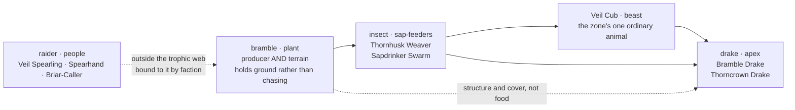

# A2 — Ecology of Thornveil

**Level:** L2 · **Role:** Naturalist (roles charter §2.2) · **Date:** 2026-08-04
**Veto held:** ecology that ignores water — a food web whose energy and whose water have no stated source
**Parents (not reopened):** `A1-geography-cluster1.md` §3, §4.2, §4.3 · `content/bestiary/README.md` · `.claude/refined_backlog/F-029-l2-ecology-biome-and-habitat-lore-for-cl/spec.md`
**Measured from the repository at this commit:** `content/maps/cluster1-geography.json` — the Thornveil zone record, its polygon, and every road polyline (§5) · `content/bestiary/bestiary.json` — the fourteen `region: "thornveil"` designs (§6)

<strong>Scope of this document.</strong> One zone, at full depth. Water, vegetation, food chain and
a habitat depth model for <strong>Thornveil</strong> — and nothing else. The other nine cluster-1
zones are explicitly out of scope; this is the vertical slice that establishes the artifact shape
they will reuse. Where an ecological fact would settle something another role owns — boss identity,
spawn tables, art — it is <em>handed forward</em> in §8, never decided here.

<strong>Every attributed claim in this document cites its file and section, and every citation was
verified by <code>grep</code> before it was written.</strong> That is not ceremony. An earlier draft
of this work asserted that the <code>east-rim-track</code> runs through Thornveil. It does not, and
nothing but a check against the map data would have caught it. The correction is recorded in §5.

---

## 1. The one fact everything follows from

A1 §4.2's zone table, row 4, describes Thornveil as:

> *"The interfluve between the river and the eastern hills — the ground every road went **around**,
> so it stayed nobody's"*.
> — `docs/worldbuilding/A1-geography-cluster1.md` §4.2, zone 4

That is the whole zone in one word. **An interfluve is, by definition, the dry land between two
drainages** — the high ground that sheds water to either side and keeps none of it. Everything below
is a consequence of that single geographic fact, not an addition to it:

<pre class="schematic">
  interfluve — high ground between two drainages
        │
        ▼
  no through-stream ───────────────────────────►  water is dew, stone-hollow catch, and SAP
        │                                                         │
        ▼                                                         ▼
  only drought-tolerant thorn can hold ────────►  terrainKind: "bramble"
        │
        ▼
  nothing to irrigate, nothing worth crossing ─►  no farm, and no road
        │
        ▼
  "the ground every road went around, so it stayed nobody's"
</pre>

<strong>no through-stream</strong> the defining property of an interfluve

<strong>bramble</strong> <code>terrainKind: "bramble"</code> — drought-tolerant thorn on stony ground

<strong>no farm, no road</strong> a consequence of the water, not a coincidence

<strong>sap = water</strong> the scarce resource the entire food web turns on

<strong>Read the chain in reverse and it still holds.</strong> A1 asserts that the roads went around
and the ground stayed nobody's; it does not say <em>why</em> anyone would decline ground that sits
between a river and a hill line. The interfluve answers it. You cannot farm land with no water on
it, you cannot water stock crossing it, and a cart route through dense thorn costs more to cut than
the half-day it saves. Thornveil is empty because it is dry, and it is dangerous because it is empty.

---

## 2. Water — and why sap is the answer

There is no standing water in Thornveil. The zone record in
`content/maps/cluster1-geography.json#zones[thornveil]` carries `"town": null` and sits between the
Meltwash's line and the eastern hills; nothing in the geography puts a watercourse inside its
polygon. So the water in this zone exists in exactly three places:

| source | where | who can use it |
|---|---|---|
| **dew** | on cane and leaf, first hours after dawn only | small things, briefly |
| **stone-hollow catch** | rain held in the hollows of the stony upland | whatever can reach a hollow and hold it |
| **sap** | inside the bramble, all year | anything that can open a cane |

Two of those three are seasonal, diurnal, and contested. The third is not. **Sap is the only
reliable water in Thornveil**, and that is the fact the whole ecology is built on.

### 2.1 The two sap-feeders are the consequence, not the illustration

This is the point at which the derivation stops being decoration and starts predicting the roster.
If sap is the water, then the zone must support specialists that tap it — and
`content/bestiary/bestiary.json` already contains exactly two, both `insect`, both `region:
"thornveil"`, and both written before this document existed:

- **Thornhusk Weaver** (`mob-thornhusk-weaver`, `insect`, 11-20) — *"It strings its web between the
  canes at head height and dresses it in bramble husks so the line reads as more bramble."*
  It lives in the cane, on the cane, disguised as the cane.
- **Sapdrinker Swarm** (`mob-sapdrinker-swarm`, `insect`, 21-30) — *"They drink the bramble dry and
  move on together when a stand of cane dies."*
  A swarm that consumes its water source until the source is dead, then migrates.

<strong>The Sapdrinker's lore is a water budget written as a monster.</strong> A creature that
"drinks the bramble dry" and then <em>has to move</em> is only coherent in a place where the plant
<em>is</em> the reservoir. In a zone with a stream, that swarm would simply drink from the stream and
stay. The design already assumed the interfluve; this document is catching up to it.

### 2.2 The bramble is the water table

The consequence that matters most for level design: in a zone with no aquifer a player can see,
**the bramble itself is the reservoir**. Depth of root is depth of water. The oldest, deepest-rooted
growth holds the most, and therefore supports the most.

That is why the zone's largest thing is a plant, at the centre, at the top of the band range:

> *"At the center of the veil is a tree the bramble runs out from, and the Bramble Mothers answer to
> it the way a wall answers to a foundation."*
> — `content/bestiary/bestiary.json`, `mob-heartwood-tyrant` (`plant`, 61-70, `faction-thornveil`)

**Heartwood Tyrant is not merely the strongest thing in Thornveil — it is the reason the interior can
support anything at all.** Its own lore places it at the centre and makes the Bramble Mothers
structurally dependent on it. Bramble Mother's lore closes the loop from the other end: *"Every
bramble wall in the eastern veil runs back to her, root under root."* The root network is the
hydrology, and the hydrology is the faction.

---

## 3. Vegetation

`content/maps/cluster1-geography.json#zones[thornveil]` carries `"terrainKind": "bramble"`, and A1
§4.2 describes the terrain as *"Stony bramble upland, dense sightlines, no through-track"*. One
vegetation type, one growth habit — but **not one age**.

`content/bestiary/README.md` describes the whole `plant` family as *"Bramble and thorn. Almost
entirely Thornveil; holds ground rather than chasing."* Holding ground is the key phrase: bramble
does not disperse to new territory, it thickens where it already is. So the only variable across the
zone is **how long a given stand has been left alone** — and that is set by how close it is to the
traffic on the western edge.

| age structure | where | condition |
|---|---|---|
| **cut-back young growth** | the track margin | first-year canes; passing carts and stock keep it open, so it never thickens |
| **standing wall** | along the skirting route | mature, continuous, tall enough to close sightlines — the thing the track runs beside rather than through |
| **uncut body** | off-track interior | no cutting agent has ever operated here; canes over canes, decades deep |
| **heartwood** | the centre | the oldest stems and the deepest root mass; the zone's water store |

<strong>The age gradient is the whole depth model in one variable.</strong> Thornveil does not need
four terrain types to justify four difficulty tiers. It needs one plant and one question: how long
since anything cut this? Distance from the road answers it, and the answer is monotonic — which is
exactly what a level-band gradient requires.

---

## 4. The food chain

<pre class="schematic">
  the bramble is BOTH the producer and the terrain — there is no separate ground to stand on
</pre>

Two of the four trophic levels are not this document's invention. They are read straight out of
`content/bestiary/README.md`'s twelve-family table, and are quoted rather than paraphrased so that
the distinction between *cited* and *derived* stays legible:

| level | the README's own words | file |
|---|---|---|
| **producer** | `plant` — *"Bramble and thorn. Almost entirely Thornveil; holds ground rather than chasing."* | `content/bestiary/README.md`, Families table |
| **apex** | `drake` — *"Scaled things, winged and wingless, that sit at the top of a region's food chain."* | `content/bestiary/README.md`, Families table |

Everything between those two ends is what this document derives:

- **The bramble is producer *and* terrain.** This is the structural oddity of the zone. In every
  other cluster-1 ground the vegetation is scenery and the monsters stand on it. Here the plant
  family *is* the monster family — five of the fourteen designs — so eating the producer and
  fighting the producer are the same act.
- **`insect` is the primary consumer**, and it consumes *water*, not leaf. Both sap-feeders are
  covered in §2.1.
- **Veil Cub is the zone's one ordinary animal** (`mob-veil-cub`, `beast`, 1-10) — the sole `beast`
  in a roster of fourteen. Its lore says *"Nobody has seen the grown animal."* A zone that supports
  exactly one vertebrate herbivore-predator line, and cannot show you the adult, is a zone with a
  thin energy budget. That thinness is the interfluve again.
- **Drakes are apex, per the README**, and Bramble Drake's lore confirms the physical relationship
  with the terrain: *"It does not fly. It pushes through the deep veil at chest height and takes the
  canes down with it, which is how you know where it has been."* The apex predator here is defined
  by what it does to the plant — and the dropped clause is the ecological point: the drake's passage
  is legible in the bramble afterwards, which is only possible because the bramble is the terrain.

### 4.1 The raiders are outside the web — and that is the interesting part

The three `raider` designs — Veil Spearling (11-20), Thornveil Spearhand (21-30), Briar-Caller
(31-40) — are drawn **outside the trophic web** in the diagram above, on a dotted edge. They are
people. They do not eat bramble and bramble does not eat them.

They are here because of §1: this is *"the ground every road went around, so it stayed nobody's"*
(A1 §4.2). They moved into the one ground in cluster 1 that no road overlooks, for exactly that
reason.

<strong>Outside the food web, inside the political one — and the faction data draws the line in
exactly the same place.</strong> Cross-tabulating the fourteen designs by <code>family</code> and
<code>faction</code>, <code>faction-thornveil</code> covers <strong>8 of 14</strong>, and it is
<em>precisely</em> the five <code>plant</code> designs plus the three <code>raider</code> designs.
Every <code>insect</code>, the one <code>beast</code> and both <code>drake</code> designs are
<code>faction-unaligned</code>. The bramble and the people who serve it are one political body;
everything that merely <em>eats</em> here belongs to no one. Bramble Mother's lore states the
arrangement outright: <em>"The skirmishers feed her and do not pretend it is anything else."</em>
The raiders are not predators of this ecosystem and not prey in it — they are its
<strong>tenants</strong>, paying rent to the thing that owns the water. That relationship is handed
to I-062 and I-064 and is not resolved here.

---

## 5. The roads skirt it — confirmed in geometry, not just prose

A1 §4.2 says every road went *around*. The map data agrees, and the check is arithmetic rather than
interpretive. Thornveil's polygon in `content/maps/cluster1-geography.json#zones[thornveil]` spans
**x 104–142, y 104–158**.

### 5.1 The road that matters: `terrace-track-north`

`cluster1-geography.json#roads[terrace-track-north]` — name *"up the terrace"*, `from:
"expedition-camp"`, `to: "northern-icefield"` — carries this note:

> *"A1 §2: the north-east fork runs up the river terrace to the camp, **Thornveil's edge** and the
> ice."*
> — `content/maps/cluster1-geography.json#roads[terrace-track-north].note`

Its polyline is `[96,104] → [102,93] → [108,82] → [110,70] → [110,58] → [109,46] → [107,36]`, so it
runs **x ≈ 96–110** and climbs northward out of the frame. Tested against the zone polygon:

<strong>0 of 7</strong> road vertices inside the Thornveil polygon

<strong>x 96 → 110</strong> road span, against the zone at x 104–142

<strong>8 units</strong> gap from the road's start to the zone's west edge at x = 104

<strong>y &lt; 104</strong> every vertex after the first is north of the zone entirely

Its first point `[96,104]` sits level with the zone's northern tip and **eight units west of the
zone's westernmost vertices** `[104,108]` and `[104,138]`. It **grazes the western edge and never
enters.** That is the road the depth model's route tier describes: you pass *along* Thornveil, not
*through* it.

### 5.2 The correction: `east-rim-track` does not touch this zone

<strong>Recorded because it was wrong, and because the citation rule is what caught it.</strong>
An earlier draft of this feature asserted that <code>east-rim-track</code> runs through Thornveil.
<strong>It does not, and it does not come near it.</strong>
<code>cluster1-geography.json#roads[east-rim-track]</code> runs <code>from: "norhollow"</code> to
<code>to: "coastal-spur"</code>, with a polyline spanning <strong>x 36–74</strong> — thirty units
west of the zone's westernmost edge, on the far side of the river line, with
<strong>0 of 6</strong> vertices inside the polygon. It is a road across the flat, not up the
terrace. Nothing but checking the coordinates would have surfaced this; prose about "the eastern
track" reads plausibly right up until you plot it.

<strong>This is what makes the depth model true rather than convenient.</strong> A1 says every road
went around Thornveil; the polygon arithmetic agrees, for both roads that were ever candidates. Going
in is therefore a <em>choice</em> a player makes, and the further in they go the less anyone has ever
been there. The difficulty gradient is not imposed on the zone — it is the zone's history of being
avoided.

---

## 6. The depth model

Four concentric tiers, from the skirting track inward to the heartwood. They are committed as data
in `content/bestiary/placement-thornveil.json` and enforced by `checkBestiaryPlacement()` in
`scripts/check_content.mjs`.

<strong>A1 §4.2's <code>[15, 28]</code> is NOT amended.</strong> The zone band stands exactly as the
Cartographer wrote it, and <code>placement-thornveil.json</code>'s <code>routeBand</code> is gated
to equal <code>cluster1-geography.json#zones[thornveil].levelBand</code> byte for byte — rule
<strong>G8</strong>. This document does not change that number; it states <em>what that number
describes</em>: <strong>the skirting route of §5.1, not a ceiling on what lives behind it.</strong>

### 6.1 The precedent — A1 already did this once

This is not a new licence taken by L2. A1 §4.3 is titled *"The Ashvale Front is not a band — it is a
gradient, and the bestiary already says so"*, and it resolves the Front into three depths rather than
one number:

| A1 §4.3's own tiers | band | A1's stated reason |
|---|---|---|
| **the southern lip** | **10–25** | nearest Emberdown and the ford; the old, settled, marked burials |
| **the middle** | **25–50** | rows still legible, some subsidence, Void-scar thinning but not gone |
| **the northern deep** | **55–80** | under Cindervast's shoulder, where the last season's dead lie where they fell |

A1's §4.2 table records that zone's band as *"10–80 · gradient (§4.3)"* — the table row and the
gradient coexist without contradiction. Thornveil is the same move, with the same justification
shape: **distance from the last travelled ground is the level curve.** For the Front that distance is
measured from the living towns; for Thornveil it is measured from the terrace track.

### 6.2 The four tiers

| tier | band | what it is | why the band |
|---|---|---|---|
| **The Verge** | **1–14** | the track margin | passing traffic keeps the thorn cut back, so the growth is young and the things in it are small |
| **The Route** | **15–28** | the thorn wall the track runs beside | **A1 §4.2's binding band.** This is the skirting passage of §5.1 |
| **The Interior** | **29–50** | the bramble body, off the track and out of sight of it | no road has ever crossed here and nothing cuts the thorn back |
| **The Heart** | **51–70** | the roadless centre, the deepest root mass | the oldest growth holds the most water, so the largest things stand here |

The tiers are **contiguous and non-overlapping** — 14→15, 28→29, 50→51 — which gate rule **G7**
enforces, so no level in 1–70 belongs to two tiers or to none.

### 6.3 All fourteen designs, by tier

Every `region: "thornveil"` design in `content/bestiary/bestiary.json` appears here **exactly once**.
That is not an eyeball claim: gate rule **G4** derives the required set from the roster and fails on
any design missing *or* duplicated.

| tier | design | family | band | locale |
|---|---|---|---|---|
| **Verge** | Bramble Shoot | `plant` | 1-10 | cart-cut margins |
| **Verge** | Thicket Hopper | `insect` | 1-10 | dry grass at the bramble's first edge |
| **Verge** | Veil Cub | `beast` | 1-10 | outer thickets within sight of the track |
| **Route** | Bramble Stalker | `plant` | 11-20 | the thorn wall the track runs beside |
| **Route** | Veil Spearling | `raider` | 11-20 | ambush cuts overlooking the terrace track |
| **Route** | Thornhusk Weaver | `insect` | 11-20 | husk galleries in the roadside thorn |
| **Route** | Bramble Warden | `plant` | 21-30 | the first standing thickets, where the wall thickens |
| **Route** | Thornveil Spearhand | `raider` | 21-30 | the raiders' cut paths just inside the wall |
| **Route** | Sapdrinker Swarm | `insect` | 21-30 | sap runs on the older stems |
| **Interior** | Bramble Drake | `drake` | 31-40 | stone hollows in the bramble body |
| **Interior** | Briar-Caller | `raider` | 31-40 | the raiders' deep camp, past where the track can see |
| **Interior** | Bramble Mother | `plant` | 41-50 | a root mass holding its own standing water |
| **Heart** | Thorncrown Drake | `drake` | 51-60 | the crown thickets above the heartwood |
| **Heart** | Heartwood Tyrant | `plant` | 61-70 | the heartwood itself — the zone's deepest root and its water table |

<strong>14 / 14</strong> designs placed, proven by gate rule G4

<strong>4</strong> tiers, contiguous over bands 1–70

<strong>0</strong> designs re-banded or re-regioned

<strong>15–28</strong> A1's zone band, unchanged

Note where the ladders land. The four growth lines the roster was written with — `plant`, `insect`,
`raider`, `drake` — each climb *outward from the track inward*, and the two that reach the Heart are
the two that the water argument predicts: the deepest-rooted plant, and the apex that lives on top
of it.

---

## 7. Why placement is authored, not computed

The obvious objection to a placement file is that it looks derivable: bands are ten wide, tiers are
ranges, so surely a formula over `levelBand` could produce the tier and save the data. It cannot, and
the reason is arithmetic:

<pre class="schematic">
tier        levels 1 ────────────────────────────────────────► 50

verge        ├────────────┤   1-14
                          ↑ the 14 / 15 edge
route                      ├────────────┤   15-28   ← A1 §4.2's band
                                        ↑ the 28 / 29 edge
interior                                 ├────────────────────┤   29-50

band 11-20             ├────────┤   4 levels in verge, 6 in route
band 21-30                       ├────────┤   8 levels in route, 2 in interior
</pre>

- **Band 11-20 straddles the verge/route edge at 14/15.** Bramble Stalker, Veil Spearling and
  Thornhusk Weaver all carry it, and all three are placed in the Route — but **4 of that band's 10
  levels fall inside the Verge's range**, so containment cannot decide it.
- **Band 21-30 straddles the route/interior edge at 28/29.** Bramble Warden, Thornveil Spearhand and
  Sapdrinker Swarm all carry it, and all three are placed in the Route — yet **2 of that band's 10
  levels fall in the Interior**.

Tier boundaries fall at 14, 28 and 50; band boundaries fall at multiples of ten. **They do not align,
and they were never going to** — the tiers are set by the geography of the track and the roster's
bands were set by the level curve. Any computed mapping would have to break one of those two.

<strong>So the gate checks overlap, not containment.</strong> Rule <strong>G6</strong> fails only
when a design's band is <em>fully disjoint</em> from its tier's range; straddling is legitimate and
expected. That is the concrete reason placement earns a <em>file</em> rather than a formula: the
information in it genuinely is not present anywhere else, and a human had to decide it.

---

## 8. What this hands forward

Neither of the following is decided here. Both are handed on with the ecology that constrains them.

### 8.1 To I-062 — the boss

Thornveil offers **two apex candidates, and they are in genuine tension.** This document deliberately
does not break the tie:

| candidate | family | band | the case for it |
|---|---|---|---|
| **Heartwood Tyrant** | `plant` | 61-70 | Tops the zone by every argument in §2 — it *is* the water table, the Bramble Mothers answer to it, and it is the highest band in the roster. The ecology points here. |
| **Thorncrown Drake** | `drake` | 51-60 | `content/bestiary/README.md` defines `drake` as the family that *"sit\[s\] at the top of a region's food chain"*. The **stated family contract** points here. |

<strong>The tension is real and should not be papered over.</strong> The zone's <em>hydrology</em>
makes the plant apex; the bestiary's <em>own family definition</em> makes the drake apex. Note that
Thorncrown Drake's lore already concedes ground to the bramble — <em>"the canes grow through its back
plates and it carries a hedge on its spine"</em> — which is one possible reading of a drake that is
apex predator but not apex organism. <strong>I-062 rules.</strong>

### 8.2 To I-064 — spawn tables

**The tier is the spawn-table axis.** `placement-thornveil.json` gives every Thornveil design a
`tier` and a `locale`, so a spawn table for this zone can be keyed on tier rather than on the zone as
a whole — which is what the zone band alone could never support, because it collapsed a 1–70
ecosystem into 15–28.

I-064's own chain is unchanged and is specified in `content/bestiary/README.md`: a mob type in
`colyseus-server/src/config/mobs/definitions/` regenerated into `mob-types.json`, plus an `assetKey`
in `asset-keys.json` matching an art-manifest entry at the declared tier. **Nothing in this document
mints either.**

### 8.3 To the remaining nine zones

This is the template, and its shape is the deliverable:

1. Find the **one terrain fact** the Cartographer already wrote, and derive water from it first.
2. Check whether the roster's existing bands **already exceed** the zone band — if so, the zone is a
   gradient and A1 §4.3's Ashvale precedent applies.
3. Verify road geometry against the zone polygon **numerically**. §5.2 is why.
4. Author the tiers; let the gate prove completeness with **G4** rather than proving it by eye.

---

## 9. Citation register

Every attributed claim above, and where it was verified. Each was confirmed with `grep` against the
named file before the sentence citing it was written.

| § | claim | source | verified |
|---|---|---|---|
| §1, §4.1 | *"The interfluve between the river and the eastern hills — the ground every road went around, so it stayed nobody's"* | `docs/worldbuilding/A1-geography-cluster1.md` §4.2, zone 4 | line 194 |
| §3, §4 | `plant` — *"Almost entirely Thornveil; holds ground rather than chasing"* | `content/bestiary/README.md`, Families table | line 76 |
| §4, §8.1 | `drake` — *"sit at the top of a region's food chain"* | `content/bestiary/README.md`, Families table | line 78 |
| §5.1 | *"the north-east fork runs up the river terrace to the camp, Thornveil's edge and the ice"* | `content/maps/cluster1-geography.json#roads[terrace-track-north].note` | line 592 |
| §5.1 | 0 of 7 road vertices inside the zone polygon; road x 96–110 vs zone x 104–142 | `content/maps/cluster1-geography.json` | point-in-polygon test over the committed data |
| §5.2 | `east-rim-track` runs `norhollow → coastal-spur`, x 36–74, 0 of 6 vertices inside | `content/maps/cluster1-geography.json#roads[east-rim-track]` | point-in-polygon test over the committed data |
| §6.1 | Ashvale Front gradient: southern lip 10–25 / middle 25–50 / northern deep 55–80 | `docs/worldbuilding/A1-geography-cluster1.md` §4.3 | heading line 202; the three band figures at lines 223, 225, 227 |
| §4.1 | `faction-thornveil` covers 8 of 14, being exactly the 5 `plant` + 3 `raider` designs; all `insect`, `beast` and `drake` are `faction-unaligned` | `content/bestiary/bestiary.json` | family × faction cross-tab over the committed roster |
| §7 | band 11-20 puts 4 of 10 levels in the Verge; band 21-30 puts 2 of 10 in the Interior | tier edges 14/15 and 28/29 vs `levelBand` | counted level by level against the committed tiers |
| §2.2, §4, §8.1 | design lore quotations | `content/bestiary/bestiary.json`, `lore` field of each named design | read from the committed roster |
| §3, §6 | `terrainKind: "bramble"`, `levelBand: [15, 28]`, `town: null` | `content/maps/cluster1-geography.json#zones[thornveil]` | read from the committed record |
