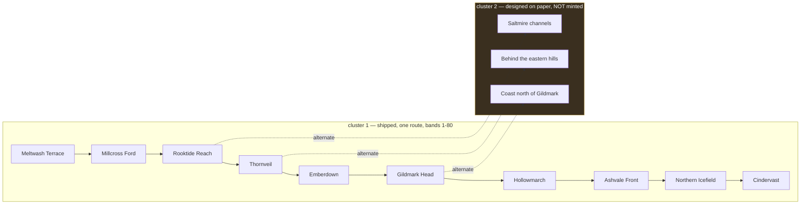

# A2 — The ten grounds of cluster 1

**Level:** L2 · **Role:** Naturalist (roles charter §2.2) · **Date:** 2026-08-08
**Veto held:** content that ignores water — a zone that yields what its water cannot support, or threatens with something its ground does not have
**Veto answered here:** the **Political Economist's G3** — *"blocks anything with no cost, no scarcity and no loser."* §7 takes each of the eight resource kinds and names who profits from it and who pays for it, against the town economies A1 §6 already wrote.
**Parents (not reopened):** `docs/worldbuilding/A1-geography-cluster1.md` §3.1, §3.2, §3.3, §4.2, §4.3, §4.4, §6, §7.1 · `docs/worldbuilding/A2-ecology-thornveil.md` §1, §2, §6 · `docs/superpowers/specs/2026-08-08-l2-zone-content-design.md`
**Measured from the repository at this commit:** `content/maps/cluster1-geography.json` — the ten zone ids, their bands and terrain kinds, `camps[expedition-camp]` and `towns[cindervast].wallsOnly.gateAt` · `content/maps/atlas-frontier.md` — the three live `zoneHazards` entries on `region-icefield` · `content/bestiary/bestiary.json` — the `lore` field of eighteen named designs · `content/story/canon.md` §4 · `content/story/style.md` §3, §4

---

<div class="callout info">
<strong>Scope of this document.</strong> What a player <em>does</em> in each of cluster 1's ten
grounds — what threatens them, what they can carry out, what they will remember seeing, and why
they walked in at all. Ten zones, at the depth <code>A2-ecology-thornveil.md</code> gave one.
Nothing else.
<br><br>
<strong>Two things are deliberately out of scope.</strong> <strong>Route alternates are prose
only</strong> (design D1): §9 specifies where cluster 2's branches attach and they are never minted
as zones, never given a record, never counted by the budget — A1 §4.4 already ruled that the
alternates are cluster 2's to build. And <strong><code>content/maps/atlas-frontier.md</code> is not
touched</strong>: per A1 §5.3 that 1000×1000 shelf is a compressed miniature, and whether it is
rebuilt or retired is the Systems Designer's call under DR-001 §6.4.2, not this role's.
</div>

## 0. Scope — and the naming trap this document avoids

This is **A2**, a sibling of `A2-ecology-thornveil.md`. SWF §2 reserves **A3** for L3 — races,
dungeons, camps and the ruling monsters — which is I-063's slot. Nothing here mints an A3, and
nothing here decides an L3 question.

Three further limits, stated so a reader does not go looking for what is not here:

- **This document does not re-band any zone.** `levelBand` belongs to `cluster1-geography.json` and
  A1 §4.2 wrote it. Where a band is quoted below it is quoted, not amended.
- **This document does not place a single creature.** F-029 owns placement, and its G1–G8 rules run
  over a separate file class.
- **This document does not amend `canon.md`, the story nodes or the bestiary.** Where it collides
  with any of them, §13 names the collision instead of smoothing it.

---

## 1. Provenance

Derives from **`A1-geography-cluster1.md`** — the ten zones and their terrain (§4.2), the Ashvale
Front's three ages (§4.3), the route and its missing alternates (§4.4), the water in four reaches
(§3.1), the terrain in five kinds (§3.2), the one-line reason each town exists (§3.3), the six town
economies written silhouette-first for concept art (§6), and the map's own legend (§7.1).

Derives from **`A2-ecology-thornveil.md`** for one zone at full depth — the interfluve argument and
its no-through-stream consequence (§1), sap standing in for water (§2), and the four tiers and the
landmarks they name (§6). **This document does not restate Thornveil's tiers differently.** The
`[15, 28]` band and the four-tier depth model stand exactly as that artifact wrote them; §2's
Thornveil row adds hazards, resources and landmarks on top of them and changes none of them.

Researched against the repository rather than against a new dossier: `content/maps/cluster1-geography.json`,
`content/maps/atlas-frontier.md`, `content/bestiary/bestiary.json`, `content/schemas/map.schema.json`,
`content/story/canon.md`, `content/story/style.md`, and the design
`docs/superpowers/specs/2026-08-08-l2-zone-content-design.md`.

**Citation convention.** `canon.md` is cited **by section heading** (§4 *Geography & trade logic*),
never by line number. Line citations into that file have rotted three times in this repository
because an insert above them moves every number below.

---

## 2. The ten grounds

This table is the **authoring input** for the ten zone records under `content/zones/`. Every zone
id, `reasonToGo`, hazard id, hazard `effect`, resource id, resource `kind`, landmark id, landmark
`name` and landmark `source` in those records is a cell here, written in the exact form the record
carries — a landmark `source` cell reads `docs/worldbuilding/A1-geography-cluster1.md#4.2`, not
`A1 §4.2`. Nothing may appear in a record that is not derived from this table.

**What this table does not carry:** hazard `name`, hazard `description`, hazard `note`, resource
`name`, resource `description` and landmark `description` have no cells here. That prose is authored
against `content/story/style.md` and is reviewed for voice, not for provenance against this table.

**Legend.** **[C]** transcribed from canon · **[D]** derived one step from canon, and the step is
named · **[N]** needs invention. Hazard `→ effect` maps to one of the seven runtime `zoneHazards`
types; **`none`** is an **absence-hazard** (design C3) — a real danger the engine cannot yet
express, which the gate warns about by design and which carries an authoring note saying why no
enum value fits.

| zone | reasonToGo | hazards (id → effect) | resources (id, kind) | landmarks (id, name, source) | citation |
| --- | --- | --- | --- | --- | --- |
| `meltwash-terrace` | The last drained ground before the crossing: grass for the stock, gravel underfoot, and a camp that is still standing when the water goes down. | `meltwater-cold` → `freeze`<br>`the-thaw-rise` → none | `cropped-grass`, `forage`<br>`the-braided-heads`, `water` | `the-expedition-camp`, "The expedition camp", `content/maps/cluster1-geography.json#camps[expedition-camp]`<br>`the-gravel-bars`, "The gravel bars", `docs/worldbuilding/A1-geography-cluster1.md#4.2` | [C] throughout (A1 §4.2 zone 1, A1 §3.1); the `freeze` mapping is [D] |
| `millcross-ford` | One crossing serves the whole land, and everything waiting on it has to be fed, stabled and ferried here. | `high-water-at-the-ford` → none<br>`the-millrace` → none | `race-milled-grain`, `crop`<br>`the-quarry-face`, `stone` | `the-cart-queue`, "The cart queue", `docs/worldbuilding/A1-geography-cluster1.md#6`<br>`the-mill-wheel-housing`, "The mill-wheel housing", `docs/worldbuilding/A1-geography-cluster1.md#6` | [C] (A1 §6; `mob-chaff-crawler`, `mob-quarrystone-beetle`, `mob-millrace-lurker`). **Zero mapped hazards — §10's named case.** Mill collision → §13 |
| `rooktide-reach` | Everything moving between sea and river changes hulls here, and whatever goes over the side in the change stays on the flats. | `the-turning-tide` → none<br>`the-low-water-mud` → `stun` | `old-plank`, `salvage`<br>`cut-reed`, `forage` | `the-barge-cranes`, "The barge-cranes", `docs/worldbuilding/A1-geography-cluster1.md#6`<br>`the-rook-flats`, "The rook flats", `docs/worldbuilding/A1-geography-cluster1.md#6` | [C] (A1 §3.1, A1 §6, `mob-thatch-mite`, `mob-tideflat-nipper`); reed→`forage` is [D] (the enum has no reed); the `stun` mapping is [D] |
| `thornveil` | The one ground no road overlooks, which is why the people who do not want to be overlooked are in it. | `the-thorn-wall` → `damage`<br>`no-through-stream` → none | `cane-sap`, `water`<br>`spear-cane`, `timber` | `the-heartwood`, "The heartwood", `docs/worldbuilding/A2-ecology-thornveil.md#6.2`<br>`the-crown-thickets`, "The crown thickets", `docs/worldbuilding/A2-ecology-thornveil.md#6.3` | [C] except `spear-cane` and the `damage` mapping. `spear-cane` is **[D], the weakest cell in the table** — `style.md` §4 gives `faction-thornveil` a throwing-spear harness, canon never says they cut cane for the shafts. §15 carries it as [D], not as a transcribed fact |
| `emberdown` | The only hillside in the land where the fuel and the food come out of the same ground. | `seam-damp` → `poison`<br>`the-ember-pits` → `burn` | `burning-stone`, `fuel`<br>`ledge-loam`, `crop` | `the-terraced-ledges`, "The terraced ledges", `docs/worldbuilding/A1-geography-cluster1.md#6`<br>`the-adits`, "The adits", `docs/worldbuilding/A1-geography-cluster1.md#4.2` | [C] (A1 §4.2 zone 5, A1 §6, `canon.md` §4, `mob-slagheap-grub`, `mob-emberpit-digger`); bad air in a worked adit is [D] |
| `gildmark-head` | The only door the sea has, with half a day of mudflat in front of it holding everything that missed the door. | `the-moving-sandbars` → none<br>`the-salt` → none | `beached-cargo`, `salvage`<br>`dressed-headland-stone`, `stone` | `the-mirror-tower`, "The mirror tower", `docs/worldbuilding/A1-geography-cluster1.md#6`<br>`the-mires-bar`, "The mire's bar", `docs/worldbuilding/A1-geography-cluster1.md#4.2` | [C] (A1 §3.1 Saltmire, A1 §6, A1 §7.1, `mob-bound-war-beast`); `dressed-headland-stone` is [D] — canon names no quarry. **Zero mapped hazards — §10's second named case.** **Name it "The mire's bar", never "the bar"** |
| `hollowmarch` | Where the timber and the ore both start, behind the only wall in the land that was never taken down. | `the-open-moor` → none<br>`the-outer-fields` → `poison`<br>`hollow-stakes` → none | `the-timber-line`, `timber`<br>`the-ore-heads`, `ore` | `the-tally-boards`, "The tally boards", `docs/worldbuilding/A1-geography-cluster1.md#6`<br>`the-palisade-line`, "The palisade line", `docs/worldbuilding/A1-geography-cluster1.md#4.2` | [C] (A1 §3.3, A1 §4.2 zone 7, A1 §6, `canon.md` §4, `mob-hollowmoor-giant`, `mob-graveturf-creeper`, `mob-palisade-borer`); the `poison` mapping is [D] |
| `ashvale-front` | The only ground both towns reach in a day and neither can hold, which is why four seasons of what either army carried is still lying on it. | `no-water-on-it` → none<br>`no-cover-for-a-days-crossing` → none<br>`the-alkali-dust` → `burn` | `abandoned-arms`, `salvage`<br>`the-southern-lip-loam`, `crop` | `the-grave-rows`, "The grave rows", `docs/worldbuilding/A1-geography-cluster1.md#4.3`<br>`the-abandoned-cut-lines`, "The abandoned cut lines", `docs/worldbuilding/A1-geography-cluster1.md#4.2` | [C] (A1 §3.2 item 3, A1 §4.2 zone 8, A1 §4.3, `mob-warscar-titan`, `mob-trench-gnawer`); the `burn` mapping is [D]; **`crop` rests on `canon.md` §4's literal "Embervale farms the Ashvale loam" and COLLIDES with A1 §1/§3.1 — §13 case 2** |
| `northern-icefield` | Every river in the land starts under this shelf, and the company at the gate on its lip has been standing there since the city behind it fell. | `the-cold` → `freeze`<br>`the-white-weather` → `stun`<br>`the-crevasses` → none | `the-meltwater-heads`, `water`<br>`the-gravel-head`, `stone` | `the-oath-gate`, "The oath-gate", `docs/worldbuilding/A1-geography-cluster1.md#4.2`<br>`the-crevasse-shelf`, "The crevasse shelf", `docs/worldbuilding/A1-geography-cluster1.md#4.2` | [C] throughout. **The two mapped hazards are not derived — they are already live** in `content/maps/atlas-frontier.md`'s `zoneHazards` for `region-icefield` (`freeze` ×2, `stun` with `castTime: 400`). Cite that, do not re-derive |
| `cindervast` | A city the weapon took without knocking it down: intact mortar, no rubble in the streets, and what the people in it were carrying still where they dropped it. | `the-afterglow` → `poison`<br>`a-city-with-nobody-in-it` → none | `relic-scrap`, `salvage`<br>`district-fuel`, `fuel` | `the-giving-king-statues`, "The Giving King statues", `docs/worldbuilding/A1-geography-cluster1.md#6`<br>`the-dead-gate`, "The dead gate", `content/maps/cluster1-geography.json#towns[cindervast].wallsOnly.gateAt` | [C] (A1 §4.2 zone 10, A1 §6, `mob-soot-wrapped-scavenger`, `mob-relicglow-moth`, `mob-relicslag-crawler`); `district-fuel` is [D], two steps from `mob-cinderfall-giant`; the `poison` mapping is [D]. **Name it "The dead gate", never "the gate"** |

**What the table adds up to.** **23 hazards, of which 10 carry a runtime `effect` and 13 do not**;
**20 resources** across ten pairwise-distinct kind sets; **20 landmark names, all distinct**. These
four numbers are re-derived from `content/zones/` once the records exist rather than trusted from
here.

<div class="callout warn">
<strong>Two landmark near-misses are deliberate and must be held, not tidied.</strong>
<em>"The gravel bars"</em> (zone 1) against <em>"The mire's bar"</em> (zone 6), and
<em>"The oath-gate"</em> (zone 9) against <em>"The dead gate"</em> (zone 10). Both pairs are
distinct names, and both are the correct names: A1 §6 calls Gildmark's first sight <em>the bar</em>
and A1 §4.2 calls it <em>the mire's bar</em> — the longer form is the one that does not collide.
An editor shortening either one to "the bar" or "the gate" breaks the distinctiveness rule.
</div>

### 2.1 The resource-kind sets, machine-readable

Ten zones, ten pairwise-distinct kind sets. This block is the machine-readable half of the table
above; the two are edited together or not at all.

```json
{
  "meltwash-terrace":  ["forage", "water"],
  "millcross-ford":    ["crop", "stone"],
  "rooktide-reach":    ["salvage", "forage"],
  "thornveil":         ["water", "timber"],
  "emberdown":         ["fuel", "crop"],
  "gildmark-head":     ["salvage", "stone"],
  "hollowmarch":       ["timber", "ore"],
  "ashvale-front":     ["salvage", "crop"],
  "northern-icefield": ["water", "stone"],
  "cindervast":        ["salvage", "fuel"]
}
```

---

## 3. Claims — the new facts, numbered and binding

- **C1 · A zone's reason to exist for a player is a separate fact from its reason to exist
  geographically.** A1 §4.2 already answers *why is this ground here* for all ten. It never answers
  *why does someone walk in.* These are different questions and the second one is this artifact's
  spine.
- **C2 · Every zone yields something a person carries out.** Cluster 1 is a post-war land whose towns
  are named for what they extract or move — the ford, the seam, the ore heads, the hull change. A
  zone that yields nothing is a corridor, not a zone.
- **C3 · A hazard may be an absence.** The Ashvale Front's threat is stated by A1 §4.2 zone 8 as
  *no water, no cover, easy to dig*. Nothing ticks. This is a hazard the world already has and the
  engine cannot yet express, and this artifact records it as a hazard regardless.
- **C4 · A landmark is a thing a traveller sees before anything else.** A1 §6 already wrote this
  test for the six towns and answered it for each — the cart queue, the smoke, the tally boards, the
  bar, the birds, the statues. C4 extends the same test to the four town-less zones.
- **C5 · Two zones sharing a terrain kind must not share a resource profile.** This is the
  load-bearing constraint that keeps the three river-country zones distinct, and it is enforced by
  gate rather than by taste.

**No claim is minted beyond C5.** The design numbered five and this artifact executes those five.

---

## 4. Causal links — what each claim explains that was already on the page

| Claim | Explains |
| --- | --- |
| C1 | Why A1 §4.2 can say Meltwash Terrace is *"the only drained flat ground within a morning's walk of the ford"* and still leave a player with no errand there. |
| C2 | Why the six towns' economies in A1 §6 are all extraction or transit, and why Cindervast — which *"does nothing for a living"* — is the land's dead end. |
| C3 | Why the Ashvale Front is *"the only region of the nine with species in all eight bands"* (A1 §4.3) yet holds no town: the ground kills by what it lacks, so nobody settles it and everything can live on it. |
| C4 | Why A1 §6 was written silhouette-first for concept art — the same first-sight test that drives an art brief drives a player's memory of a place. |
| C5 | Why the Systems Designer assumes **12 species per zone before repetition is felt** (`role-systems-designer-scale.md` §1.3, where the figure is used; declared as an assumption in that file's §0 *Assumed* list): repetition is a content-identity problem, and terrain is too coarse an axis to solve it — seven distinct `terrainKind` values cover ten zones, so five of the ten share a label with a neighbour. |

---

## 5. Consequences — two per claim, on ordinary life

- **C1 → travel.** A land where every ground has an errand is a land people cross on purpose. The
  waystations A1 §7.1 draws on the road legs stop being scenery and become the places the errands
  are handed out.
- **C1 → work.** The burial detail DR-001 gives the player is the one profession with a reason to
  enter all ten grounds — the errands in §2 span the whole route, and no other trade named anywhere
  in A1 §6 has business in every one of them.
- **C2 → trade.** If every zone yields, then the trade road's traffic is not just through-traffic;
  each stretch has its own local cargo, and Millcross's refusal to formalise its tolls (A1 §6)
  becomes a live grievance for nine zones' worth of carters rather than an anecdote.
- **C2 → food.** A camp on the terrace lives on grass it did not plant and water it did not carry.
  That is why the expedition camp can stand on ground with no town on it, and why it empties when
  the thaw comes up over the bars.
- **C3 → law.** Ground that kills by absence cannot be policed by presence. The Front has grave rows
  and no wardens, which is why it is *"the only ground both towns reach in a day and neither can
  hold"* (A1 §4.2, zone 8).
- **C3 → burial.** An absence-hazard is why the Front is dug rather than settled: the same lack of
  water and cover that makes it lethal makes it easy to dig.
- **C4 → travel.** A traveller navigates cluster 1 by first-sight landmarks, not by distance — which
  is exactly the mechanism A1 §5.3 requires when it bans expressing fictional days as walking time
  and mandates a *"signpost at a waystation, not with the player's legs."*
- **C4 → who gets rich.** Two of the twenty landmarks are instruments of record-keeping rather than
  scenery, and they are kept in opposite ways: Gildmark's mirror tower is the private line A1 §5.2
  says follows the public towers' ridgelines, while Norhollow's tally boards stand at an open gate,
  *"replaced when full and never erased"* (A1 §6). One town's account is read by whoever walks up to
  it; the other's is read by whoever owns the tower.
- **C5 → who gets rich.** Distinct resource profiles mean the three river-country zones compete on
  different goods, so no single town can corner the river.
- **C5 → trade.** Because the two rim zones yield different things — fuel and grain on one side, timber
  and ore on the other — the sister towns' bargain `canon.md` §4 describes (*"grain from one side of
  the plain against timber and ore from the other"*) is a consequence of the ground, not of a treaty.
  Which is why the war did not end it.

---

## 6. The hazard vocabulary, and its runtime binding

A hazard in this artifact is a **fiction** first. The runtime binding is optional and comes second.

**The seven runtime types**, copied from `content/schemas/map.schema.json`
(`#/properties/zoneHazards/items/properties/type/enum`): `freeze`, `stun`, `burn`, `poison`,
`regen`, `heal`, `damage`. The same seven strings are the effect types `ZoneEffectManager` switches
on (`colyseus-server/src/modules/ZoneEffectManager.ts`), which is where the vocabulary comes from. A
zone hazard may carry one of these as its `effect`, or carry none at all.

<div class="callout success">
<strong><code>effect</code> is not an invention of this artifact — three of these are already
authored in shipped content.</strong> <code>content/maps/atlas-frontier.md</code>'s
<code>zoneHazards</code> block carries two <code>freeze</code> entries and one <code>stun</code>
entry (that one with <code>castTime: 400</code>), all three on
<code>regionId: region-icefield</code>, and the content gate checks them on every run. That is why
<code>northern-icefield</code>'s two mapped hazards below are marked <strong>[C]</strong> and not
<strong>[D]</strong>: they are transcriptions of hazards somebody already wrote into committed
content, not mappings this artifact proposes.
</div>

<div class="callout warn">
<strong>What that does not mean — and this artifact does not claim it.</strong> It does not mean the
engine plays them. <code>grep -rn "zoneHazards" colyseus-server/src</code> returns
<strong>nothing</strong>: the block's only readers today are <code>scripts/check_content.mjs</code>
and its test, and <code>ZoneEffectManager</code> builds its zones from cast skills, never from the
map file. <strong>§14 question 2 stands exactly as written — nothing consumes <code>effect</code> at
runtime yet.</strong> "Already authored" is a claim about the content tree; it is not a claim about
the server.
</div>

**Three kinds of hazard, and only the first is machine-visible:**

1. **Mapped** — the fiction lands cleanly on one of the seven. `the-cold` → `freeze`. Ten of the
   twenty-three.
2. **Unmappable by shape** — the fiction is a real danger with no enum value near it. A tide that
   turns, a sandbar that moves, a stake that answers hollow. The record carries no `effect` and an
   authoring note saying why.
3. **Absence-hazards** — design C3, and the sharpest case of kind 2. `no-water-on-it` and
   `no-cover-for-a-days-crossing` are the Ashvale Front's defining threats and **nothing ticks**.
   The danger is that the ground gives you nothing for a day. Rejecting these would delete the
   Front's whole character to satisfy an enum, so they stay, and the gate warns rather than fails.

**The arithmetic, stated so it can be re-derived rather than remembered:** 23 hazards across ten
zones — 10 mapped, 13 unmapped. Two zones carry **no** mapped hazard at all; they are enumerated by
name in §10, not from memory.

---

## 7. The eight resource kinds, and the town economy each maps to

This is the **G3 answer**. Nothing here is invented economics: each kind maps to a living A1 §6 town
economy, and each names a party that profits and a party that pays.

| kind | the A1 §6 economy it maps to | zones | who profits | who pays |
| --- | --- | --- | --- | --- |
| `crop` | *"Embervale farms the loam on the ledges"*; Millcross *"feeding whoever is waiting"* | `millcross-ford`, `emberdown`, `ashvale-front` | Embervale's ledge farms; Millcross's mill | the cart queue — Millcross prices a meal by how long the crossing is backed up, and refuses to write the price down |
| `timber` | *"Norhollow cuts timber"* | `thornveil`, `hollowmarch` | Norhollow, and the raiders who cut their own shafts and pay nobody | Norhollow's palisade guard, who must walk the line twice a day tapping stakes because the town is made of its own product |
| `ore` | *"works the ore heads behind it"* | `hollowmarch` | Norhollow, and whoever buys the ore that goes across the plain | the ore-head crews — in a town built entirely of timber, *"the only stone is the ore-head machinery"* (A1 §6), and they are the ones who work it |
| `fuel` | *"digs the seam under them"*; the fires still finding fuel in Cindervast's outer districts | `emberdown`, `cindervast` | Embervale's forty hearths that never go out; the Column, in the ruin | Embervale's smiths — the town *"lost a forge house"* to what lives in the warm ground *"and rebuilt it on stone"* (`mob-emberpit-digger`) |
| `stone` | *"dressed stone at the bottom"* of Gildmark; the quarry face west of Millcross | `millcross-ford`, `gildmark-head`, `northern-icefield` | Gildmark's counting-houses, sitting on five terraces of it | the quarry crews, who work around a thing that turns a hammer and have stopped calling that a delay |
| `water` | the braided heads; Thornveil's sap, which is the zone's only water at all | `meltwash-terrace`, `thornveil` | nobody, in a river basin — which is exactly the point | everybody, in the two grounds that have none: Thornveil drinks sap, and the Front drinks what it carried in |
| `forage` | the terrace's cropped grass; the new reed Rooktide reroofed with | `meltwash-terrace`, `rooktide-reach` | the stock waiting on the crossing, and Rooktide's roofers | Rooktide, which bought the mites with the reed and says so out loud |
| `salvage` | *"old plank sewn into new"*; the harbour's word for a crate that opens on a beach | `rooktide-reach`, `gildmark-head`, `ashvale-front`, `cindervast` | Rooktide, which does not hide the join; Gildmark, which has a word for it | the owner of the cargo, and the dead of the Front, who are wearing the salvage |

<div class="callout idea">
<strong>Where the eight kinds fall is itself an argument.</strong> Four zones yield
<code>salvage</code> and only one yields <code>ore</code>. That is the correct shape for a land four
seasons out of a war: there is more lying on the ground than there is coming out of it, and the one
town still digging is the one behind a wall it never took down.
</div>

---

## 8. Distinctiveness — why no two of the ten read alike

Terrain cannot carry this. `cluster1-geography.json` holds only **seven distinct `terrainKind`
values across ten zones**: `river-country` covers three, `rim` covers two. Five of ten zones share a
terrain label with a neighbour, so content derived from terrain alone produces five near-duplicates.
Resource kind carries it instead, and the towns' real economies are what make the sets honest.

**The three river-country zones, side by side:**

| zone | kinds | the economy that forces it |
| --- | --- | --- |
| `meltwash-terrace` | `forage` + `water` | No town. A camp on drained ground lives on grass it did not plant and water it did not carry |
| `millcross-ford` | `crop` + `stone` | The ford town mills what the queue eats and cuts the quarry face west of the crossing |
| `rooktide-reach` | `salvage` + `forage` | The hull change. What goes over the side stays on the flats, and the roofs are new reed |

**The two rim zones, side by side:**

| zone | kinds | the economy that forces it |
| --- | --- | --- |
| `emberdown` | `fuel` + `crop` | Farmable loam sitting directly on a shallow seam — the reason two sources call Embervale two different kinds of town |
| `hollowmarch` | `timber` + `ore` | *"Norhollow remains a forest-and-mine town"* (`canon.md` §4) |

### 8.1 The collision this rule caught, and the three edits that fixed it

The naive derivation — read straight off canon with no distinctiveness pass — put **four** zones on
`salvage` and gave **three of them the identical set `{salvage, stone}`**: `gildmark-head`,
`ashvale-front` and `cindervast`. A three-way tie, found by running the check before the prose was
written rather than after ten records existed.

Three citation-backed edits fixed it, and each is an argument rather than a nudge:

1. **`millcross-ford` drops `salvage`** → `{crop, stone}`. A1 §6's scavenged cart-boards describe
   *how the town is built*, not what its ground yields; C2 asks what a person carries **out**. This
   takes the pressure on `salvage` from four zones to three.
2. **`ashvale-front` takes `crop` instead of `stone`** → `{salvage, crop}`. `canon.md` §4:
   *"Embervale farms the Ashvale loam."* A1 §4.3 independently calls the southern lip *"settled,
   marked, grassed over."* **This collides with A1 §1/§3.1's alkali-flat reading and is named in §13
   case 2, not smoothed.**
3. **`cindervast` takes `fuel` instead of `stone`** → `{salvage, fuel}`. `mob-cinderfall-giant`:
   *"the outer districts where the fires still find fuel."* Two derivation steps, flagged **[D]** in
   §15.

---

## 9. The alternates — on paper only

A1 §4.4 states cluster 1's known deficiency plainly: the Systems Designer's model calls for **three
zones per ten-level band** — one main route plus two alternates, which is 24 levelling zones — and
cluster 1 ships **one route, ten zones, no alternates**. A1 assigns the fix to cluster 2 and already
names where the branches go. This section specifies them and stops there.

**They stay prose. They get no schema, no record, and no budget row.** Gating a record for zones
that do not exist would manufacture a completeness signal for unbuilt content, which is exactly what
the completeness rule exists to prevent.

| alternate | forks from | the band it would serve | what is already there |
| --- | --- | --- | --- |
| **The Saltmire channels** | `rooktide-reach` | the fork zone's own band, **10–20** | A whole zone of tidal ground currently folded into the edges of zones 3 and 6 (A1 §4.4). A1 §3.1: *"channels, mud, salt scrub and moving sandbars — no road crosses it, and no keel drafts it"* |
| **The coast north of Gildmark** | `gildmark-head` | the fork zone's own band, **30–45** | A1 §4.4 names it. A1 §6: for the last half-day of the coast road there is *"nothing but mudflat, wrecked hulls, sandbar and gulls"* — the wrecks run in both directions from the rock |
| **Behind the eastern hills** | `thornveil` | the fork zone's own band, **15–28** | A1 §4.4 names *"the far side of the eastern hills behind Thornveil"*. `A2-ecology-thornveil.md` §5.2 establishes that `east-rim-track` does not touch the zone — the far side is reached around it, not through it |

**The bands are derived, not transcribed.** A1 §4.4 names the three sites and does not band them.
Giving each alternate the band of the zone it forks from is the minimum reading of the
three-per-band model, and it is flagged **[D]** rather than presented as canon. Cluster 2 may
re-band any of them without contradicting anything here.



---

## 10. Costs and limits

<div class="callout danger">
<strong>The blind spot, named by enumeration and not by memory.</strong> Because a hazard may carry
no <code>effect</code>, a zone can reach content-complete with <strong>zero</strong> hazards the
engine can express. On the §2 table as written, that set is exactly <strong>two zones:
<code>millcross-ford</code></strong> (<code>high-water-at-the-ford</code> and
<code>the-millrace</code>, both unmapped) <strong>and <code>gildmark-head</code></strong>
(<code>the-moving-sandbars</code> and <code>the-salt</code>, both unmapped).
<br><br>
<strong><code>ashvale-front</code> is not in that set</strong>, and only for one reason: it carries
a third hazard, <code>the-alkali-dust</code> → <code>burn</code>, on top of its two absences. Remove
that third hazard and the Front joins the set, and this section must be rewritten to say so. The set
is re-derived from <code>content/zones/</code> after any hazard edit, never copied forward.
</div>

- **13 of 23 hazards have no runtime binding.** The world says considerably more than the engine can
  express, and the unmapped count is the only honest measure of that gap. It must be printed, not
  swallowed.
- **The distinctiveness rule bites hardest where the land is genuinely similar.** The three
  river-country zones share a river. Forcing different resource kinds may push an author toward a
  strained distinction rather than an honest one. The mitigation is that the towns' real economies
  already differ — the ford tolls, the hull change, and a camp with no town at all — which is why §8
  argues each set from an economy rather than from a preference.
- **`spear-cane` is the weakest cell in the whole table** and is not hidden. `style.md` §4 gives
  `faction-thornveil` a throwing-spear harness; canon never says the raiders cut cane for the shafts.
  It is marked **[D]** in §2 and in §15, and it is the first cell to strike if the Archivist rejects
  a derivation.
- **`meltwash-terrace` has no bestiary region**, which exempted it from F-029's placement work. It
  is **not** exempt here: it has terrain, a camp and a reason to go, so it owes a full record.
- **This is a fiction-layer artifact.** It does not touch `content/maps/atlas-frontier.md`. Per
  A1 §5.3 that 1000×1000 shelf is a compressed miniature, and the decision to rebuild or retire it
  is the Systems Designer's under DR-001 §6.4.2 — explicitly not this role's call.

---

## 11. Known-wrong — what people in the world believe that is false

- **That the Front is empty.** A1 §4.3 measured it: *"the only region of the nine with species in
  all eight bands."* The people who cross it fastest are the ones most certain nothing lives there.
- **That Cindervast yields nothing.** It *"does nothing for a living"*, which is a statement about
  its inhabitants, not its ground: a bleached, unrubbled city with intact mortar is the largest
  intact salvage field in the land, and the people who left it will not say its name — *"the
  Cindered never say the city's old name aloud — only 'the fall,' or 'home, once'"* (`style.md` §3;
  `canon.md` §1 scatters the survivors *"through every other town as the Cindered"*). **The two
  groups still standing in the ruin are a different matter — §13 case 4.**
- **That Thornveil is worthless.** Every road went *around* it, so it stayed nobody's — a judgement
  about routing that the land's own water contradicts. The zone with no through-stream is the zone
  whose water is worth carrying.
- **That Millcross, being the hub, is closest to the sea.** Every road passes through it and it is
  still **2.5 h** from the port, while a town on a side spur is **1.5 h** (A1 §5.1). The carters know
  the travel times and still say the hub is nearest, because the hub is where they turn around.

---

## 12. What this does not change

- **`content/maps/cluster1-geography.json` — not edited.** Zone records reference it; nothing is
  written back. No band, polygon, town link or terrain kind moves.
- **`content/maps/atlas-frontier.md` and its `zoneHazards` — untouched.** The three live icefield
  entries are cited as an existence proof and are not amended, moved or added to.
- **`bestiary.json`, `placement-thornveil.json` and F-029's G1–G8 — untouched.** Zone rules live in
  a separate function over a separate file class.
- **`A2-ecology-thornveil.md`'s four tiers and its `[15, 28]` band — untouched.** Thornveil's row in
  §2 sits on top of that depth model and does not restate it.
- **The story nodes, the novel, the five-act structure and `canon.md` — untouched.** Nothing here
  amends narrative, and §13's collisions are reported for adjudication rather than fixed by edit.
- **The `mob-bases`, `spawn-entries` and `world-state-systems` budget lines and their blockers.**

---

## 13. Contradiction rule, and the four live collisions

**`canon.md` §6 states the rule exactly: *"Content in Tasks 3–8 that contradicts this file is a
review finding; fix the content or amend this file deliberately in the same commit, never
silently."*** Note what that does and does not demand: the collision must not be passed over in
silence, and where the fix is this artifact's to make it is made here. It does **not** demand that
this artifact settle a collision between two files it does not own — cases 2, 3 and 4 below are
named and routed to the Archivist rather than decided, which is the "never silently" half of the
rule, not an exception to it. All four were found while writing §2 and §11.

**1 · D1 — this idea's own title against A1 §4.4.** I-060's title asks for *"alternates for the
single route cluster 1 currently ships."* A1 §4.4 had already ruled on that, named where the
alternates go, and assigned them to cluster 2 — calling the single route *"a known deficiency rather
than hiding it."* **Resolved in A1's favour.** The alternates are specified on paper in §9 and never
minted; the idea's own title is corrected rather than left to disagree.

**2 · The Ashvale loam.** `canon.md` §4 states *"Embervale farms the Ashvale loam and works the
ember-seam beneath it"* — which puts farmable loam on the Front. A1 §1 and §3.1 read the same loam
as the **west rim's**, and describe the flat itself as old lake silt where *"rain sinks and goes
alkaline,"* with no catchment of its own. **This is load-bearing here**, not academic: the
distinctiveness fix in §8.1 gives `ashvale-front` the kind `crop` on canon's literal sentence, and
the resource `the-southern-lip-loam` exists only if that sentence is read as ground on the Front.
A1 §4.3 gives the reading its best support independently — the southern lip is *"settled, marked,
grassed over."*
**The Archivist holds the veto.** Note that `canon.md` §4 already carries an accommodation on the
*neighbouring* question — whether Embervale is a farm town or a mining town — and instructs *"do not
'fix' either."* That accommodation is about the town, not about which side of the plain the loam is
on, so it does not settle this. **If the Archivist rejects the reading**, the fallback is
`ashvale-front` → `{salvage, forage}` **and** `rooktide-reach` moved off `forage` — both edits or
neither, or the collision simply moves.

**3 · Millcross's mill.** `mob-millstone-warden` says *"When the mill burned, the warden kept
turning, and it has been walking the ruin in a circle ever since."* A1 §6 describes the mill-wheel
housing in the **present tense**, as the town's one tall thing. Either there are two mills, or one
was rebuilt. **Millcross's landmark record depends on which**: `the-mill-wheel-housing` is a working
building under one reading and a ruin with something walking in it under the other. **Routed to the
Archivist**, who holds G5 and already holds A1 §8's three geographic accommodations. Reported, not
decided — and the record ships with the present-tense reading because that is A1's, with this row
attached to it.

**4 · Who will not say Cindervast's name.** A1 §6 closes its Cindervast paragraph with the city's
population being *"the Stoneguard holding a gate with nothing behind it, and the Ash Prophet's
people in the outer districts, and neither will say the city's name."* Two sources pull against
that. `style.md` §3 assigns the name-taboo to **the Cindered** — *"the Cindered never say the city's
old name aloud"* — who are the scattered survivors, not the occupiers (`canon.md` §1: *"survivors
scatter through every other town as the Cindered"*). And `style.md` §5 gives the Ash Prophet a
sample line that **says the name aloud**: *"Cindervast didn't lie about what it was."* The two
groups holding the ruin are `faction-stoneguard` and `faction-ashen-column` (`factions.json`,
`links: region-cindervast`), and the Column's creed — *"Everything standing is a lie waiting to
fall"* — points away from reverence rather than toward it.
**§11 therefore attributes the silence only to the Cindered, which is the uncontested reading**, and
the A1 §6 clause is left standing rather than edited: this artifact does not own A1. **Routed to the
Archivist** with the rest.

---

## 14. Open questions handed on

1. **Does a zone record need a `dangerBand` distinct from the geography's `levelBand`?** The Ashvale
   Front is a gradient (A1 §4.3), so one band per zone may be wrong for it specifically. Not
   answered here; the Front's record may need a shape the other nine do not.
2. **Who consumes `effect` at runtime?** Nothing does today. Wiring authored hazards into
   `ZoneEffectManager` is a separate engineering idea and is not filed.
3. **Does I-063 attach its L3 content to zone records or to geography directly?** I-063 owns that;
   this artifact deliberately leaves `landmarks` unaware of what an L3 pass will hang on them.
4. **Should `landmarks[].source` become mandatory once the ten are written?** It is
   conventional-not-required here to avoid blocking deliberate invention. Worth revisiting now that
   all twenty landmarks in §2 carry one.
5. **Do the three alternates keep the bands §9 derives for them?** The bands are this artifact's
   reading of the three-per-band model, not A1's words. Cluster 2 may re-band them freely.

---

## 15. Citation register

One row per `[C]` / `[D]` / `[N]` marker in the §2 table — **73 rows: 10 `reasonToGo`, 23 hazard,
20 resource, 20 landmark.** Every quotation was confirmed by `grep` against the named file before
the row was written. `canon.md` is cited by section heading.

### 15.1 `reasonToGo` — 10 rows

| claim | marker | cited file + section | derivation step, if [D] |
| --- | --- | --- | --- |
| `meltwash-terrace` reasonToGo | [C] | `docs/worldbuilding/A1-geography-cluster1.md` §4.2 zone 1 — *"The only drained flat ground within a morning's walk of the ford. Stock, tents and anyone waiting for the crossing go here"* | — |
| `millcross-ford` reasonToGo | [C] | `docs/worldbuilding/A1-geography-cluster1.md` §6 Millcross — *"one crossing serves an entire land"*; *"tolls it refuses to formalise, stabling, ferrying at high water, and feeding whoever is waiting"* | — |
| `rooktide-reach` reasonToGo | [C] | `docs/worldbuilding/A1-geography-cluster1.md` §4.2 zone 3 — *"cargo changes hulls or it does not move"*; §6 Rooktide — *"everything moving between sea barge and river barge is handled, warehoused and taxed here"* | — |
| `thornveil` reasonToGo | [C] | `docs/worldbuilding/A1-geography-cluster1.md` §4.2 zone 4 — *"the ground every road went around, so it stayed nobody's"*; `content/story/style.md` §4 — `faction-thornveil`, *"Strike from the bramble; never be where you were seen."* | — |
| `emberdown` reasonToGo | [C] | `docs/worldbuilding/A1-geography-cluster1.md` §4.2 zone 5 — *"Where farmable loam sits directly on shallow fuel"* | — |
| `gildmark-head` reasonToGo | [C] | `docs/worldbuilding/A1-geography-cluster1.md` §6 Gildmark — *"For the last half-day of the coast road there is nothing but mudflat, wrecked hulls, sandbar and gulls"*; §4.2 zone 6 | — |
| `hollowmarch` reasonToGo | [C] | `docs/worldbuilding/A1-geography-cluster1.md` §4.2 zone 7 — *"where the timber line and the ore both start"*; §6 Norhollow — *"the palisade was not taken down"* | — |
| `ashvale-front` reasonToGo | [C] | `docs/worldbuilding/A1-geography-cluster1.md` §4.2 zone 8 — *"The only ground both towns reach in a day and neither can hold"*; `content/bestiary/bestiary.json` `mob-warscar-titan` — *"Four seasons of unburied dead, wearing four seasons of abandoned armor"* | — |
| `northern-icefield` reasonToGo | [C] | `docs/worldbuilding/A1-geography-cluster1.md` §4.2 zone 9 — *"every river in cluster 1 starts under this shelf; the Stoneguard's oath-gate is in its south lip"* | — |
| `cindervast` reasonToGo | [C] | `docs/worldbuilding/A1-geography-cluster1.md` §6 Cindervast — *"the relic did not char the city, it took it, so the walls stand clean and the mortar is intact and there is no rubble in the streets"* | — |

### 15.2 Hazards — 23 rows

| claim | marker | cited file + section | derivation step, if [D] |
| --- | --- | --- | --- |
| `meltwater-cold` → `freeze` | [D] | `docs/worldbuilding/A1-geography-cluster1.md` §3.1 *The heads* — *"Meltwater from beneath the shelf, cold, milk-grey with rock flour"* | one step: canon states the water is meltwater-cold; wading it is the nearest thing in the ground to the runtime `freeze` type |
| `the-thaw-rise` → none | [C] | `docs/worldbuilding/A1-geography-cluster1.md` §3.1 — *"Runs hard in thaw, near-dry in deep cold — the land's one seasonal clock"* | — (no enum value expresses a river coming up) |
| `high-water-at-the-ford` → none | [C] | `docs/worldbuilding/A1-geography-cluster1.md` §6 Millcross — *"ferrying at high water"* | — (no enum value expresses a crossing closing) |
| `the-millrace` → none | [C] | `content/bestiary/bestiary.json` `mob-millrace-lurker` — *"It waits in the millrace where the current hides its shape and takes what comes to drink"* | — (the danger is a current that hides a shape; no enum value fits) |
| `the-turning-tide` → none | [C] | `docs/worldbuilding/A1-geography-cluster1.md` §3.1 *The tidal reach* — *"The sea pushes up it twice a day as far as Rooktide's landing and no further"* | — (no enum value expresses water arriving on a schedule) |
| `the-low-water-mud` → `stun` | [D] | `content/bestiary/bestiary.json` `mob-tideflat-nipper` — *"Rooktide children learn to keep moving on the flats before they learn to read a tide mark"* | one step: the flats punish standing still because the mud holds a foot; the enum has no *mired*, and `stun` is the type that stops a body moving |
| `the-thorn-wall` → `damage` | [D] | `docs/worldbuilding/A2-ecology-thornveil.md` §6.2 — the Route tier, *"the thorn wall the track runs beside"* | one step: a thorn wall injures on contact and does nothing else; `damage` is the enum's plain-injury type |
| `no-through-stream` → none | [C] | `docs/worldbuilding/A2-ecology-thornveil.md` §1 — *"An interfluve is, by definition, the dry land between two drainages"*, and its metric tile *"no through-stream"* / *"the defining property of an interfluve"*; §2 — *"There is no standing water in Thornveil"* | — (an absence-hazard: the zone's danger is that it has no water in it) |
| `seam-damp` → `poison` | [D] | `docs/worldbuilding/A1-geography-cluster1.md` §4.2 zone 5 — *"adits into a burning-stone seam"* | one step: air standing overnight in a worked adit is bad air; of the seven types only `poison` describes harm from breathing |
| `the-ember-pits` → `burn` | [C] | `content/bestiary/bestiary.json` `mob-emberpit-digger` — *"It digs under the ember pits and comes up wherever the ground is warmest"* | — (`burn` is the literal reading of an ember pit) |
| `the-moving-sandbars` → none | [C] | `docs/worldbuilding/A1-geography-cluster1.md` §3.1 *The Saltmire* — *"channels, mud, salt scrub and moving sandbars"* | — (no enum value expresses ground that is not where it was) |
| `the-salt` → none | [C] | `docs/worldbuilding/A1-geography-cluster1.md` §6 Gildmark — *"every seaward face is tarred black against the salt"* | — (slow ruin of gear and timber; nothing in the enum ticks that slowly) |
| `the-open-moor` → none | [C] | `content/bestiary/bestiary.json` `mob-hollowmoor-giant` — *"It comes down off the open moor when the wind turns, and the wind turning is the only warning anyone gets"* | — (the hazard is exposure with one warning sign; no enum value fits) |
| `the-outer-fields` → `poison` | [D] | `content/bestiary/bestiary.json` `mob-graveturf-creeper` — *"What crawls out of the outer fields is from the ones it could not reach in time. A creeper is small, cold, and wrong to touch"* | one step: ground that is wrong to touch harms on contact without wounding; `poison` is the nearest of the seven |
| `hollow-stakes` → none | [C] | `content/bestiary/bestiary.json` `mob-palisade-borer` — *"A stake that answers hollow gets pulled and replaced before dark, every time, no argument"* | — (the hazard is a wall that may not hold; nothing in the enum expresses structural failure) |
| `no-water-on-it` → none | [C] | `docs/worldbuilding/A1-geography-cluster1.md` §4.2 zone 8 — *"Level alkali flat, no water"*; §3.1 — *"Why the Ashvale flat has no water at all"* | — (**absence-hazard**, design C3: nothing ticks, and that is the point) |
| `no-cover-for-a-days-crossing` → none | [C] | `docs/worldbuilding/A1-geography-cluster1.md` §3.2 item 3 — *"offers no cover for a full day's crossing"* | — (**absence-hazard**, design C3) |
| `the-alkali-dust` → `burn` | [D] | `docs/worldbuilding/A1-geography-cluster1.md` §3.2 item 3 — *"pale, level, treeless, windblown. Dusts everything grey"*; §3.1 — *"Rain sinks and goes alkaline"* | one step: windblown alkali dust on wet eyes and skin; of the seven types only `burn` describes that harm |
| `the-cold` → `freeze` | [C] | `content/maps/atlas-frontier.md` `zoneHazards` — two `freeze` entries, `regionId: region-icefield` | — (**not derived: already authored in committed content.** Not the same as *played* — see §6's second callout. **Reading `region-icefield` as this zone is an identification, not a given**: A1 §5.3 calls that map a *"compressed miniature"* whose three regions sit in three different zones) |
| `the-white-weather` → `stun` | [C] | `content/maps/atlas-frontier.md` `zoneHazards` — the `stun` entry, `castTime: 400`, `regionId: region-icefield` | — (**not derived: already authored in committed content.** Same two caveats as the row above: not *played*, and `region-icefield` ≡ `northern-icefield` is a reading of a compressed miniature, not an identity the corpus states) |
| `the-crevasses` → none | [C] | `docs/worldbuilding/A1-geography-cluster1.md` §4.2 zone 9 — *"Old ice over stone, meltwater braids, crevasse shelf"* | — (a hole under a crust; nothing in the enum expresses falling) |
| `the-afterglow` → `poison` | [D] | `content/bestiary/bestiary.json` `mob-relicglow-moth` — *"the violet afterglow that never left the fallen city"*; `mob-relicslag-crawler` — *"things that have been near it for long enough stop wanting to eat"* | one step: canon states proximity takes the appetite; of the seven types only `poison` is harm without a wound |
| `a-city-with-nobody-in-it` → none | [C] | `docs/worldbuilding/A1-geography-cluster1.md` §6 Cindervast — *"Cindervast does nothing for a living"*; §4.2 zone 10 — pop. 0 | — (**absence-hazard**: no water, no bell, no one to carry you out) |

### 15.3 Resources — 20 rows

| claim | marker | cited file + section | derivation step, if [D] |
| --- | --- | --- | --- |
| `cropped-grass`, `forage` | [C] | `docs/worldbuilding/A1-geography-cluster1.md` §4.2 zone 1 — *"River terrace: cropped grass, gravel bars, willow scrub"* | — |
| `the-braided-heads`, `water` | [C] | `docs/worldbuilding/A1-geography-cluster1.md` §3.1 *The heads* — *"braided across gravel"* | — |
| `race-milled-grain`, `crop` | [C] | `docs/worldbuilding/A1-geography-cluster1.md` §6 Millcross — *"the mill-wheel housing over the race"*; `content/bestiary/bestiary.json` `mob-chaff-crawler` — *"Grain dust settles in the yard behind the mill"* | — |
| `the-quarry-face`, `stone` | [C] | `content/bestiary/bestiary.json` `mob-quarrystone-beetle` — *"it eats the quarry face west of Millcross"* | — |
| `old-plank`, `salvage` | [C] | `docs/worldbuilding/A1-geography-cluster1.md` §6 Rooktide — *"every building has old plank sewn into new, salvaged from the years the town was nearly empty"* | — |
| `cut-reed`, `forage` | [D] | `docs/worldbuilding/A1-geography-cluster1.md` §3.1 *The tidal reach* — *"Brackish, reed-fringed, barge water"*; `content/bestiary/bestiary.json` `mob-thatch-mite` — *"Rooktide rebuilt its roofs with new reed"* | one step: the eight-value enum has no `reed`; cut reed is gathered off wild ground rather than farmed or felled, so `forage` |
| `cane-sap`, `water` | [C] | `docs/worldbuilding/A2-ecology-thornveil.md` §2 — *"Sap is the only reliable water in Thornveil"*, and the sap row of that section's three-source water table reads *"inside the bramble, all year / anything that can open a cane"* | — |
| `spear-cane`, `timber` | **[D]** | `content/story/style.md` §4 — `faction-thornveil`, costume motif *"bramble-woven leathers, throwing-spear harness"*; mob family `mob:spear_thrower` | **the weakest cell in the table.** `style.md` gives the Thornveil Skirmishers a throwing-spear harness; **canon never says the raiders cut cane for the shafts.** One step, and it is the step this artifact would strike first if a derivation must go |
| `burning-stone`, `fuel` | [C] | `docs/worldbuilding/A1-geography-cluster1.md` §6 Embervale — *"digs the seam under them"*; §3.3 — *"Hill loam over a burning-stone seam"*; `content/story/canon.md` §4 *Geography & trade logic* — *"works the ember-seam beneath it"* | — |
| `ledge-loam`, `crop` | [C] | `docs/worldbuilding/A1-geography-cluster1.md` §6 Embervale — *"Embervale farms the loam on the ledges"* | — |
| `beached-cargo`, `salvage` | [C] | `content/bestiary/bestiary.json` `mob-bound-war-beast` — *"A crate that goes over the side in a storm opens on the beach a week later. The harbor has a word for the ones that get loose, and the word is shrinkage"* | — |
| `dressed-headland-stone`, `stone` | [D] | `docs/worldbuilding/A1-geography-cluster1.md` §6 Gildmark — *"Material is dressed stone at the bottom"* | one step: **canon names no quarry at Gildmark.** A vertical town of dressed stone standing on a rock headland is read as cutting its own footings out of the rock it stands on |
| `the-timber-line`, `timber` | [C] | `docs/worldbuilding/A1-geography-cluster1.md` §3.3 Norhollow — *"Where the timber line and the ore heads both begin"*; `content/story/canon.md` §4 — *"Norhollow remains a forest-and-mine town"* | — |
| `the-ore-heads`, `ore` | [C] | `docs/worldbuilding/A1-geography-cluster1.md` §6 Norhollow — *"Norhollow cuts timber and works the ore heads behind it"* | — |
| `abandoned-arms`, `salvage` | [C] | `content/bestiary/bestiary.json` `mob-warscar-titan` — *"wearing four seasons of abandoned armor"*; `mob-trench-gnawer` — *"It works the cut lines both towns dug and then abandoned"* | — |
| `the-southern-lip-loam`, `crop` | **[C]** | `content/story/canon.md` §4 *Geography & trade logic* — the literal sentence *"Embervale farms the Ashvale loam and works the ember-seam beneath it"*; corroborated by `docs/worldbuilding/A1-geography-cluster1.md` §4.3 — the southern lip is *"settled, marked, grassed over"* | **the citation is real *and* it collides — see §13 case 2.** A1 §1/§3.1 read the same loam as the west rim's and call the flat alkali with no catchment. The Archivist holds the veto; the fallback is `{salvage, forage}` **with** `rooktide-reach` moved off `forage` |
| `the-meltwater-heads`, `water` | [C] | `docs/worldbuilding/A1-geography-cluster1.md` §3.1 *The heads* — *"under the icefield's south lip"*; §4.2 zone 9 — *"every river in cluster 1 starts under this shelf"* | — |
| `the-gravel-head`, `stone` | [C] | `docs/worldbuilding/A1-geography-cluster1.md` §3.2 item 1 — *"Ice shelf and gravel head (north) — old ice over stone, meltwater braids, no soil"* | — |
| `relic-scrap`, `salvage` | [C] | `content/bestiary/bestiary.json` `mob-soot-wrapped-scavenger` — *"The Column digs the ruin districts for relic scrap and posts scavengers to keep other diggers off"* | — |
| `district-fuel`, `fuel` | **[D], two steps** | `content/bestiary/bestiary.json` `mob-cinderfall-giant` — *"It walks the outer districts where the fires still find fuel and it will not enter the streets nearest the hall"* | **step 1:** canon states fires in the outer districts are still finding fuel, so burnable material is still standing there a generation on. **step 2:** burnable material a person can walk out with is the `fuel` kind. Neither step is written down in canon; both are read off that one sentence |

### 15.4 Landmarks — 20 rows

| claim | marker | cited file + section | derivation step, if [D] |
| --- | --- | --- | --- |
| `the-expedition-camp`, "The expedition camp" | [C] | `content/maps/cluster1-geography.json#camps[expedition-camp]` — `name: "the expedition camp"`, `zone: "meltwash-terrace"` | — |
| `the-gravel-bars`, "The gravel bars" | [C] | `docs/worldbuilding/A1-geography-cluster1.md` §4.2 zone 1 — *"cropped grass, gravel bars, willow scrub"* | — |
| `the-cart-queue`, "The cart queue" | [C] | `docs/worldbuilding/A1-geography-cluster1.md` §6 Millcross — *"First thing a traveller sees: the cart queue."* | — |
| `the-mill-wheel-housing`, "The mill-wheel housing" | [C] | `docs/worldbuilding/A1-geography-cluster1.md` §6 Millcross — *"one tall thing, the mill-wheel housing over the race"* | — (**collides** with `mob-millstone-warden`'s burned mill — §13 case 3) |
| `the-barge-cranes`, "The barge-cranes" | [C] | `docs/worldbuilding/A1-geography-cluster1.md` §6 Rooktide — *"the pilings and barge-cranes below them"* | — |
| `the-rook-flats`, "The rook flats" | [C] | `docs/worldbuilding/A1-geography-cluster1.md` §6 Rooktide — *"Thousands of rooks working the flats at low water, lifting all at once when the tide turns"* | — |
| `the-heartwood`, "The heartwood" | [C] | `docs/worldbuilding/A2-ecology-thornveil.md` §6.2 — the Heart tier, *"the roadless centre, the deepest root mass"*; §6.3 — *"the heartwood itself — the zone's deepest root and its water table"* | — |
| `the-crown-thickets`, "The crown thickets" | [C] | `docs/worldbuilding/A2-ecology-thornveil.md` §6.3 — *"the crown thickets above the heartwood"* | — |
| `the-terraced-ledges`, "The terraced ledges" | [C] | `docs/worldbuilding/A1-geography-cluster1.md` §6 Embervale — *"stacked in six or seven ledges above its own fields"* | — |
| `the-adits`, "The adits" | [C] | `docs/worldbuilding/A1-geography-cluster1.md` §4.2 zone 5 — *"adits into a burning-stone seam"*; corroborated in §9 art brief A1-ART-03 — *"Adit mouths open directly into the hillside between ledges"* | — |
| `the-mirror-tower`, "The mirror tower" | [C] | `docs/worldbuilding/A1-geography-cluster1.md` §6 Gildmark — *"the mirror tower, a slim square shaft with a glazed cap that catches sun at a strange hour"* | — |
| `the-mires-bar`, "The mire's bar" | [C] | `docs/worldbuilding/A1-geography-cluster1.md` §4.2 zone 6 — *"Rock headland, deep berth, harbour terraces, the mire's bar"* | — (**the longer form is the binding one**: A1 §6's *"the bar"* would collide with zone 1's gravel bars) |
| `the-tally-boards`, "The tally boards" | [C] | `docs/worldbuilding/A1-geography-cluster1.md` §6 Norhollow — *"First thing a traveller sees: the tally boards at the gate"* | — |
| `the-palisade-line`, "The palisade line" | [C] | `docs/worldbuilding/A1-geography-cluster1.md` §4.2 zone 7 — *"palisade line at the rim"* | — |
| `the-grave-rows`, "The grave rows" | [C] | `docs/worldbuilding/A1-geography-cluster1.md` §4.3 — the three ages of burial, southern lip / middle / northern deep; §4.2 zone 8 — *"grave rows"* | — |
| `the-abandoned-cut-lines`, "The abandoned cut lines" | [C] | `docs/worldbuilding/A1-geography-cluster1.md` §4.2 zone 8; `content/bestiary/bestiary.json` `mob-trench-gnawer` — *"It works the cut lines both towns dug and then abandoned"* | — |
| `the-oath-gate`, "The oath-gate" | [C] | `docs/worldbuilding/A1-geography-cluster1.md` §4.2 zone 9 — *"the Stoneguard's oath-gate is in its south lip"* | — |
| `the-crevasse-shelf`, "The crevasse shelf" | [C] | `docs/worldbuilding/A1-geography-cluster1.md` §4.2 zone 9 — *"Old ice over stone, meltwater braids, crevasse shelf"* | — |
| `the-giving-king-statues`, "The Giving King statues" | [C] | `docs/worldbuilding/A1-geography-cluster1.md` §6 Cindervast — *"In every square, the Giving King holding a child, upright and undamaged among the fused shadows of the people the weapon took"* | — |
| `the-dead-gate`, "The dead gate" | [C] | `content/maps/cluster1-geography.json#towns[cindervast].wallsOnly.gateAt`; `docs/worldbuilding/A1-geography-cluster1.md` §2.1 X8 — *"Cindervast's dead gate"* | — (**the longer form is the binding one**: *"the gate"* would collide with zone 9's oath-gate) |

---

**Status:** delivered for L2 synthesis. Ten grounds, one derivation table, three named collisions,
one stated deficiency carried forward from A1 §4.4, and five open questions. Nothing smoothed.
