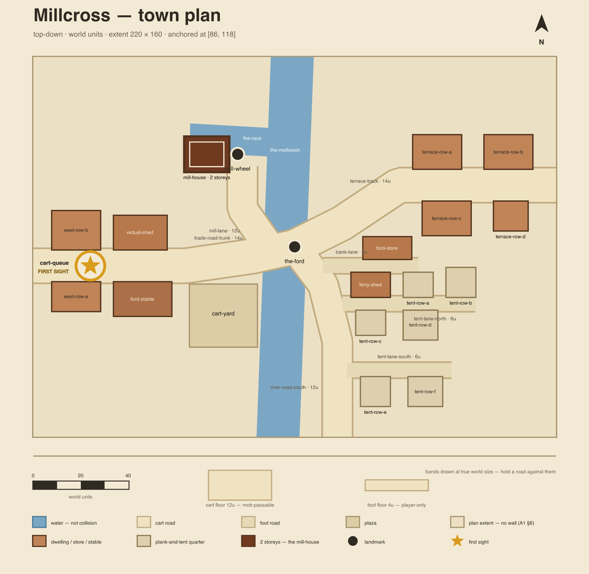

# A3 — Town plans

## 0. Spatial review of cluster-1 geography

A **read-only** pass over `content/maps/cluster1-geography.json` (`version: 1`, git blob
`48a0a115d5bd1a12f3cedf5486d11150b51c80a8`, node v26.5.0) against four criteria. Per the F-040
design §9 the geography file is **never written back** — this section *records*, it does not *fix*.
Every number below is reproduced by the command printed beneath it; run each from the repo root.

| # | Criterion | Verdict |
| --- | --- | --- |
| 1 | Roads routed sanely | **PASS with two recorded observations** |
| 2 | Zone polygons tile | **PASS — no interior gaps; 6 overlaps, all accepted** |
| 3 | Every town `at` lies inside its zone | **PASS — 7 of 7** |
| 4 | Coast and river do not self-intersect | **PASS — 0 self-intersections in either** |

Units are **km** throughout (`coordinateSystem.units`); the sheet is 150 km × 190 km, x east, y south.

---

### 0.1 Criterion 1 — roads routed sanely — **PASS (2 observations)**

All 8 roads: **0** duplicate consecutive vertices, **0** vertices off the 150 × 190 sheet, minimum
interior angle **149.0°** (no hairpins or backtracking spikes), detour ratio 1.001–1.068 (drawn
length vs straight line — every road is a nearly-direct route, none wanders).

The ford is coherent: `river.ford.at = [86,118]` is a **river vertex**, is Millcross's own `at`, and
is the shared endpoint of **3** roads (`trade-road-trunk`, `river-road-south`, `terrace-track`).
**0** road segment properly crosses the river anywhere — no road fords the water off-ford.

**Observation 1 — three roads name a non-place in `from`/`to`.** `east-rim-track.to =
"coastal-spur"` (a road id), `terrace-track-north.to = "northern-icefield"` (a zone id),
`cindervast-approach.from = "ashvale-front"` (a zone id). Each carries a `note` explaining the
join, so this reads as deliberate — but a consumer resolving road endpoints to town coordinates
must handle three id namespaces, not one.

**Observation 2 — two roads are *longer* than their `roadKm`.** `distances.drawnRoadsAreCentrelines`
states the drawn centre-line "runs 0–15% short of `roads[].roadKm`". Six roads honour that
(0.3%–14.9% short); `flat-crossing` is **4.6% long** and `terrace-track` is **1.3% long**. The
declared band is narrowly wrong, not the geometry.

Separately, `cindervast-approach` ends **6.00 km** from Cindervast's `at` — but only **2.81 km**
from `towns[cindervast].wallsOnly.gateAt`, i.e. it stops outside the gate of a ruin. Consistent with
A1 §7.1 ("not maintained"), not a defect.

```
node -e '
const g = require("./content/maps/cluster1-geography.json");
const P = {}; for (const t of g.towns) P[t.id] = t.at; for (const c of g.camps) P[c.id] = c.at;
const len = p => p.slice(1).reduce((a, q, i) => a + Math.hypot(q[0] - p[i][0], q[1] - p[i][1]), 0);
const cr = (o, a, b) => (a[0] - o[0]) * (b[1] - o[1]) - (a[1] - o[1]) * (b[0] - o[0]);
const X = (a, b, c, d) => { const d1 = cr(c, d, a), d2 = cr(c, d, b), d3 = cr(a, b, c), d4 = cr(a, b, d);
  return ((d1 > 0 && d2 < 0) || (d1 < 0 && d2 > 0)) && ((d3 > 0 && d4 < 0) || (d3 < 0 && d4 > 0)); };
const R = g.river.points; let dup = 0, oob = 0, cross = 0;
for (const r of g.roads) {
  const s = r.points[0], e = r.points[r.points.length - 1];
  const dA = P[r.from] ? Math.hypot(s[0] - P[r.from][0], s[1] - P[r.from][1]) : null;
  const dB = P[r.to] ? Math.hypot(e[0] - P[r.to][0], e[1] - P[r.to][1]) : null;
  let sharp = 180;
  for (let i = 1; i < r.points.length - 1; i++) {
    const u = [r.points[i][0] - r.points[i - 1][0], r.points[i][1] - r.points[i - 1][1]];
    const v = [r.points[i + 1][0] - r.points[i][0], r.points[i + 1][1] - r.points[i][1]];
    sharp = Math.min(sharp, 180 - Math.acos(Math.max(-1, Math.min(1, (u[0] * v[0] + u[1] * v[1]) / (Math.hypot(...u) * Math.hypot(...v))))) * 180 / Math.PI);
  }
  for (let i = 1; i < r.points.length; i++) if (r.points[i][0] === r.points[i - 1][0] && r.points[i][1] === r.points[i - 1][1]) dup++;
  for (const p of r.points) if (p[0] < 0 || p[0] > 150 || p[1] < 0 || p[1] > 190) oob++;
  for (let i = 0; i < r.points.length - 1; i++) for (let j = 0; j < R.length - 1; j++) if (X(r.points[i], r.points[i + 1], R[j], R[j + 1])) cross++;
  const d = len(r.points);
  console.log(r.id.padEnd(22), "endGapFrom=" + (dA === null ? "n/a(" + r.from + ")" : dA.toFixed(2)),
    "endGapTo=" + (dB === null ? "n/a(" + r.to + ")" : dB.toFixed(2)),
    "drawnKm=" + d.toFixed(1), "roadKm=" + r.roadKm,
    "shortBy=" + (r.roadKm == null ? "n/a" : (100 * (r.roadKm - d) / r.roadKm).toFixed(1) + "%"),
    "detour=" + (d / Math.hypot(e[0] - s[0], e[1] - s[1])).toFixed(3),
    "minInteriorAngle=" + sharp.toFixed(1));
}
console.log("TOTALS duplicateVertices=" + dup, "verticesOffSheet=" + oob, "properRoadXriverCrossings=" + cross);
const f = g.river.ford.at;
console.log("ford=" + JSON.stringify(f), "isRiverVertex=" + g.river.points.some(p => p[0] === f[0] && p[1] === f[1]),
  "roadsWithVertexOnFord=" + g.roads.filter(r => r.points.some(p => p[0] === f[0] && p[1] === f[1])).map(r => r.id).join("|"));
'
```

```
trade-road-trunk       endGapFrom=0.00 endGapTo=0.00 drawnKm=49.0 roadKm=55 shortBy=10.9% detour=1.013 minInteriorAngle=159.4
coastal-spur           endGapFrom=0.00 endGapTo=0.00 drawnKm=72.4 roadKm=85 shortBy=14.9% detour=1.017 minInteriorAngle=151.7
east-rim-track         endGapFrom=0.00 endGapTo=n/a(coastal-spur) drawnKm=42.9 roadKm=43 shortBy=0.3% detour=1.019 minInteriorAngle=149.0
flat-crossing          endGapFrom=0.00 endGapTo=0.00 drawnKm=31.4 roadKm=30 shortBy=-4.6% detour=1.046 minInteriorAngle=160.6
river-road-south       endGapFrom=0.00 endGapTo=0.00 drawnKm=59.8 roadKm=60 shortBy=0.3% detour=1.068 minInteriorAngle=156.6
terrace-track          endGapFrom=0.00 endGapTo=0.00 drawnKm=17.2 roadKm=17 shortBy=-1.3% detour=1.001 minInteriorAngle=175.0
terrace-track-north    endGapFrom=0.00 endGapTo=n/a(northern-icefield) drawnKm=71.5 roadKm=null shortBy=n/a detour=1.037 minInteriorAngle=160.9
cindervast-approach    endGapFrom=n/a(ashvale-front) endGapTo=6.00 drawnKm=73.7 roadKm=null shortBy=n/a detour=1.012 minInteriorAngle=166.3
TOTALS duplicateVertices=0 verticesOffSheet=0 properRoadXriverCrossings=0
ford=[86,118] isRiverVertex=true roadsWithVertexOnFord=trade-road-trunk|river-road-south|terrace-track
```

### 0.2 Criterion 2 — zone polygons tile — **PASS, all 6 overlaps accepted**

All 10 zone polygons are **simple and convex** (6–8 vertices each), so exact pairwise intersection
area is computed by Sutherland–Hodgman clipping. Sum of zone areas **12 335.5 km²**.

**Gaps: none.** A 0.5 km sampling grid over the whole sheet finds **11 113.3 km²** covered by
exactly one zone, **612.0 km²** by two or more, and **16 774.8 km²** uncovered — of which
**100%** is reachable from the sheet edge by flood fill, i.e. it is open sea and unzoned margin.
**Interior gaps: 0.0 km².** No hole is enclosed by zones. *Caveat of the method:* an unzoned notch
that touches the sheet edge is indistinguishable from open sea, so this proves no **enclosed** gap.

**Overlaps: 6 pairs, every one already accepted.** Nothing here is a new finding.

| Pair | Overlap | % of smaller zone | Status |
| --- | --- | --- | --- |
| `hollowmarch × ashvale-front` | 364.90 km² | 38.7% | **Intentional** — `ashvale-front` carries `gradient: true`; A1 §4.3 calls it a gradient, not a band |
| `emberdown × ashvale-front` | 169.56 km² | 17.4% | **Intentional** — same reason |
| `meltwash-terrace × hollowmarch` | 50.18 km² | 7.4% | **Explicitly accepted** (previously filed, not blocking) |
| `millcross-ford × rooktide-reach` | 19.32 km² | 2.9% | **Explicitly accepted** |
| `meltwash-terrace × thornveil` | 6.48 km² | 1.0% | **Explicitly accepted** |
| `meltwash-terrace × millcross-ford` | 3.69 km² | 0.6% | **Explicitly accepted** |

The four "explicitly accepted" rows reproduce the four already-filed figures exactly. They are
recorded here as accepted, **not** re-raised. F-040 decision D2 puts the town plan in its own local
coordinate space anchored to the geography `at` point, so region topology does not reach it.

```
node -e '
const g = require("./content/maps/cluster1-geography.json");
const area = p => { let a = 0; for (let i = 0; i < p.length; i++) { const j = (i + 1) % p.length; a += p[i][0] * p[j][1] - p[j][0] * p[i][1]; } return Math.abs(a / 2); };
const clip = (s, c) => { let o = s;
  for (let i = 0; i < c.length && o.length; i++) {
    const A = c[i], B = c[(i + 1) % c.length], side = p => (B[0] - A[0]) * (p[1] - A[1]) - (B[1] - A[1]) * (p[0] - A[0]);
    const inp = o; o = [];
    for (let j = 0; j < inp.length; j++) { const P = inp[j], Q = inp[(j + 1) % inp.length], sp = side(P), sq = side(Q);
      if (sp >= 0) o.push(P);
      if ((sp > 0 && sq < 0) || (sp < 0 && sq > 0)) { const t = sp / (sp - sq); o.push([P[0] + t * (Q[0] - P[0]), P[1] + t * (Q[1] - P[1])]); } } }
  return o; };
const Z = g.zones;
for (const z of Z) { const p = z.polygon; let pos = 0, neg = 0;
  for (let i = 0; i < p.length; i++) { const c = (p[(i + 1) % p.length][0] - p[i][0]) * (p[(i + 2) % p.length][1] - p[i][1]) - (p[(i + 1) % p.length][1] - p[i][1]) * (p[(i + 2) % p.length][0] - p[i][0]); if (c > 0) pos++; else if (c < 0) neg++; }
  console.log("zone", z.id.padEnd(18), "vertices=" + p.length, "convex=" + (pos === 0 || neg === 0), "areaKm2=" + area(p).toFixed(1)); }
const out = [];
for (let i = 0; i < Z.length; i++) for (let j = i + 1; j < Z.length; j++) {
  const a = clip(Z[i].polygon, Z[j].polygon), ov = a.length > 2 ? area(a) : 0;
  if (ov > 1e-9) out.push([Z[i].id, Z[j].id, ov, 100 * ov / Math.min(area(Z[i].polygon), area(Z[j].polygon))]); }
out.sort((a, b) => b[3] - a[3]);
for (const o of out) console.log("OVERLAP", o[0], "x", o[1], "areaKm2=" + o[2].toFixed(2), "pctOfSmaller=" + o[3].toFixed(1) + "%");
console.log("overlappingPairs=" + out.length, "sumZoneAreaKm2=" + Z.reduce((s, z) => s + area(z.polygon), 0).toFixed(1));
const pip = (p, poly) => { let c = false; for (let i = 0, j = poly.length - 1; i < poly.length; j = i++) { const [xi, yi] = poly[i], [xj, yj] = poly[j]; if ((yi > p[1]) !== (yj > p[1]) && p[0] < (xj - xi) * (p[1] - yi) / (yj - yi) + xi) c = !c; } return c; };
const S = 0.5, nx = 150 / S, ny = 190 / S, cov = new Int8Array(nx * ny);
for (let iy = 0; iy < ny; iy++) for (let ix = 0; ix < nx; ix++) { const p = [(ix + 0.5) * S, (iy + 0.5) * S]; let n = 0; for (const z of Z) if (pip(p, z.polygon)) n++; cov[iy * nx + ix] = Math.min(n, 2); }
let c0 = 0, c1 = 0, c2 = 0; for (const v of cov) { if (v === 0) c0++; else if (v === 1) c1++; else c2++; }
const seen = new Uint8Array(nx * ny), st = [];
for (let ix = 0; ix < nx; ix++) st.push(ix, ix + (ny - 1) * nx);
for (let iy = 0; iy < ny; iy++) st.push(iy * nx, iy * nx + nx - 1);
while (st.length) { const k = st.pop(); if (seen[k] || cov[k] !== 0) continue; seen[k] = 1; const x = k % nx, y = (k - x) / nx;
  if (x > 0) st.push(k - 1); if (x < nx - 1) st.push(k + 1); if (y > 0) st.push(k - nx); if (y < ny - 1) st.push(k + nx); }
let outside = 0; for (let k = 0; k < cov.length; k++) if (cov[k] === 0 && seen[k]) outside++;
const A = S * S;
console.log("grid=" + S + "km  coveredByExactly1=" + (c1 * A).toFixed(1) + "km2", "coveredBy2plus=" + (c2 * A).toFixed(1) + "km2",
  "uncovered=" + (c0 * A).toFixed(1) + "km2", "ofWhichEdgeReachable=" + (outside * A).toFixed(1) + "km2",
  "INTERIOR_GAPS=" + ((c0 - outside) * A).toFixed(1) + "km2");
'
```

```
zone meltwash-terrace   vertices=7 convex=true areaKm2=676.0
zone millcross-ford     vertices=6 convex=true areaKm2=664.0
zone rooktide-reach     vertices=8 convex=true areaKm2=1240.0
zone thornveil          vertices=7 convex=true areaKm2=1662.0
zone emberdown          vertices=7 convex=true areaKm2=974.0
zone gildmark-head      vertices=6 convex=true areaKm2=898.0
zone hollowmarch        vertices=7 convex=true areaKm2=944.0
zone ashvale-front      vertices=8 convex=true areaKm2=1628.0
zone northern-icefield  vertices=8 convex=true areaKm2=2654.5
zone cindervast         vertices=7 convex=true areaKm2=995.0
OVERLAP hollowmarch x ashvale-front areaKm2=364.90 pctOfSmaller=38.7%
OVERLAP emberdown x ashvale-front areaKm2=169.56 pctOfSmaller=17.4%
OVERLAP meltwash-terrace x hollowmarch areaKm2=50.18 pctOfSmaller=7.4%
OVERLAP millcross-ford x rooktide-reach areaKm2=19.32 pctOfSmaller=2.9%
OVERLAP meltwash-terrace x thornveil areaKm2=6.48 pctOfSmaller=1.0%
OVERLAP meltwash-terrace x millcross-ford areaKm2=3.69 pctOfSmaller=0.6%
overlappingPairs=6 sumZoneAreaKm2=12335.5
grid=0.5km  coveredByExactly1=11113.3km2 coveredBy2plus=612.0km2 uncovered=16774.8km2 ofWhichEdgeReachable=16774.8km2 INTERIOR_GAPS=0.0km2
```

### 0.3 Criterion 3 — every town `at` lies inside its zone — **PASS, 7 of 7**

All **6 towns and 1 camp** resolve to a zone that exists, and every `at` is strictly inside that
zone's polygon by ray casting. The tightest is the expedition camp at **4.99 km** from the
`meltwash-terrace` edge; Millcross itself sits **10.41 km** inside `millcross-ford`. Nothing is
near enough to an edge to be sensitive to rounding — which matters for F-040, since
`anchor.geographyAt: [98.2, 152.6]` — re-derived from the resolved-world join after the geography
mirror retired (2026-08-29; previously `[86, 118]`, inherited verbatim from the mirror).

```
node -e '
const g = require("./content/maps/cluster1-geography.json");
const pip = (p, poly) => { let c = false; for (let i = 0, j = poly.length - 1; i < poly.length; j = i++) { const [xi, yi] = poly[i], [xj, yj] = poly[j]; if ((yi > p[1]) !== (yj > p[1]) && p[0] < (xj - xi) * (p[1] - yi) / (yj - yi) + xi) c = !c; } return c; };
const seg = (p, a, b) => { const vx = b[0] - a[0], vy = b[1] - a[1], t = Math.max(0, Math.min(1, ((p[0] - a[0]) * vx + (p[1] - a[1]) * vy) / (vx * vx + vy * vy))); return Math.hypot(p[0] - (a[0] + t * vx), p[1] - (a[1] + t * vy)); };
const Z = Object.fromEntries(g.zones.map(z => [z.id, z.polygon]));
let bad = 0;
for (const e of [...g.towns.map(t => [t.id, t.at, t.zone, "town"]), ...g.camps.map(c => [c.id, c.at, c.zone, "camp"])]) {
  const poly = Z[e[2]];
  if (!poly) { bad++; console.log(e[3], e[0].padEnd(16), "zone=" + e[2], "NO SUCH ZONE"); continue; }
  const inside = pip(e[1], poly);
  let m = Infinity; for (let i = 0; i < poly.length; i++) m = Math.min(m, seg(e[1], poly[i], poly[(i + 1) % poly.length]));
  if (!inside) bad++;
  console.log(e[3], e[0].padEnd(16), "at=" + JSON.stringify(e[1]), "zone=" + e[2].padEnd(18), inside ? "INSIDE" : "OUTSIDE", "clearanceToEdgeKm=" + m.toFixed(2));
}
console.log("placesOutsideTheirZone=" + bad, "of", g.towns.length + g.camps.length);
'
```

```
town millcross        at=[86,118] zone=millcross-ford     INSIDE clearanceToEdgeKm=10.41
town gildmark         at=[11,157] zone=gildmark-head      INSIDE clearanceToEdgeKm=9.00
town embervale        at=[44,94] zone=emberdown          INSIDE clearanceToEdgeKm=10.75
town norhollow        at=[74,94] zone=hollowmarch        INSIDE clearanceToEdgeKm=9.45
town rooktide         at=[84,174] zone=rooktide-reach     INSIDE clearanceToEdgeKm=5.37
town cindervast       at=[46,12] zone=cindervast         INSIDE clearanceToEdgeKm=12.00
camp expedition-camp  at=[96,104] zone=meltwash-terrace   INSIDE clearanceToEdgeKm=4.99
placesOutsideTheirZone=0 of 7
```

### 0.4 Criterion 4 — coast and river do not self-intersect — **PASS**

Both polylines carry 20 points / 19 segments. Testing every **non-adjacent** segment pair for proper
crossing *and* for collinear touching: **0 intersections in the coastline, 0 in the river.** Neither
has a duplicate consecutive point. Minimum interior angle is **152.3°** (coast) and **111.6°**
(river) — no cusp tight enough to read as a drafting error.

```
node -e '
const g = require("./content/maps/cluster1-geography.json");
const cr = (o, a, b) => (a[0] - o[0]) * (b[1] - o[1]) - (a[1] - o[1]) * (b[0] - o[0]);
const on = (a, b, p) => Math.min(a[0], b[0]) - 1e-12 <= p[0] && p[0] <= Math.max(a[0], b[0]) + 1e-12 && Math.min(a[1], b[1]) - 1e-12 <= p[1] && p[1] <= Math.max(a[1], b[1]) + 1e-12;
const seg = (a, b, c, d) => { const d1 = cr(c, d, a), d2 = cr(c, d, b), d3 = cr(a, b, c), d4 = cr(a, b, d);
  if (((d1 > 0 && d2 < 0) || (d1 < 0 && d2 > 0)) && ((d3 > 0 && d4 < 0) || (d3 < 0 && d4 > 0))) return "proper";
  if (d1 === 0 && on(c, d, a)) return "collinear-touch"; if (d2 === 0 && on(c, d, b)) return "collinear-touch";
  if (d3 === 0 && on(a, b, c)) return "collinear-touch"; if (d4 === 0 && on(a, b, d)) return "collinear-touch";
  return null; };
for (const [name, pts] of [["coastline", g.coastline.points], ["river", g.river.points]]) {
  const hits = [];
  for (let i = 0; i < pts.length - 1; i++) for (let j = i + 2; j < pts.length - 1; j++) { const r = seg(pts[i], pts[i + 1], pts[j], pts[j + 1]); if (r) hits.push("seg" + i + "xseg" + j + ":" + r); }
  let dup = 0, spike = 180;
  for (let i = 1; i < pts.length; i++) if (pts[i][0] === pts[i - 1][0] && pts[i][1] === pts[i - 1][1]) dup++;
  for (let i = 1; i < pts.length - 1; i++) { const u = [pts[i][0] - pts[i - 1][0], pts[i][1] - pts[i - 1][1]], v = [pts[i + 1][0] - pts[i][0], pts[i + 1][1] - pts[i][1]];
    spike = Math.min(spike, 180 - Math.acos(Math.max(-1, Math.min(1, (u[0] * v[0] + u[1] * v[1]) / (Math.hypot(...u) * Math.hypot(...v))))) * 180 / Math.PI); }
  console.log(name.padEnd(10), "points=" + pts.length, "segments=" + (pts.length - 1),
    "nonAdjacentIntersections=" + hits.length, hits.join(",") || "(none)",
    "duplicateConsecutivePoints=" + dup, "minInteriorAngle=" + spike.toFixed(1));
}
'
```

```
coastline  points=20 segments=19 nonAdjacentIntersections=0 (none) duplicateConsecutivePoints=0 minInteriorAngle=152.3
river      points=20 segments=19 nonAdjacentIntersections=0 (none) duplicateConsecutivePoints=0 minInteriorAngle=111.6
```

### 0.5 What this section did not do

Nothing above was written back to `content/maps/cluster1-geography.json`, and the two observations
in §0.1 were **not** repaired. The review was scoped to exactly the four criteria; road–road
junction topology, coast × river interaction, terrain patches, the relay, the sea lane and the
`distances` residuals were not examined.

---

## 1. The scale contract, and where every number in it comes from

These are the project's first written spatial numbers. The point of this section is not the table —
it is the **derivation**. Every input below was read out of the server source; nothing was chosen by
eye.

### 1.1 The measured inputs

| input | value | verified in |
| --- | --- | --- |
| player radius | **1.3**, hard-clamped | `PLAYER_STATS.radius` in `colyseus-server/src/config/combat/combatStats.ts`. `colyseus-server/src/schemas/Player.ts` clamps it **twice**: `Math.min(PLAYER_STATS.radius, 1.3)` at construction (line 156), then a post-construction check that warns and resets anything above 1.3 (lines 185–189). A player cannot be wider than 2.6 units. |
| mob radii | **3 – 5** across the eight ordinary types | `colyseus-server/src/config/mobs/definitions/*.ts` |
| mob radii, **full** registered range | **3 – 9** — `doubleAttacker` 8, `thorncrownDrake` 9 | same directory; all ten types are registered in `colyseus-server/src/config/mobs/index.ts` |
| player speed | **20 u/s** | `PLAYER_STATS.maxMoveSpeed` |
| world | **1000 × 1000** | `worldWidth` / `worldHeight` in `colyseus-server/src/config/gameConfig.ts` |
| static collision bodies before F-040 | **4** — the world boundary walls | `colyseus-server/src/physics/PlanckPhysicsManager.ts` |

```
grep -rn "radius:" colyseus-server/src/config/mobs/definitions/*.ts
grep -n "radius\|maxMoveSpeed" colyseus-server/src/config/combat/combatStats.ts
grep -n "worldWidth\|worldHeight" colyseus-server/src/config/gameConfig.ts
```

```
definitions/spearThrower.ts:9:  radius: 3,
definitions/brambleStalker.ts:25:  radius: 3, // skirmisher
definitions/veilSpearling.ts:27:  radius: 3, // skirmisher
definitions/aggressive.ts:9:  radius: 3.5,
definitions/balanced.ts:9:  radius: 4,
definitions/hybrid.ts:9:  radius: 4,
definitions/defensive.ts:9:  radius: 5,
definitions/brambleDrake.ts:24:  radius: 5, // bruiser
definitions/doubleAttacker.ts:10:  radius: 8,
definitions/thorncrownDrake.ts:35:  radius: 9,
combat/combatStats.ts:  radius: 1.3, // Player radius must not exceed 1.3
combat/combatStats.ts:  maxMoveSpeed: 20,
gameConfig.ts:13:  worldWidth: 1000,
gameConfig.ts:14:  worldHeight: 1000,
```

### 1.2 The contract, with the arithmetic shown

| rule | floor | derivation, step by step |
| --- | --- | --- |
| `roads[].kind: "cart"` width | **≥ 12** | largest routed mob radius **5** → **diameter 10** → one unit of clearance either side → **12**. The mob, not the player, sets this number. |
| `roads[].kind: "foot"` width | **≥ 4** | player radius **1.3** → **diameter 2.6** → ~0.7 of clearance either side → **4**. |
| `extent` on both axes | **150 – 260** | D1: a town ~200 units across is **ten seconds to cross** at the measured 20 u/s (200 ÷ 20 = 10 s). The band is that figure with tolerance. |
| `footprints[].rect` shorter side | **≥ 6** | a building narrower than a mob is standing next to reads as a prop, not a mass. |

Millcross sits **above** every floor, deliberately: cart roads at **14, 14, 12, 12**; foot roads at
**6**; extent **220 × 160**.

### 1.3 The counter-intuitive fact, stated plainly

> **A street sized for a player is impassable to a bramble drake.**

A 4-unit alley clears a player (diameter 2.6) with 1.4 units to spare. A `brambleDrake` has radius 5
— diameter **10** — so it does not merely squeeze through that alley, it is short by **6 units** and
cannot enter at all. The consequence is a design commitment, not a tuning knob: **every `foot` road
authored in a town is permanently mob-free**, and any street a mob is ever routed down has to be
sized for the mob from the day it is drawn. Widening it later moves every footprint beside it.

Two corrections worth recording, since both touch this derivation:

- **The player-diameter figure.** 12 units is **4.6 player-diameters** (12 ÷ 2.6), i.e. **9.2 player
  *radii***. Design §3's callout says "roughly nine player-diameters"; the count is nine *radii*.
  The floor of 12 is unaffected — only the illustrative ratio was.
- **The mob band the floor was derived from is not the full registered range.** The 12-unit floor
  clears radius ≤ 5. Two of the ten registered mob types exceed that: `doubleAttacker` at **8**
  (needs 16 + clearance) and `thorncrownDrake` at **9** (the F-030 boss — needs 18 + clearance).
  Neither is routed through a town today, and design §10 question 3 has not decided whether mobs
  enter towns at all. **Recorded, not resolved** — see §6.

---

## 2. Millcross, derived from A1 §6

`docs/worldbuilding/A1-geography-cluster1.md` §6 dictates most of the plan. Each row below quotes it
**verbatim** (whitespace re-flowed only — the source is hard-wrapped) and states what the quote
forces in `content/towns/town-millcross.json`.

| A1 §6, verbatim | what it forces in the plan |
| --- | --- |
| "A town with no wall and no plan, built along both banks of a river crossing and spilling a quarter-mile up each road out of it." | **No wall, no gate footprint, no bounded core.** `footprints[].kind` never takes a wall or gate value in this file. Buildings are strung **along the roads out of the crossing** (ribbon sprawl) rather than packed round a centre, and both banks carry building. |
| "The silhouette is horizontal and low: one tall thing, the mill-wheel housing over the race, and everything else a single storey, solidly built — timber frames on stone footings, plastered walls, steep shingled roofs, real chimneys." *(amended 2026-08-29 with the materials upgrade and tent removal)* | **Exactly one `storeys: 2` mass** — `mill-house` — and it sits **at the race**. All 10 other footprints are `storeys: 1`. A second two-storey building anywhere in the file contradicts canon. |
| "**First thing a traveller sees: the cart queue.** It starts before the town does, sometimes a mile out, because one crossing serves an entire land." | `landmarks[].firstSight: true` belongs to **`cart-queue`** and nothing else, and it is placed **out along the trunk road, west of the town proper** — "before the town does". |
| "Millcross lives on the ford — tolls it refuses to formalise, stabling, ferrying at high water, and feeding whoever is waiting." | Four of the trades appear as buildings: **`ford-stable`** (stabling), **`ferry-shed`** (ferrying), **`victual-shed`** (feeding whoever is waiting). Tolls have no building by design — canon says they are *refused formalisation*, so a toll-house would contradict it. |
| "After the war it is the only town that grew: the refugee camps that once ringed the east bank came down when the timber rows went up, and the displaced still arrive — those on the road camp under canvas at the crossroads and move on." *(amended 2026-08-29, owner decision: the permanent tent quarter is removed from town truth; refugees' tents are a temporary road-side state, not a built quarter)* | **No tent rows.** `footprints[].kind` never takes `tent` — the value was removed from the schema enum and the renderer map in the same commit. The quarter's former foot lanes are gone with it; temporary camps in the story (`quests.json`, the Quartermaster's act) are canvas on the road, outside the built plan. |
| A1 §3.1, verbatim: "Gravel-bedded, fordable in a dozen places on foot, in **exactly one** by cart — that place is Millcross" | **One** cart crossing. The three canon cart roads meet at a single point, `the-ford` at `[110, 80]`, and no other road crosses the water. |

The resolved-world join supplies the rest of the frame (2026-08-29, mirror retired):
`anchor.geographyAt = [98.2, 152.6]` (→ the plan's `anchor`), `river.id = "the-meltwash"`,
`river.ford.label = "the ford"`, and the three road ids that §0.1 measured as sharing the ford vertex — `trade-road-trunk`,
`river-road-south`, `terrace-track`.

---

## 3. Canon vs invented — every id and every coordinate class

This table exists to catch one specific defect: **an element that is in the JSON and not in this
table.** Coverage is verified mechanically in §3.3, not by reading.

Three classes are used:

- **CANON-ID** — the id string itself is lifted verbatim from a canon file.
- **CANON-THING** — A1 §6 (or §3.1) names the *thing*; the id string is authored.
- **INVENTED** — no canon referent at all; design-open.

### 3.1 The 22 ids in `content/towns/town-millcross.json`

> **Citation note (2026-08-29):** rows below citing `cluster1-geography.json` are historical — the
> geography mirror retired on `release/1.8` (9cd227c). The live authority is the resolved-world join
> (`content/world/resolved/`, regenerated by `scripts/check_resolved.mjs --write`) and the spine;
> the anchor re-derived from it is `[98.2, 152.6]`, not the mirror's `[86, 118]`.

| id (and where it lives) | class | canon warrant — verbatim | invented |
| --- | --- | --- | --- |
| `the-meltwash` — `water[0]` | **CANON-ID** | `cluster1-geography.json`: `river.id: "the-meltwash"`, `river.name: "the Meltwash"` | its in-town polygon; that it runs the full height of the plan |
| `the-race` — `water[1]` | CANON-THING | A1 §6: "the mill-wheel housing over the race" | id string `the-race`; `kind: "race"`; its polygon; that it runs **west** off the river |
| `trade-road-trunk` — `roads[0]` | **CANON-ID** | `cluster1-geography.json` `roads[].id`; §0.1 measured it with a vertex on the ford `[86,118]` | in-town `points`; `width: 14`; that it runs west from the ford |
| `terrace-track` — `roads[1]` | **CANON-ID** | as above | in-town `points`; `width: 14`; that it runs north-east |
| `river-road-south` — `roads[2]` | **CANON-ID** | as above | in-town `points`; `width: 12`; that it runs south-east |
| `mill-lane` — `roads[3]` | INVENTED | — | everything: the id, that a cart lane serves the mill at all, `width: 12`, its route |
| `bank-lane` — `roads[4]` | INVENTED | — | everything: id, `kind: "foot"`, `width: 6`, route along the east bank |
| `mill-house` — `footprints[0]` | CANON-THING | A1 §6: "one tall thing, the mill-wheel housing over the race, and everything else a single storey" | id string; `rect`; `kind: "mill"`; `entranceOn: "mill-lane"`. **`storeys: 2` is canon-forced; its being the only one is canon-forced.** |
| `victual-shed` — `footprints[1]` | CANON-THING | A1 §6: "feeding whoever is waiting" | id string; `rect`; `kind: "store"`; that it fronts the trunk road |
| `ford-stable` — `footprints[2]` | CANON-THING | A1 §6: "stabling" | id string; `rect`; `kind: "stable"`; siting west of the cart yard |
| `west-row-a` — `footprints[3]` | INVENTED | *(pattern only: "built along both banks")* | the dwelling itself, id, `rect`, `kind: "dwelling"` |
| `west-row-b` — `footprints[4]` | INVENTED | *(pattern only, as above)* | as above |
| `ford-store` — `footprints[5]` | INVENTED | — | everything: id, `rect`, `kind: "store"`, east-bank siting |
| `ferry-shed` — `footprints[6]` | CANON-THING | A1 §6: "ferrying at high water" | id string; `rect`; `kind: "store"`; that it sits on the east bank |
| `terrace-row-a` — `footprints[7]` | INVENTED | *(pattern only: "spilling a quarter-mile up each road out of it")* | the dwelling itself, id, `rect`, siting on the terrace road |
| `terrace-row-b` — `footprints[8]` | INVENTED | *(pattern only, as above)* | as above |
| `terrace-row-c` — `footprints[9]` | INVENTED | *(pattern only, as above)* | as above |
| `terrace-row-d` — `footprints[10]` | INVENTED | *(pattern only, as above)* | as above |
| `cart-yard` — `plazas[0]` | CANON-THING | A1 §6: "It starts before the town does, sometimes a mile out, because one crossing serves an entire land." — the queue is canon; **the yard it stands in is design §6's derivation, not a canon noun** | id string; `rect`; the `why` sentence; siting west of the ford |
| `cart-queue` — `landmarks[0]` | CANON-THING | A1 §6: "**First thing a traveller sees: the cart queue.**" | id string; `at: [24, 88]`. `firstSight: true` is canon-forced. |
| `the-ford` — `landmarks[1]` | CANON-THING | `cluster1-geography.json` `river.ford.label: "the ford"`; A1 §3.1 "in **exactly one** by cart — that place is Millcross" | id string `the-ford`; `at: [110, 80]` in local space |
| `mill-wheel` — `landmarks[2]` | CANON-THING | A1 §6: "the mill-wheel housing over the race" | id string; `at: [86, 41]` |

**Counts: 4 CANON-ID · 9 CANON-THING · 9 INVENTED = 22.** Two further identifiers sit outside the
`id` fields and are both **CANON-ID**: `town: "millcross"` (`spineId`) and `anchor.geographyAt:
[98.2, 152.6]` (resolved-world join, re-derived 2026-08-29).

### 3.2 Every coordinate, width and count is invented

A1 §6 is prose. **It carries no geometry whatsoever** — not one number. So the whole numeric surface
of the file is authored, and this is the honest half of the table:

| numeric class | in the file | status |
| --- | --- | --- |
| `extent` | `220 × 160` | **INVENTED**, inside design §3's 150–260 band and D1's "~200 across" |
| `anchor.geographyAt` | `[86, 118]` | **CANON** — copied from `towns[millcross].at` |
| `water[].poly` | 2 polygons, **8 vertices** total | INVENTED |
| `roads[].points` | 5 polylines, **17 vertices** total | INVENTED |
| `roads[].width` | cart `14, 14, 12, 12` · foot `6` | INVENTED — the **floors** (12 / 4) are design §3; every value above them is chosen |
| `roads[].kind` | 4 `cart`, 1 `foot` | INVENTED (the enum is schema; the assignment is authored) |
| `footprints[].rect` | **11** rects | INVENTED |
| `footprints[].kind` | `mill`, `store`, `stable`, `dwelling` in use | mostly INVENTED; `mill` is canon-forced by §2; `tent` was removed from the schema enum and this plan with the quarter (owner decision 2026-08-29) |
| `footprints[].storeys` | `2` on `mill-house`; `1` on the other **10** | **canon-forced values, authored fields** — A1 §6 says "everything else a single storey"; writing the number down is authoring |
| `footprints[].entranceOn` | 11 assignments across 5 roads | INVENTED |
| `plazas[].rect` + `why` | 1 rect, 1 sentence | INVENTED |
| `landmarks[].at` | 3 points | INVENTED |
| `landmarks[].firstSight` | 1 (`cart-queue`) | **canon-forced** — A1 §6 names the cart queue |
| `landmarks[].source` | 3 citation strings | INVENTED (provenance metadata, not canon text) |
| element counts | 2 water · 7 roads · 17 footprints · 1 plaza · 3 landmarks | INVENTED |

### 3.3 How coverage was verified

Not by reading. The command below enumerates every `id` in the JSON, then checks each one appears as
an inline-code token in §3.1 of this document, **and** checks §3.1 introduces no id the JSON does not
contain (the reverse direction — a table row for a building that was deleted is the same defect
wearing a different hat). Run from the repo root:

```
node -e '
const fs = require("fs");
const p = JSON.parse(fs.readFileSync("content/towns/town-millcross.json", "utf8"));
const doc = fs.readFileSync("docs/worldbuilding/A3-town-plans.md", "utf8");
const sec = doc.slice(doc.indexOf("### 3.1 The 30 ids"), doc.indexOf("### 3.2 Every coordinate"));
const jsonIds = [...p.water, ...p.roads, ...p.footprints, ...p.plazas, ...p.landmarks].map(x => x.id);
const tableIds = [...new Set([...sec.matchAll(/^\| `([a-z0-9-]+)` —/gm)].map(m => m[1]))];
const missing = jsonIds.filter(i => !tableIds.includes(i));
const extra = tableIds.filter(i => !jsonIds.includes(i));
console.log("idsInJson=" + jsonIds.length, "idsInTable=" + tableIds.length);
console.log("inJsonNotInTable=" + (missing.join(",") || "(none)"));
console.log("inTableNotInJson=" + (extra.join(",") || "(none)"));
console.log("duplicateIdsInJson=" + (jsonIds.length - new Set(jsonIds).size));
console.log(missing.length === 0 && extra.length === 0 ? "COVERAGE OK" : "COVERAGE DEFECT");
'
```

```
idsInJson=30 idsInTable=30
inJsonNotInTable=(none)
inTableNotInJson=(none)
duplicateIdsInJson=0
COVERAGE OK
```

The **canon** quotes were verified the same way — whitespace-normalising `A1-geography-cluster1.md`
and asserting `String.prototype.includes` for each quoted passage, rather than trusting a
transcription. All six §2 quotes and the §3.1 warrants resolve to `OK`; the source is hard-wrapped,
so a line-oriented `grep -F` reports false misses on any quote that spans a line break.

---

## 4. The render



Regenerated by:

```
node tools/art-forge/generate/townplan.mjs \
  --plan content/towns/town-millcross.json \
  --out docs/worldbuilding/A3-town-millcross-plan.png
```

Roads are drawn at **true width**, so the 12-unit cart road is checkable against the scale bar by
eye — the point of §1.3 is visible rather than asserted.

---

## 5. The accepted layout judgement — the river runs north–south

**In `town-millcross.json` the Meltwash runs north–south down the middle of the plan.** Design §2's
example JSON draws a water band horizontally (`"poly": [[0,52],[220,58],[220,74],[0,68]]`). That
block is **schema illustration, not layout**, and the plan does not follow it. Two reasons, both
checkable:

1. **The parent map already fixed the axis.** In `content/maps/cluster1-geography.json` the Meltwash
   passes the ford at `[86,118]` running **north–south**: the neighbouring river vertices are
   `[90,106]` and `[88,128]`, a local run of **Δx = 2 against Δy = 22**. A town plan whose river ran
   east–west would contradict the world map it is anchored to.
2. **A1 §6 requires an east bank.** "the refugee camps on the **east bank** never came down" — an
   east bank only exists if the river separates east from west, i.e. if it runs north–south. A
   horizontal river gives Millcross a north bank and a south bank and leaves the refugee quarter
   nowhere to stand.

```
node -e '
const g = require("./content/maps/cluster1-geography.json");
const p = g.river.points, i = p.findIndex(q => q[0] === 86 && q[1] === 118);
console.log("fordVertexIndex=" + i, JSON.stringify(p.slice(i - 1, i + 2)));
console.log("localRun dx=" + Math.abs(p[i + 1][0] - p[i - 1][0]), "dy=" + Math.abs(p[i + 1][1] - p[i - 1][1]));
'
```

```
fordVertexIndex=8 [[90,106],[86,118],[88,128]]
localRun dx=2 dy=22
```

The three canon cart roads therefore converge on the ford from **west** (`trade-road-trunk`),
**north-east** (`terrace-track`) and **south-east** (`river-road-south`), and the east bank carries
the ford-store and ferry-shed below the terrace road.

---

## 6. Open questions, carried forward unresolved

These are design §10's four questions, reproduced as they stand. **This document does not answer
them.** They are recorded here so the next town plan inherits them rather than re-deciding them by
accident.

| # | question (design §10, verbatim) | why it stays open |
| --- | --- | --- |
| 1 | "**Does water block, slow, or drown?** Not decided; §5 deliberately leaves `water[]` non-physical." | The collision binder emits bodies for footprints only. `the-meltwash` and `the-race` are drawn and are not solid. |
| 2 | "**Where does a town plan attach to the runtime map?** Needs the Systems Designer's topology call (DR-001 §6.4.2). The `anchor` field is the seam." | `anchor.geographyAt: [86,118]` is written and correct; nothing consumes it at runtime. D2 put the plan in its own local space precisely so this could stay open. |
| 3 | "**Do mobs enter towns?** T3's 12-unit floor assumes yes. If towns are mob-free, `cart` roads could be much narrower and towns would tighten considerably." | This is the load-bearing one. §1.2's entire cart-road derivation rests on the *yes* branch, and §1.3 records that even *yes* is only satisfied for mob radius ≤ 5. |
| 4 | "**Interiors?** `entranceOn` implies a door. Whether it leads anywhere is out of scope." | 17 footprints carry `entranceOn`; none of them opens onto anything. |


