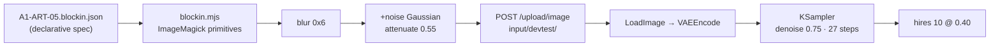

# ABP · FLUX.1-dev evaluation + the composition anchor

**Date:** 2026-08-01 · **Branch:** `feat/F-024` · **Hardware:** GPU 1 (RTX 3090, 24 GB), ComfyUI 0.24.1 on
`127.0.0.1:8189` · **Follows:** `ABP-flux-eval.md` · **Licence context:** `DR-002-flux-dev-licence-risk.md`

Two jobs ran in this round, and they have **different answers**:

1. Does FLUX.1-dev close the brief-fidelity gap that schnell could not?
2. Does a deterministic composition anchor fix the composition failure both models share?

## Verdict up front

<div class="callout warn">

**Job 1 — dev fixes fidelity _partially_, and it is not the clean win the hypothesis predicted.**

Dev is **decisively better on Norhollow** — it holds the stated palette, drops every anachronism, and
**does not reproduce the "CALENER SAFE" watermark**. It is **marginally better on Gildmark**, and on
_detail density_ it is arguably **worse than schnell**. It also introduces a **new** failure schnell did
not have: **style instability** — output swings between photoreal, plastic 3D-render and flat vector
illustration depending on guidance and latent source. That is criterion **A8 (set coherence)**, and dev
fails it harder than schnell did.

</div>

<div class="callout success">

**Job 2 — the composition anchor works, and it is the most valuable result of the round.**

Anchoring an img2img pass on a programmatically-drawn block-in **converts A5 from a hard fail to a clear
pass**, and it does something the hypothesis did not predict: it **also repairs brief fidelity** for
large spatial elements. Gildmark's mudflat and sandbar — absent from every un-anchored arm on both
models — appear reliably, because they were _drawn_ rather than described.

**The working denoise window is `0.70–0.78`, and it only exists if the block-in carries grain.**

</div>

<div class="callout danger">

**The watermark blocker is not gone — it moved.** Plain dev renders are clean (verified by 1:1 corner
crops). The **anchored** render re-introduces hallucinated signature text in **both** bottom corners
("©Llaman Wnalo", "Way Miamk der Sioucle Icourgl."). The painterly/canvas look the colour anchor induces
is what triggers it. Item 4 of the previous doc — an artifact gate — is still required, and is now
**more** urgent, not less.

</div>

## Method

- **Subjects and prompts:** identical to `ABP-flux-eval.md` — `A1-ART-05 Gildmark` and
  `A1-ART-04 Norhollow`, taken **byte-identical** from `tools/art-forge/out/l1/briefs.tsv` by reading the
  TSV, not retyped. Seed `12345` throughout, so schnell → dev → anchored is a clean comparison.
- **Execution:** strictly sequential on `:8189`. The runner asserts the queue is empty before every job
  and aborts on any job it did not queue. It never saw one.
- **Arm coupling:** each subject's base and hires passes ran as **one graph with two `SaveImage` nodes**,
  so hires refines the byte-identical base rather than a re-roll.
- **Nothing on the remote host was reconfigured or restarted.** The only write was uploading two block-in
  PNGs via the standard `POST /upload/image` API into an `input/devtest/` subfolder — this is ordinary
  img2img usage and the only way to drive `LoadImage` from a locally-generated image.

### Where the dev graph came from

Discovered from the running instance, not guessed:

1. `GET /templates/index.json` → located `flux_dev_checkpoint_example` ("Flux.1 Dev fp8: Text to Image").
2. `GET /templates/flux_dev_checkpoint_example.json` → its wiring lives in a **subgraph definition**
   (`definitions.subgraphs`), not the root `nodes` array. Read the subgraph's nodes and link list.
3. `GET /object_info/CheckpointLoaderSimple` → confirmed `flux1-dev-fp8.safetensors` is visible and that
   the all-in-one checkpoint supplies `MODEL, CLIP, VAE`, so `UNETLoader` + `DualCLIPLoader` + `VAELoader`
   are unnecessary.
4. `GET /object_info/FluxGuidance` → `conditioning` + `guidance` (FLOAT, default 3.5).

**Two corrections to the assumptions this round started with:**

- The shipped dev template runs **20 steps, cfg 1, `euler`/`simple`, denoise 1** — matching the brief's
  expectation — but it contains **no `FluxGuidance` node at all**. ComfyUI's Flux path defaults `guidance`
  to **3.5** when no node sets it, so the template is implicitly a guidance-3.5 graph. Adding the node
  explicitly is still correct: it makes the value **recorded and reproducible** rather than an
  invisible default.
- The template uses **`ConditioningZeroOut`** for the negative, not schnell's empty `CLIPTextEncode`. At
  cfg 1 both are inert, but this graph follows the authoritative dev template.

### Settings

| arm             | model               | steps  | cfg | guidance |  denoise | size      |
| --------------- | ------------------- | ------ | --: | -------: | -------: | --------- |
| **D-base**      | `flux1-dev-fp8`     | 20     |   1 |  **5.0** |      1.0 | 1280×832  |
| **D-hires**     | same, 2nd pass      | 10     |   1 |      5.0 |     0.40 | 1920×1248 |
| **D-anchored**  | same, img2img       | 27     |   1 |      5.0 | **0.75** | 1280×832  |
| _F-hires (ref)_ | `flux1-schnell-fp8` | 4 / 10 |   1 |   _none_ |  1.0/0.4 | —         |

**Cost.** Warm, a dev base is ~13 s and base+hires ~81 s — the same order as schnell and still well under
the old T48 baseline. Dev is not expensive here.

## Job 1 — does dev fix fidelity?

### The guidance sweep — the decisive experiment

Guidance is the lever schnell structurally lacks, so it was swept before anything else, on both subjects,
same seed, 20 steps.

| guidance | Gildmark                                                            | Norhollow                                                            |
| -------- | ------------------------------------------------------------------- | -------------------------------------------------------------------- |
| 2.5      | soft, generic; driftwood on the beach is the closest thing to hulls | —                                                                    |
| 3.5      | tower cap is an open railed platform, not glazed                    | **weathered oak ✓, frost-white ✓, crossed-stakes emblem ✓**          |
| **5.0**  | terraces read as tiers; glazed lantern appears                      | **best overall** — palette held, palisade dominates, roof-peak above |
| 7.0      | **best structure** — genuinely stepped mass, clear glazed lantern   | **worst** — season flips to summer green, palisade stops dominating  |

<div class="callout idea">

**Guidance is a real lever, but it is subject-dependent and it trades off.** Higher guidance buys
_structural_ adherence (Gildmark's terraces and glazed cap) and costs _atmospheric_ adherence (Norhollow's
frost-white winter becomes summer). There is no single value that maximises both subjects. **5.0 was
chosen as the standard** because it is the best compromise; 7.0 is defensible for architectural subjects
only. This is a genuine finding and it means "set guidance and forget it" is wrong.

</div>

### The hires pass — a documented rule that does _not_ transfer

`ABP-flux-eval.md` derived `steps = ceil(native_steps / denoise)` for the hires pass, because at schnell's
native 4 steps a naive 10×0.40 pass does nothing. Applied to dev (native 20), that rule demands **50 steps
at denoise 0.40**. Both were run and measured on the same base image, at 1:1 crops:

| hires variant            | edge energy (Laplacian σ) |   vs base |
| ------------------------ | ------------------------: | --------: |
| base, upsampled to match |                    0.0206 |         — |
| **10 steps @ 0.40**      |                **0.0386** | **+87 %** |
| 50 steps @ 0.40          |                    0.0394 |     +91 % |

**The rule does not need re-scaling for dev.** 50 steps buys **+2 %** for roughly 5× the sampler work at
1920×1248, and visually it slightly _over-smooths_ the stonework. **10 steps at 0.40 is correct for dev**,
exactly as the brief specified. The schnell rule was a fix for a **distilled** model's 4-step schedule, not
a general law — worth recording so nobody "corrects" the dev recipe upward later.

### Per-criterion scoring against §6.0

**✗** fails · **~** partial · **✓** clears the bar

#### A1-ART-05 Gildmark

| #      | criterion            | schnell-hires | dev-hires | dev-anchored |
| ------ | -------------------- | ------------- | --------- | ------------ |
| **A1** | detail density       | **✓**         | ~         | **✓**        |
| **A2** | depth                | ✓             | ~         | **✓**        |
| **A3** | material read        | ✓             | ~         | ✓            |
| **A4** | light                | ✓             | ✓         | ✓            |
| **A5** | composition          | ✗             | ✗         | **✓**        |
| **A6** | thumbnail legibility | ✓             | ✓         | ✓            |
| **A7** | brief fidelity       | ✗             | ~         | **~+**       |
| **A8** | set coherence        | ~             | ✗         | ✗            |

#### A1-ART-04 Norhollow

| #      | criterion            | schnell-hires | dev-hires |
| ------ | -------------------- | ------------- | --------- |
| **A1** | detail density       | **✓**         | ~         |
| **A2** | depth                | ✓             | ✓         |
| **A3** | material read        | ✓             | ~         |
| **A4** | light                | ✓             | ~         |
| **A5** | composition          | ✗             | ✗         |
| **A6** | thumbnail legibility | ✓             | ✓         |
| **A7** | brief fidelity       | ✗             | **✓**     |
| **A8** | set coherence        | ~             | ✗         |

### Named specifics — the things schnell dropped

| Gildmark brief element        | schnell | dev (g5.0)          | dev-anchored             |
| ----------------------------- | ------- | ------------------- | ------------------------ |
| five terraces                 | ~       | ~ (3–4 tiers)       | ~ (2–3 tiers)            |
| tarred black seaward faces    | ✗       | ✗                   | ~ (dark base wall)       |
| slim tower, **glazed cap**    | ✓       | **✓ clear lantern** | **✓ clear lantern**      |
| **mudflat / sandbar**         | ✗       | ~ (a beach)         | **✓ unmistakable**       |
| **wrecked hulls**             | ✗       | ✗                   | ✗ (ribs became rocks)    |
| deep green water              | ~       | ✓                   | ✓                        |
| palette gold / crimson / grey | ✗       | ~                   | **✓**                    |
| harbour-scale emblem          | ✗       | ✗                   | ~ (plaque over the door) |

| Norhollow brief element                                | schnell                    | dev (g5.0)        |
| ------------------------------------------------------ | -------------------------- | ----------------- |
| palisade dominates the silhouette                      | ✓                          | ✓                 |
| only roof-peaks and smoke above                        | ✗ (chateau + gantry crane) | **✓**             |
| palette hollow-green / frost-white / **weathered oak** | **✗ charred black**        | **✓**             |
| bell-over-crossed-stakes emblem                        | ✗                          | **✓ on the gate** |
| waist-high tally boards                                | ✗                          | ✗                 |
| figures in layered furs                                | ~                          | ✗                 |
| **hallucinated "CALENER SAFE"**                        | **present — blocker**      | **✓ absent**      |

**Dev's clearest win is Norhollow's palette and anachronism control.** Schnell rendered "weathered oak" as
charred black and invented a modern steel gantry crane; dev renders weathered oak, keeps the ore-head
reading, and puts the emblem on the gate lintel where the brief asks for it.

**Dev's clearest loss is A1 and A8.** Compare the two dev images on `_sheet.png`: Gildmark reads as a
smooth **3D game render**, Norhollow as **flat vector illustration**. They do not read as the same world,
and neither reads as a painting. Schnell's two images, whatever else was wrong with them, at least shared
a medium.

## Job 2 — the composition anchor

### Design

The creature path already has the governing law, recorded in `tools/art-forge/prompts/style-laws.json`:

> _"text alone CANNOT hold head-body ratio — must anchor with an image."_

The environment equivalent is a **flat value/colour block-in of the brief's stated camera**, drawn
**programmatically from a declarative spec** so it is deterministic and reusable rather than hand-made per
image. The spec encodes only what text demonstrably cannot hold:

- **horizon height** · **foreground occluding mass** · **midground silhouette** · **plane separation** ·
  **where the focal point sits in the frame**

It deliberately encodes **no detail**. Detail is the sampler's job; layout is the anchor's job.
Coordinates are normalised `0..1`, so one spec is resolution-independent. Masses draw back-to-front
(painter's algorithm).



### The two findings that make it work

<div class="callout danger">

**Finding 1 — a flat block-in hijacks _style_, not just layout. This was the failure that nearly sank the
experiment.**

The first sweep used clean flat grey shapes. At **every** denoise from 0.60 to 0.85 the output came back
as **flat vector poster art** — the model read flat regions as a flat graphic medium. Output PNGs were
**0.4 MB**; nothing rendered. By 0.90, where it finally began to render, the layout was **already lost**
(back to a centred symmetric island). **There was no window at all.**

</div>

<div class="callout success">

**Finding 2 — grain creates the window.**

A flat region carries no high-frequency content, so at any workable denoise the sampler has nothing to
grow texture from. Adding Gaussian grain (`-attenuate 0.55 +noise Gaussian`) gives every region something
to develop. Same specs, same seeds, same denoises: PNGs went **0.4 MB → 1.9 MB** and the images rendered
fully. **Grain is not a nicety; without it the anchor does not function.**

</div>

### The denoise window — measured

Colour block-in, Gildmark, seed 12345, guidance 5.0, `steps = ceil(20 / denoise)`:

| denoise  | renders?                | layout held?                   | verdict         |
| -------- | ----------------------- | ------------------------------ | --------------- |
| 0.50     | ✗ flat geometric shapes | ✓ (trivially)                  | unusable        |
| 0.60     | ~ thin, under-populated | ✓ strongly                     | too low         |
| 0.65     | ✓ but sparse            | ✓                              | marginal        |
| **0.70** | **✓**                   | **✓**                          | **usable**      |
| **0.75** | **✓ richest**           | **✓**                          | **recommended** |
| 0.78     | ✓                       | ✓ (edge)                       | upper bound     |
| 0.80     | ✓                       | ~ mass drifting back to centre | degrading       |
| 0.85     | ✓                       | ✗ centred symmetric island     | lost            |
| 0.90     | ✓                       | ✗                              | lost            |

<div class="metric-grid">
<div class="metric-tile"><strong>0.70 – 0.78</strong><br/>the anchor window</div>
<div class="metric-tile"><strong>0.75</strong><br/>recommended value</div>
<div class="metric-tile alarm"><strong>grain required</strong><br/>no window without it</div>
</div>

For comparison, the creature path's numbers are **0.82 destroys layout / 0.30–0.60 nothing renders**. The
environment window sits **lower and narrower** — the layout signal in a block-in is spatially coarser and
therefore easier for the sampler to overwrite than a creature silhouette.

### Did it fix composition?

**Yes.** Against the un-anchored render of the same brief, same model, same seed:

- **Un-anchored (D-hires):** a single mass centred in the frame on an empty backdrop. The A5 failure
  verbatim.
- **Anchored (D-anchored):** headland mass on the **left third**; the glazed tower reads as a deliberate
  focal point at the upper-left thirds intersection; the mudflat sweeps **right** into distance; dark
  foreground rocks frame **both** bottom corners; four genuine depth planes (foreground rocks → headland →
  sandbar → distant hills).

**And it improved brief fidelity as a side effect** — the most useful surprise of the round. The mudflat
and sandbar are absent from every un-anchored arm on both models, and present and unmistakable in the
anchored one, **because they were drawn as shapes**. The anchor is not only a composition tool; it is a
_placement_ tool for spatial brief elements that text cannot pin down.

**The limit is scale.** Large drawn masses (mudflat, sandbar, headland, tower) survive reliably. The three
small **hull-rib** shapes degraded into generic rocks. Below roughly 3–4 % of frame width, drawn props do
not survive the denoise — those still need prompt text or a later pass.

<div class="callout warn">

**Honest negative on measurement.** Two automated composition metrics were attempted — a Laplacian
edge-energy centroid and a sky-band silhouette centroid — and **both are degenerate**: the first returns
`x ≈ 0.497` for every image regardless of composition (auto-level flattens it), the second is dominated by
clouds and distant coastline. They are recorded here so nobody re-tries them naively. **A5 was scored by
eye**, which is what §6.0 specifies anyway ("judged per image against the pinned references").

</div>

## Does either job clear the bar?

**Job 1: no.** Dev is a genuine improvement on brief fidelity for _atmospheric and palette_ terms and
removes the watermark blocker on plain renders — but it does not deliver the named props (tarred black
faces, wrecked hulls, tally boards), it regresses on detail density, and it fails **A8 set coherence**
harder than schnell. Reporting "dev fixes fidelity" would be overselling. **Dev fixes about half of it and
breaks something else.**

**Job 2: yes, for its stated scope.** The anchor converts A5 from a hard fail to a clear pass, is
deterministic and reusable, and improves A7 for large spatial elements. It is the first thing in four
rounds that fixed the criterion it targeted. **It is also the finding that most reduces the case for dev**
— per `DR-002`, "the composition anchor closing the fidelity gap well enough on schnell alone" is an
explicit reversal condition for the licence risk, and the anchor has **not been tested on schnell yet**.

## What should change in `tools/art-forge/`

Recommendations only — **no tooling under `tools/art-forge/` was modified or committed** in this
evaluation. The generator and specs written during it live in the git-ignored
`tools/art-forge/out/devtest/anchor/` so they are reproducible, and are listed here for promotion.

1. **Promote the block-in generator to `tools/art-forge/generate/blockin.mjs`**, with specs at
   `tools/art-forge/prompts/blockin/<subject>.json`. It is ~60 lines and shells out to ImageMagick; it has
   no npm dependency.
2. **Record the grain requirement as a law in `style-laws.json`**, alongside the head-body-ratio law it
   generalises: _"a flat block-in anchors layout but hijacks medium — the anchor MUST carry grain or the
   sampler returns flat vector art."_ This is the single most expensive thing to rediscover.
3. **Record the anchor window (`0.70–0.78`, default `0.75`) in `forge.config.json`**, distinct from the
   creature `denoise 0.82`. One config key per asset class, not one shared number.
4. **Do not re-scale the hires rule for dev.** Encode `hires = 10 steps @ 0.40` for both models and note
   that `steps = ceil(native/denoise)` was a distilled-model correction, not a general law.
5. **Ship the artifact gate — now genuinely blocking.** Item 4 of `ABP-flux-eval.md` is unresolved and the
   anchored path re-introduces corner signature text. At minimum, flag high-contrast text-like regions in
   image corners before a render is accepted. Both anchored corners would have been caught.
6. **Record `guidance` in the manifest `gen` block**, and record that it is **subject-dependent** (5.0
   default, 7.0 for architectural subjects, never 7.0 for seasonal/atmospheric ones).
7. **Test the anchor on schnell before adopting dev.** This is the cheapest high-value experiment
   remaining and it is a stated reversal condition in `DR-002`. Schnell beat dev on A1 detail density; if
   the anchor supplies the composition and placement, **schnell + anchor may dominate dev + anchor** — and
   schnell is Apache-2.0, which removes the licence exposure entirely.
8. **Fix A8 before any batch run.** Dev's medium swings between photoreal, 3D-render and flat vector. A
   set of L1 illustrations generated this way will not read as one world. A fixed style-prefix string, or
   a shared anchor treatment across all subjects in a set, needs to be validated first.
9. **Tag any dev output at intake** per `DR-002`: `model: "flux1-dev-fp8"`, `license: "non-commercial"`,
   tag `licence-restricted`. **Nothing from this round was intaken** — it is evaluation material only.

## Artifacts

All git-ignored, under `tools/art-forge/out/devtest/`:

- **`_sheet.png`** (2628×1344) — two subject rows, **schnell-hires | dev-hires | dev-anchored**, every
  cell labelled with model and settings.
- Guidance sweeps: `ART-0{4,5}-*__D-g{2p5,3p5,5p0,7p0}_*.png`
- Hires comparison: `ART-05-gildmark__D-hires{10,50}_*.png`
- Anchor denoise sweeps: `ART-05-gildmark__A{,G,C}-d0p{5,6,65,7,75,8,85,9}_*.png`
- Final anchored pair: `ART-05-gildmark__D-anchored-{base,hires}_*.png`
- Anchor generator + specs: `anchor/blockin.mjs`, `anchor/A1-ART-05.{blockin,grain,colour}.json`,
  `anchor/blockin-A1-ART-05{,-grain,-colour}.png`

## The working graphs

### Dev text-to-image + hires

Node `10` is D-base; node `16` is D-hires. Differences from the schnell graph are marked.

```
CheckpointLoaderSimple ─┬─(0 MODEL)─────────────────────────────────┬─> KSampler(8) ─> VAEDecode(9) ─> SaveImage(10)  [D-base]
                        ├─(1 CLIP)─> CLIPTextEncode(4) ─┬─> FluxGuidance(6) ──┤    ▲              │
                        │                               └─> ConditioningZeroOut(5)─┤ EmptySD3Latent(7)
                        └─(2 VAE)──────────────────┐               │                        v
                                                   │               └─────< VAEEncode(14) < ImageScale(13) < ImageUpscaleWithModel(12) < UpscaleModelLoader(11)
                                                   │                            │
                                                   └──> KSampler(15) ─> VAEDecode(17) ─> SaveImage(16)                 [D-hires]
```

```json
{
  "1": {
    "class_type": "CheckpointLoaderSimple",
    "inputs": { "ckpt_name": "flux1-dev-fp8.safetensors" }
  },
  "4": {
    "class_type": "CLIPTextEncode",
    "inputs": { "clip": ["1", 1], "text": "<BRIEF PARAGRAPH VERBATIM>" }
  },
  "6": {
    "class_type": "FluxGuidance",
    "inputs": { "conditioning": ["4", 0], "guidance": 5.0 }
  },
  "5": {
    "class_type": "ConditioningZeroOut",
    "inputs": { "conditioning": ["4", 0] }
  },
  "7": {
    "class_type": "EmptySD3LatentImage",
    "inputs": { "width": 1280, "height": 832, "batch_size": 1 }
  },
  "8": {
    "class_type": "KSampler",
    "inputs": {
      "model": ["1", 0],
      "positive": ["6", 0],
      "negative": ["5", 0],
      "latent_image": ["7", 0],
      "seed": 12345,
      "steps": 20,
      "cfg": 1,
      "sampler_name": "euler",
      "scheduler": "simple",
      "denoise": 1
    }
  },
  "9": {
    "class_type": "VAEDecode",
    "inputs": { "samples": ["8", 0], "vae": ["1", 2] }
  },
  "10": {
    "class_type": "SaveImage",
    "inputs": {
      "images": ["9", 0],
      "filename_prefix": "devtest/<subject>__D-base"
    }
  },

  "11": {
    "class_type": "UpscaleModelLoader",
    "inputs": { "model_name": "4x-UltraSharp.pth" }
  },
  "12": {
    "class_type": "ImageUpscaleWithModel",
    "inputs": { "upscale_model": ["11", 0], "image": ["9", 0] }
  },
  "13": {
    "class_type": "ImageScale",
    "inputs": {
      "image": ["12", 0],
      "width": 1920,
      "height": 1248,
      "upscale_method": "lanczos",
      "crop": "disabled"
    }
  },
  "14": {
    "class_type": "VAEEncode",
    "inputs": { "pixels": ["13", 0], "vae": ["1", 2] }
  },
  "15": {
    "class_type": "KSampler",
    "inputs": {
      "model": ["1", 0],
      "positive": ["6", 0],
      "negative": ["5", 0],
      "latent_image": ["14", 0],
      "seed": 12345,
      "steps": 10,
      "cfg": 1,
      "sampler_name": "euler",
      "scheduler": "simple",
      "denoise": 0.4
    }
  },
  "17": {
    "class_type": "VAEDecode",
    "inputs": { "samples": ["15", 0], "vae": ["1", 2] }
  },
  "16": {
    "class_type": "SaveImage",
    "inputs": {
      "images": ["17", 0],
      "filename_prefix": "devtest/<subject>__D-hires"
    }
  }
}
```

### The anchored graph

Identical, except the base latent comes from the block-in instead of an empty latent. Nodes `7` and `8`
are replaced by:

```json
{
  "30": {
    "class_type": "LoadImage",
    "inputs": { "image": "devtest/blockin-<subject>-colour.png" }
  },
  "31": {
    "class_type": "VAEEncode",
    "inputs": { "pixels": ["30", 0], "vae": ["1", 2] }
  },
  "8": {
    "class_type": "KSampler",
    "inputs": {
      "model": ["1", 0],
      "positive": ["6", 0],
      "negative": ["5", 0],
      "latent_image": ["31", 0],
      "seed": 12345,
      "steps": 27,
      "cfg": 1,
      "sampler_name": "euler",
      "scheduler": "simple",
      "denoise": 0.75
    }
  }
}
```

> `steps: 27` is `ceil(20 / 0.75)` — it keeps ~20 **executed** steps at denoise 0.75. Change the denoise
> and the step count must move with it, or the anchored pass silently under-renders.

### The block-in generator

```js
// tools/art-forge/out/devtest/anchor/blockin.mjs  (proposed: generate/blockin.mjs)
// usage: node blockin.mjs <spec.json> <out.png>
export function buildDrawArgs(spec) {
  const { width: W, height: H } = spec;
  const px = (v, n) => Math.round(v * n);
  const args = [
    "-size",
    `${W}x${H}`,
    `gradient:${spec.sky.top}-${spec.sky.bottom}`,
  ];
  for (const m of spec.masses) {
    args.push("-fill", m.value);
    if (m.shape === "rect") {
      const [x0, y0, x1, y1] = m.rect;
      args.push(
        "-draw",
        `rectangle ${px(x0, W)},${px(y0, H)} ${px(x1, W)},${px(y1, H)}`,
      );
    } else if (m.shape === "poly") {
      args.push(
        "-draw",
        `polygon ${m.points.map(([x, y]) => `${px(x, W)},${px(y, H)}`).join(" ")}`,
      );
    } else throw new Error(`unknown shape "${m.shape}" in mass "${m.name}"`);
  }
  args.push("-blur", `0x${spec.blur ?? 6}`);
  // MANDATORY: without grain the sampler returns flat vector art at every denoise.
  if (spec.noise)
    args.push("-attenuate", String(spec.noise), "+noise", "Gaussian");
  return args;
}
```

Spec shape (abridged — Gildmark's full spec has 17 masses):

```json
{
  "id": "A1-ART-05",
  "subject": "Gildmark",
  "camera": "from the water at the end of the coastal road, low sun",
  "width": 1280,
  "height": 832,
  "horizon": 0.6,
  "focal": [0.26, 0.24],
  "blur": 6,
  "noise": 0.55,
  "sky": { "top": "#8f9aa4", "bottom": "#e8dcc0" },
  "masses": [
    {
      "name": "sea",
      "plane": "bg",
      "shape": "rect",
      "rect": [0, 0.6, 1, 1],
      "value": "#2f4a45"
    },
    {
      "name": "headland-rock",
      "plane": "mg",
      "shape": "poly",
      "points": [
        [0.11, 0.8],
        [0.16, 0.55],
        [0.3, 0.3],
        [0.46, 0.44],
        [0.6, 0.58],
        [0.74, 0.7],
        [0.76, 0.82]
      ],
      "value": "#241f1c"
    },
    {
      "name": "terrace-1",
      "plane": "mg",
      "shape": "rect",
      "rect": [0.16, 0.66, 0.6, 0.745],
      "value": "#1d1a18"
    },
    {
      "name": "tower",
      "plane": "mg",
      "shape": "rect",
      "rect": [0.235, 0.145, 0.285, 0.36],
      "value": "#8e7c50"
    },
    {
      "name": "tower-glazed-cap",
      "plane": "mg",
      "shape": "rect",
      "rect": [0.226, 0.105, 0.294, 0.15],
      "value": "#f2e6c4"
    },
    {
      "name": "fg-rocks-left",
      "plane": "fg",
      "shape": "poly",
      "points": [
        [-0.02, 1.02],
        [-0.02, 0.74],
        [0.12, 0.8],
        [0.26, 0.9],
        [0.34, 1.02]
      ],
      "value": "#12100e"
    }
  ]
}
```

> **Design the block-in asymmetrically.** The first Gildmark spec centred the terrace stack and shrank both
> edges evenly; it rendered as a symmetric Mesoamerican ziggurat — the exact A5 failure the anchor exists to
> prevent. Keeping the left edges near-vertical (a cliff face) and stepping only the right edges is what
> produced a town climbing a headland. **A centred anchor produces a centred image; the anchor cannot fix a
> composition it does not itself contain.**
