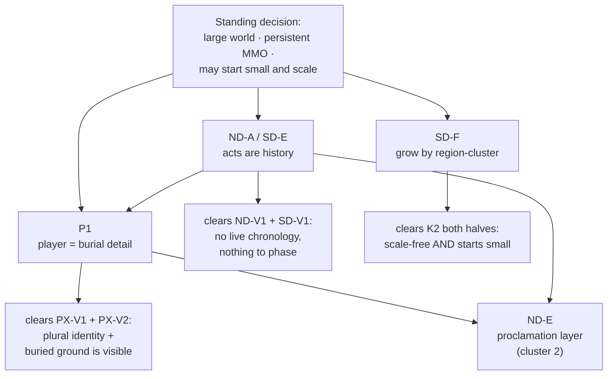

# DR-001 — L1 scope: what shape the world takes at continent scale

**Level:** L1 · **Role:** Principal (charter §2.3) · **Date:** 2026-08-01
**Status:** decided, with five items escalated to the owner
**Serves:** `docs/superpowers/specs/2026-08-01-worldbuilding-roles-charter.md` §1, §2.3, §2.4 · `docs/superpowers/specs/2026-08-01-synthesis-workflow-contract.md` §3–§4

**Evidence read in full:** `docs/worldbuilding/A0-current-world.md` (44 commitments, 23 gaps, 14 contradictions) · `role-narrative-director-scope.md` (options A–E, 2 vetoes) · `role-systems-designer-scale.md` (options A–F, 2 vetoes) · `role-player-experience-crux.md` (options P1–P3, 2 vetoes).
**Verified against the repository at this commit:** the verb question in §2, by measurement rather than argument.

<strong>Standing decisions are not reopened here.</strong> Persistent MMO · large world at
MMO-continent scale, may start small and scale · deliberate tone contrast · everything revisable ·
zero real-world nouns. The owner was shown the evidence challenging large-world and declined to
reopen it. This record solves around it. Where this document says a thing is <em>the owner's</em>,
it is not decided here — see §8.

<strong>Cost is recorded, never decisive.</strong> Per charter §2.3, cost appears in this record as a
consequence only. §7 states plainly where the cheapest option and the best option differ, and the
cheapest option is <strong>not</strong> the one chosen.

---

## 1. Criteria and weights — published before any scoring

Six criteria, each derived from a §1 standing decision. None was invented to fit an answer, and no
criterion is "cost", "effort" or "schedule".

| #      | Criterion                         | Weight | Derived from                                                 | The question it asks                                                                                   |
| ------ | --------------------------------- | ------ | ------------------------------------------------------------ | ------------------------------------------------------------------------------------------------------ |
| **K1** | **Persistence integrity**         | **25** | "Persistent MMO"                                             | Does a player's action leave a mark another player can find? A world where it cannot is a lobby.       |
| **K2** | **Scale coherence**               | **20** | "Large, continent scale, **may start small and scale**"      | Does the shape stay true as the world grows — **and** does it permit starting small? Both halves.      |
| **K3** | **Dramatic survival**             | **20** | "Grim world" half of tone contrast; "everything revisable"   | How much of the corpus's dramatic force survives, and how much of the existing 44 commitments is used? |
| **K4** | **Player standing**               | **15** | "Persistent MMO" — thousands of simultaneous players         | Does the player get a coherent identity that stays true when replicated ten thousand times?            |
| **K5** | **Tone-contrast carriage**        | **10** | "Bright art, grim world — contrast is deliberate"            | Can bright art sit on this shape without the grim flattening into wallpaper?                           |
| **K6** | **Buildability under the vetoes** | **10** | "Persistent MMO" + the two Systems Designer technical vetoes | Does the shape avoid requiring phasing or a continent-in-a-room?                                       |

Scored 0–5 per criterion; the weighted total is reported as a percentage of 500.

<strong>Vetoes are a gate, not a criterion.</strong> Six vetoes exist across three roles. They are
pass/fail and they run <em>before</em> scoring (§4). A vetoed option cannot be redeemed by a high
score, and the Principal may not overrule one (charter §2.3). Scores rank the survivors.

**On K2's second half.** "May start small and scale" is part of the standing decision, not a
concession to budget. A shape that requires the full continent, or a full simultaneous population,
on day one is _less faithful to the standing decision_, not merely more expensive. This distinction
is load-bearing in §6 and I flag it because it is the one place a cost argument could disguise
itself as a fidelity argument.

---

## 2. Ruling one — the verbs. Checked, not reasoned.

**The conflict.** The Narrative Director (§7, open question 3) states: _"All 28 quests are
`MOB_KILLED` today. Option E supplies one; the other four options do not."_ Player Experience (§3.1)
answers that the verbs already exist in the quests and the contracts, and that what is missing is
_emission, not authorship_.

This was cheap to check, so I checked it rather than reasoned about it.

| #     | Measurement                                                                                                              | Result                                                                                                            |
| ----- | ------------------------------------------------------------------------------------------------------------------------ | ----------------------------------------------------------------------------------------------------------------- |
| **1** | Objective types across all 28 quests in `content/story/quests.json`                                                      | **28 / 28 `MOB_KILLED`.** No other type. ND's measurement is correct.                                             |
| **2** | Quests whose own prose (`summary` + `narrative`) carries a non-killing verb                                              | **27 / 28.** Only `quest-cull-the-packs` does not.                                                                |
| **3** | `contracts/src/meta/types.ts:55`                                                                                         | `MatchEventType = "MOB_KILLED" \| "ITEM_PICKED_UP" \| "ZONE_ENTERED"` — 3 declared                                |
| **4** | `nakama/src/questEngine.ts:41` — the matching rule                                                                       | `obj.type !== event.type \|\| obj.targetId !== event.targetId` — **verb-agnostic**, zero engine change needed     |
| **5** | `content/schemas/quest.schema.json` — objective `type` constraint                                                        | `{"type":"string","minLength":1}` — **no enum.** The schema does not restrict the verb                            |
| **6** | `scripts/check_content.mjs:159` — the gate's own comment                                                                 | _"…keyed on objective type so future non-mob objective types stay legal"_ — the gate was **built to permit them** |
| **7** | Emitters of match events across `colyseus-server/src`                                                                    | **Exactly one:** `rooms/handlers/RoomEventHandler.ts:139`, hard-coded `type: 'MOB_KILLED'`                        |
| **8** | `contracts/content/quests.json` — the catalog Nakama actually loads (`nakama/src/questCatalog.ts`, "Real quest catalog") | Contains a live **`ITEM_PICKED_UP`** quest and a live **`ZONE_ENTERED`** quest, each with a reward block          |

<strong>Ruling: Player Experience is right, and the Narrative Director's premise is false as stated.</strong>
"Only one option supplies a non-killing verb" is contradicted at six independent layers — prose,
contract, schema, gate, engine and runtime catalog. Non-killing verbs are authored in 27 of 28
quests, declared in the contract, permitted by the schema, deliberately permitted by the gate,
executable by the quest engine unchanged, and <em>already sitting in the live runtime catalog as
two quests no event can ever complete</em>. The blockage is one hard-coded call site.

**What survives of the Narrative Director's concern, restated correctly.** PX supplied the correct
restatement itself and I adopt it as the ruling's second half: _a verb with no persistent
consequence is a differently-shaped kill count._ The structural options therefore **do** differ —
not on whether a verb exists, but on whether the verb has anywhere to land. That is Player
Experience's veto 2, and it is the real constraint. ND was pointing at a true problem and named the
wrong cause.

<strong>A finding neither role reported, and it reprices an option.</strong> There are
<strong>two quest catalogs and the runtime one is not the story one.</strong> The 28 authored quests
live in <code>content/story/quests.json</code>; the catalog Nakama loads is
<code>contracts/content/quests.json</code>, a three-entry placeholder (boar / ore / forest) with
reward blocks. <strong>The shipped narrative is not wired to the runtime quest engine at all.</strong>
This materially changes one stated price: ND-E's cost — <em>"all 28 existing quests would be
replaced"</em> — is close to zero, because they are not running. The same fact sharpens PX §3.3's
reward collision: the narrative quests have no rewards and no runtime; the runtime quests have
rewards and no narrative. Routed to the Archivist as a G5 item (§8).

---

## 3. Ruling two — the crux. Chat versus credibility.

**The conflict.** ND's C1 holds that the player population with out-of-game chat is an instant,
unsealed, unrobbable, continent-wide news channel outside every layer of the fiction, and that this
is **fatal to the story's engine at any player count** — "the central mechanism of the world is
defeated by the medium before a single design decision is made." PX's P3 holds this is escapable:
chat destroys _information_ scarcity and does nothing at all to a _credibility_ mechanic, because in
this world knowing is free and being believed is expensive.

They cannot both be right. They are not, and the deciding fact is already in canon.

### 3.1 What the mechanic actually gates

ND's argument has the form: _player chat is a fast, unrobbable channel; therefore the latency
exploit is defeated._ That inference holds only if what the latency exploit gates is **player
knowledge**. It does not. `canon.md` §4 describes a news system with **two** components, not one:

- **Speed** — the hours-versus-days gap between the bell signal and the sealed detail.
- **Authentication** — _"An unsealed proclamation is just a rumor with good staging."_ The seal is
  "state news agency and notary in one," and inter-town proclamations _count as true_ only when
  stamped.

What the system gates is not what a person knows. It is **what a town will act on**. ND's C1 attacks
the speed component and then treats the whole engine as if it were speed. It proves too much: taken
at face value, it would also mean the Widow's arc cannot work — and the Widow's arc _is in the
corpus, complete, and it works_.

### 3.2 The Widow is the existence proof, and she was written before this argument

`A0` V4 records her four beats: she saw the rider, she said it aloud in Embervale's square in full
mourning, her neighbours burned her house, and her birth-town shut its gate. She held the true
information from Day 0 with no latency disadvantage whatsoever, broadcast it publicly at zero cost,
and was **inert** — because she held no seal, no institution and no standing. `canon.md` §3 states it
outright: her knowledge is _not_ a reveal; she has known since Day 0 and does not care.

That is a complete, shipped demonstration that this world already separates knowing from being
believed. A player who knows the truth from a wiki and holds no seal is in exactly the Widow's
position: right, loud, and unable to move a town. **The player forum becomes a room full of people
who all know and cannot prove it — which is not a leak in the fiction; it is the fiction's central
experience, delivered by the medium for free.**

<strong>Ruling: Player Experience is right, on narrower ground than it claimed, and with one condition.</strong>
Out-of-game chat destroys <em>information</em> scarcity completely and permanently. It has no
purchase on a mechanic that gates <em>NPC-town disposition</em> behind a scarce, carried, forgeable,
robbable, warden-verifiable artifact — because the thing being made scarce is not knowledge, it is
<strong>standing to act</strong>. The Narrative Director named a real casualty and mis-sized it.

**What the Narrative Director is right about, stated at full strength.** Chat kills **the reveal**.
Surprise, mystery, "you find out in act 4", and reading-order-as-experience are dead on arrival and
no design recovers them. That is genuinely fatal — to the five acts _as a lived sequence_. It is not
fatal to the engine, because the engine's second component survives untouched. And note that ND's
own veto 1 already blocks the acts-as-lived-sequence for a **completely independent** reason
(simultaneity versus the who-knows-what matrix). This ruling does not weaken veto 1 by one inch, and
must not be read as doing so.

### 3.3 The condition — resolving the tension PX declined to resolve

PX's P3 admits it "partially contradicts the ND's own veto 1: if belief is the mechanic, a town's
disposition must be mutable, and mutable town state is one step from the who-knows-what matrix the
ND blocked. That tension is real and I am not resolving it here." I resolve it, because it is
exactly the Principal's job.

**They are different objects.** ND's veto 1 blocks a specific conjunction: _the five authored acts_
as a repeatable levelling spine, _plus_ the who-knows-what matrix as a live constraint, _plus_ the
act-4 confession as a repeatable first-time speech act. The matrix is a **fixed ordering over five
authored acts with four named secrets and a required act-boundary for each**. A present-tense town
disposition driven by player-carried seals has **no authored ordering, no scripted reveal and no act
boundary** — there is no "must not learn before act 4" because there is no act 4 in progress.

**Therefore:** a credibility mechanic is veto-clean **if and only if the five acts are not the thing
whose knowledge is being ordered.** That is a hard discriminator, and it is precisely what a
story-is-past shape supplies. It is the reason §6 chooses the shape it does.

---

## 4. The veto gate — run before scoring

Six vetoes. I have honoured all six; none is overruled, and none is reinterpreted to fit.

| ID        | Role               | The block                                                                                                                                            |
| --------- | ------------------ | ---------------------------------------------------------------------------------------------------------------------------------------------------- |
| **ND-V1** | Narrative Director | The five acts may not be a simultaneously-available repeatable levelling spine while also keeping the who-knows-what matrix and the act-4 confession |
| **ND-V2** | Narrative Director | The Widow may not be resolved — no defeat event, no boss fight, no redemption arc                                                                    |
| **SD-V1** | Systems Designer   | No option may play the Undertow's chronology as shared server-global state without a phasing layer; phasing is not a content task                    |
| **SD-V2** | Systems Designer   | No option may present a large continent as a single Colyseus room                                                                                    |
| **PX-V1** | Player Experience  | The five acts may not ship as the player's personal main-story spine with the player cast as the Crossroads Man                                      |
| **PX-V2** | Player Experience  | No persistent shared world in which no player action is observable by another player. "The bar is one; the current count is zero"                    |

| Option (as written by its role)          | ND-V1 | ND-V2 | SD-V1 | SD-V2 | PX-V1 | PX-V2 | Gate                      |
| ---------------------------------------- | ----- | ----- | ----- | ----- | ----- | ----- | ------------------------- |
| **SD-A** continent-wide spine            | ✗     | ✓     | ✗     | ✓\*   | ✗     | ✗     | **BLOCKED** (4)           |
| **SD-C** inverted to endgame band        | ✗     | ✓     | ✗     | ✓\*   | ✗     | ✗     | **BLOCKED** (4)           |
| **ND-B / SD-B** one region among several | ✗     | ✓     | ✗     | ✓\*   | ✓†    | ✗     | **BLOCKED** (3)           |
| **SD-D** instanced campaign + open world | ✓     | ✓     | ✓     | ✓\*   | ✓     | ✗     | **BLOCKED** (named by PX) |
| **ND-C** inciting incident / doctrine    | ✓     | ✓     | ✓     | ✓\*   | ✓     | ✗‡    | passes **only if paired** |
| **SD-F** Season 1 of a serialized world  | ✓†    | ✓     | ✓     | ✓\*   | ✓     | ✗‡    | passes **only if paired** |
| **ND-A / SD-E** completed history        | ✓     | ✓✓    | ✓     | ✓\*   | ✓     | ✗‡    | passes **only if paired** |
| **ND-D** dated world-wide season         | ✓     | ✓     | ✓§    | ✓\*   | ✓     | ✓     | **PASSES**                |
| **ND-E** courier corps                   | ✓     | ✓     | ✓     | ✓\*   | ✓     | ✓     | **PASSES**                |
| **P1** burial detail (identity)          | ✓     | ✓     | ✓     | ✓\*   | ✓     | ✓     | **PASSES**                |
| **P2** the caravan (identity)            | ✓     | ✓     | ✓     | ✓\*   | ✓     | ✓     | passes — but see §8.5     |
| **P3** credibility (identity)            | ✓¶    | ✓     | ✓     | ✓\*   | ✓     | ✓     | passes — but see §8.2     |

\* SD-V2 constrains topology, not content; it is satisfiable by every option and is a **prerequisite
on all of them**, not a discriminator. It is recorded as a binding obligation in §6.4.
† Passes only if the player is cast as the expedition/an office rather than the Crossroads Man
(SD-B), or if the season-1 region is authored post-act-5 (SD-F).
‡ Scores dashes on consequence — PX §4 records ND-A/SD-E as three dashes. It does not _answer_
PX-V2; it clears ground so PX-V2 can be answered. Unpaired, it fails.
§ ND-D is SD's "outcome 1 — fire once, server-wide". SD does not veto it but requires it be chosen
**consciously and in writing** as a guarantee of permanently orphaned content.
¶ Veto-clean under the discriminator established in §3.3, and only under it.

<strong>Finding: eight of the nine structural shapes fail at least one veto as written.</strong>
Only <strong>ND-D</strong> and <strong>ND-E</strong> pass unaided; three more pass only when paired
with a player-identity option that supplies observable world state. Four are blocked outright and
cannot be recovered by combination. This is not a near-miss — it is the panel's vetoes doing exactly
what they exist for, and it eliminates the entire "keep the acts as the playable spine" family
before any scoring occurs.

---

## 5. The scoring matrix — every option, including the ones I dislike

Scored 0–5 against §1's published criteria. **Blocked options are scored anyway**, per charter
§2.3(2): I do not get to decline to understand an option because a veto already killed it.

| Option                                 | K1 ×25 | K2 ×20 | K3 ×20 | K4 ×15 | K5 ×10 | K6 ×10 | **Total** | Gate    |
| -------------------------------------- | ------ | ------ | ------ | ------ | ------ | ------ | --------- | ------- |
| **SD-A** continent spine               | 0      | 1      | 1      | 0      | 1      | 0      | **10%**   | blocked |
| **SD-C** endgame band                  | 0      | 1      | 1      | 0      | 1      | 0      | **10%**   | blocked |
| **ND-B / SD-B** one region             | 0      | 4      | 3      | 2      | 3      | 1      | **42%**   | blocked |
| **SD-D** instanced + open world        | 0      | 3      | 4      | 1      | 3      | 4      | **45%**   | blocked |
| **ND-C** inciting incident             | 1      | 5      | 2      | 3      | 2      | 4      | **54%**   | pair    |
| **ND-A / SD-E** completed history      | 1      | 5      | 3      | 3      | 4      | 5      | **64%**   | pair    |
| **SD-F** serialized seasons            | 2      | 5      | 3      | 3      | 3      | 5      | **67%**   | pair    |
| **ND-D** dated world-wide season       | **5**  | 1      | **5**  | **5**  | 4      | 1      | **74%**   | passes  |
| **ND-E** courier corps                 | 4      | 4      | 4      | 4      | 3      | 3      | **76%**   | passes  |
| **ND-A/SD-E + SD-F + ND-E**            | 4      | 5      | 4      | 4      | 3      | 2      | **78%**   | passes  |
| **▶ ND-A/SD-E + SD-F + P1** _(chosen)_ | 4      | 5      | 3      | 4      | 4      | 4      | **80%**   | passes  |

**Where the scores come from, in one line each.**

- **SD-A / SD-C score 10%** because they lose the two heaviest criteria outright: nothing a player
  does is observable (K1=0, PX §4), and the identity is a scarcity claim issued in bulk (K4=0). SD
  itself declines to veto SD-A and I respect that — it is blocked by PX-V1, not by me.
- **ND-B/SD-B scores well on K2** (SD: "the existing content is correctly sized for option B and for
  nothing else") and is sunk by K1=0 plus PX §2.3's uncosted finding: _intimacy requires
  acquaintance_, and levels 1–30 guarantee the audience is unequipped to receive the payload.
- **SD-D's K3=4 is genuine** — it is the only option where "a story has an ending, a world may not"
  is answered _architecturally_ rather than editorially. PX-V2 blocks it anyway.
- **ND-D takes three of six criteria at maximum** and is discussed at length in §7. It loses on K2
  (a dated world-wide season needs a crowd on day one — the opposite of "may start small and scale")
  and K6 (SD's outcome 1, plus it needs the crowd-capable architecture that measurement says does not
  exist: `maxClients = 1`, no AOI, no cross-process presence, no world persistence).
- **The top two are within noise (80% vs 78%).** I say so rather than manufacture a gap. §6.3 breaks
  the tie on a real discriminator and **ships both**, in a fixed order.

---

## 6. The decision

<strong>The world takes this shape:</strong>
<strong>ND-A / SD-E</strong> — the Undertow is completed history; the playable world is set after
act 5 — delivered on <strong>SD-F</strong>'s cadence, starting at the ~9–10 zones the existing
content already sizes to and growing by one region-cluster per release — with the player cast as
<strong>P1</strong>, a burial detail under the Bell School, which supplies the non-killing verb and
the one class of observable world state that clears PX-V2.
<strong>ND-E</strong>'s proclamation/courier layer is the designated second consequence system,
scheduled for cluster 2 — not deferred indefinitely, scheduled.

Every component is drawn from the named option sets. No new option is invented.

### 6.1 Why these three, and why they are one decision rather than three

- **ND-A/SD-E is the only shape that makes the crux ruling (§3.3) usable.** A credibility mechanic is
  veto-clean only when the five acts are not the thing whose knowledge is being ordered. Putting the
  acts in the past is what makes that true, permanently and without a phasing layer.
- **SD-F is not a story shape — it is the standing decision's own second clause made operational.**
  "May start small and scale" is not a budget concession; it is text the owner settled. SD-F is
  literally that clause, and the content is already sized for it: 116 creatures at ~12 species/zone
  is one region-cluster's worth, exactly.
- **P1 is the only identity option that is already written into the corpus and needs no new fiction.**
  40 of 116 bestiary designs are made of the war's own dead; `canon.md` §5 already assigns the Bell
  School's Holy work against Void-line war-scars; and the corpus states its own bottleneck out loud
  in `Gravetide Wight`: _"the bell-wardens say the cure is a proper grave, and they are right, and
  there is no time."_ **There is no time means the scarce resource is hands, and an MMO is a machine
  for supplying hands.** This is the rare case where the population is not something the fiction must
  survive — it is what the fiction has been asking for. It also gives the player the affiliation A0
  and PX both found missing: an office that outlives the Quartermaster's scheduled death.

### 6.2 What this does to the crux, concretely

The engine is re-seated from _arrival order_ onto _standing to act_, exactly as P3 argues and §3
rules. Cluster 1 exercises the ruling in its **safest** form: burial changes ground state, and ground
state is observable, persistent and involves no NPC-town disposition, no seals and no counterparty.
Cluster 2 (ND-E) introduces carried, verifiable proclamations — the full credibility mechanic — once
the world persistence layer P1 requires is proven in production. **P3's forgery-and-robbery variant
is not adopted**, because it requires players to act on each other and §1 is silent on PvP (§8.2).

### 6.3 The tie, broken and both shipped

`ND-A/SD-E + SD-F + P1` (80%) and `ND-A/SD-E + SD-F + ND-E` (78%) are within scoring noise, and
pretending otherwise would be dishonest. The discriminator is **which is buildable first without
brushing a veto's blast radius**:

- P1's world state is a **per-zone spatial flag** — ground is buried or it is not. Nothing in it is
  an ordering, a secret or an act boundary.
- ND-E's world state is **mutable NPC-town disposition**, which is the object §3.3 had to carefully
  distinguish from the who-knows-what matrix. The distinction holds, but it is a distinction that
  must be held _deliberately_, and holding it is easier once the acts are demonstrably inert in
  production rather than merely designed to be.

So: **P1 in cluster 1, ND-E in cluster 2.** That is an order, not a hedge. Both ship.

### 6.4 Binding conditions of this decision

These are not recommendations. If any fails, the shape stops being veto-clean and **returns to the
panel** rather than being patched.

1. **The observable-world-state system ships with cluster 1, not after it.** PX-V2's bar is one
   system and the current count is zero. If buried-ground persistence slips out of cluster 1, this
   shape fails PX-V2 and the decision is void. SD's warning applies directly: this is the one item
   that gets _strictly more expensive with every commit that does not account for it_.
2. **Topology is settled before content authoring resumes at scale** (SD-V2): zone-per-room,
   cross-process presence, and a handoff path. SD-V2 is cheap to satisfy and ruinous to retrofit.
3. **`canon.md` §2's `char-expedition-member` dossier is amended in the same commit as the first
   content authored under this decision** (canon §6's contradiction rule). PX-V1 blocks that dossier
   under _every_ option, and A0's X9 records the collision as already live today at `maxClients = 1`.
4. **The five acts are never made playable as a sequence.** Not phased, not instanced, not seasonal.
   They are history, lore bodies, ruins, misremembering and grave markers. This is what ND-V1 and
   SD-V1 are both satisfied _by_.

---

## 7. What this decision sacrifices, and the losing argument at full strength

### 7.1 The sacrifice

Stated without softening, because a decision with no stated cost has not been made.

- **The acts are never played. Ever.** Five acts, 152 nodes, a 146 KB novel and 28 authored quests
  become world texture that is read, never played. The best-written material in the project will only
  ever be encountered as backstory. SD-E prices this as small in system terms (28 quests is 5% of a
  continent's need) and my §2 finding makes it smaller still (they are not wired to the runtime
  anyway) — **but the systems arithmetic is not the loss.** The loss is dramatic and it is permanent.
- **The best antagonist in the corpus is dead before the player exists.** ND's own words. The
  split-villain construction — a brain you can arrest, a heart you cannot — is the strongest
  structural idea in the project and the player will never meet either half.
- **A present-tense conflict must be invented from nothing.** SD-E names the trap precisely: _"the
  interesting war is over, you missed it"_ is a hostile opening frame. P1 supplies a **job**, not an
  **antagonist**. This is a real, unfilled hole and I am not pretending the burial corps closes it.
  It is L2's first obligation (§9).
- **The Crossroads Man is retired as a player identity**, and with him the one thing PX names as
  ND-E's permanent cost and which applies here too: **no named NPC will ever turn and thank the
  player**, because the player is ten thousand people. That is a specific pleasure, permanently
  forgone, and it should be chosen knowingly rather than discovered in month two.
- **The novel cannot become world-facing text.** ND §3 is right that close-POV interiority has
  nowhere to live in a persistent world. It survives as a companion artifact. Whether it retains
  authority over _facts_ is the Archivist's call (§8.4).

### 7.2 The losing option's strongest argument — ND-D, in its strongest form

I did not choose the option that scored highest on three of six criteria. Here is its case, made as
well as I can make it, which is the test of whether I understood it well enough to reject it.

> _This story is about what a crowd does with a truth. Every other option on the table resolves that
> question inside the author's head and then tells the player what the answer was. ND-D is the only
> shape in which the question is genuinely asked, of actual people, with the answer genuinely
> unknown._
>
> _It is the only option that inverts C1 from a fatal leak into the subject. Out-of-game chat,
> contradictory screenshots, rumour and mutual accusation are not a threat to a story about how
> belief propagates — they **are** the phenomenon, running live, at full fidelity, for free. The
> Broker's latency exploit becomes literally true, because player information really does arrive at
> different times in different languages and time zones. The Widow's thesis — that hatred needs no
> author — has never been tested against anything but the author's own conviction. ND-D tests it._
>
> _The two-tier population objection is not a defect; it is thematic correctness. A world whose
> entire subject is **who witnessed what** is a world that ought to contain people who were there
> and people who only ever heard. That is not a grievance to be engineered away. That is the world's
> own thesis, instantiated in its account list._
>
> _And it is the only option where the ending is **earned by the audience** rather than delivered to
> it. Everything I chose instead buys safety by converting the story into something the player is
> told about. ND-D is the only one that makes it something the player did._

**Why I rejected it anyway, and it is the closest call in this record.** Not on cost — I want that
on the record explicitly, because ND-D is expensive and cost is not my criterion. Three reasons:

1. **K2, both halves.** ND-D's mechanism _requires_ a large simultaneous population as a
   precondition. "May start small and scale" is a standing decision, and ND-D is the one option that
   structurally cannot honour it. This is a fidelity argument, and I flag that it sits close to a
   cost argument's border — the owner should test me on it.
2. **It consumes the corpus rather than banking it.** ND-D spends the Undertow in one unrepeatable
   window. ND-A/SD-E banks it as permanent world texture that every future cluster inherits.
3. **Reversibility.** ND-A/SD-E does **not** foreclose ND-D — a world set after act 5 can run a
   dated world-wide season later, on a new conflict, once the architecture can hold a crowd. ND-D
   forecloses everything, permanently, in one shot. Where two options are both defensible and one is
   R0-irreversible, "do it right, not fast" argues for the reversible one _and for building the
   capability first_.

ND's own priced risk stands unchallenged and I do not discount it: under ND-D the population may
decline to burn the messengers, and the story's central claim about people is then disproved in
public, permanently, with no re-run.

---

## 8. Escalated to the owner — not decided here

Charter §2.3(6): the Principal escalates rather than decides anything touching §1, anything trading
art quality against cost, or anything reshaping the product. Five items qualify. **None of these is
decided by this record.**

| #       | Escalation                                                                                                                                                                                                                                                                                                       | Why it is the owner's                                                                                                         |
| ------- | ---------------------------------------------------------------------------------------------------------------------------------------------------------------------------------------------------------------------------------------------------------------------------------------------------------------- | ----------------------------------------------------------------------------------------------------------------------------- |
| **8.1** | **The third register.** `style.md` §1: "The world speaks in two registers. Nothing is written in a third." A persistent world requires a third — ongoing ordinary life. ND §5 shows the precedent exists (the novel is already written in one, owner-approved). **Who governs it, and where is it permitted?**   | Directly amends a voice law under the tone standing decision. Also gates K5: without it, grim flattens to wallpaper at scale. |
| **8.2** | **PvP — may players act on each other?** P3 requires it, P2 invites it, ND-D depends on it. §1 is silent. My decision routes _around_ it (P1 needs no counterparty; ND-E cluster 2 can run with NPC bandits), but ND-E's full form and P3 cannot be costed until this silence ends.                              | A product-shape decision absent from the standing decisions entirely.                                                         |
| **8.3** | **The reward law.** `style.md` §7: "rewards favor lore and understanding over loot." Measured: **zero reward fields across all 28 narrative quests**, while the runtime catalog's placeholder quests all carry xp and items. At MMO quest mass this decides whether the corpus is **played or merely archived**. | A voice law versus the genre's economy. PX is right that neither the tone owner nor the Systems Designer can settle it alone. |
| **8.4** | **Whether the novel remains canonical**, becomes a companion artifact, or is superseded — now sharpened by this decision, which makes the acts unplayable. ND §7.4 assigns the _facts_ question to the Archivist; the _product_ question is the owner's.                                                         | Touches "everything revisable" and the §7 open question in the SWF contract.                                                  |
| **8.5** | **Is rebuilding the Brotherhood Caravan (P2) a resurrection or a rebuttal?** PX raises it and correctly declines it as the Narrative Director's call. I decline it too. Not needed for this decision — P2 is not adopted — but it must be answered _before_ P2 is ever picked up.                                | Not mine. Routed to the Narrative Director; flagged to the owner so it is not rediscovered later.                             |

**Also routed, not to the owner:**

- **To the Archivist (G5):** the two-quest-catalog split (§2 finding) · the
  `char-expedition-member` dual definition, A0's X9 and PX §7.1, which condition 6.3(3) now forces to
  a resolution · A0's X3, X11 and X14, all of which become _history_ under this shape and therefore
  become questions about **what people misremember** rather than about what is true — which is the
  more useful form of the question and worth stating as an upgrade, not a deferral.
- **To the Systems Designer:** SD-V2's topology prerequisites as binding condition 6.4(2).

---

## 9. Confidence, and what would change my mind

<strong>85%</strong> Ruling 1 — the verbs

<strong>85%</strong> Ruling 2 — the crux

<strong>70%</strong> The L1 shape

<strong>60%</strong> Rejecting ND-D

**Ruling 1 — 85% (would be higher, but).** The measurements are unambiguous and reproducible. The
residual 15% is not doubt about the facts; it is that "emission is the only blocker" is true at the
_plumbing_ layer and false at the _design_ layer — a `ZONE_ENTERED` emitter is a few lines, and a
zone-entry that _matters_ is a world-state system. PX said this itself; I am recording that the
headline can be over-read.
**Changes my mind:** a demonstration that emitting `ITEM_PICKED_UP` / `ZONE_ENTERED` requires
changes to the quest engine, the schema or the gate after all.

**Ruling 2 — 85%.** The seal is in canon, the Widow's arc is a complete demonstration, and the
mechanic demonstrably gates NPC-town state rather than player knowledge.
**Changes my mind:** (a) evidence that a town's disposition cannot be made mutable without
re-entering the who-knows-what matrix — that would collapse the §3.3 discriminator and push the
ruling back toward ND; or (b) playtest evidence that players coordinate out-of-game well enough to
make the _artifact_ non-scarce (organised seal-sharing at a scale that makes standing free). Note
that (b) is a measurement nobody can make yet, which is itself a reason my confidence is 85% and not
95%.

**The L1 shape — 70%.** The largest uncertainty is §7.1's admitted hole: **whether a present-tense
antagonist can be authored for a post-act-5 world without contradicting commitment V3 ("the war does
not end")**. P1 gives the player a job, not an enemy. Secondary uncertainty: whether buried-ground
world state can actually ship inside cluster 1 given that no world persistence exists in any form
today.
**Changes my mind:** if the present-tense conflict proves unauthorable under V3, then ND-A/SD-E's
ground is not _clear_, it is _barren_, and ND-C or ND-D become the stronger shapes.

**Rejecting ND-D — 60%, and this is the call I most want the owner to review.** It scores maximum on
persistence integrity, dramatic survival and player standing — the three criteria that matter most to
what this world is trying to be. I rejected it on scale-coherence fidelity and irreversibility, not
on cost.
**Changes my mind — and this is a concrete, checkable trigger:** if the architecture reaches
crowd-capable (AOI + cross-process presence + world persistence, all three) **while the corpus is
still unspent**, ND-D becomes available on its own terms and this record should be reopened by
appendix. A decision record is permanent; a later reversal appends, never edits (charter §2.3).

---

## 10. Open questions handed to L2

1. **The present-tense conflict** for a post-act-5 world, honouring V3 (§7.1, §9). L2's first
   obligation, and the largest single risk in this decision.
2. **What buried ground _is_, mechanically** — the granularity, the reversion rule, and how a player
   sees that a stretch of the Ashvale Front is quiet because other players made it quiet.
3. **Which region-cluster is cluster 1**, and how the six towns' ~42,000 people are re-grounded at
   the new scale without breaking the interlocking population table (A0 V6, §5.4).
4. **The band-mapping question PX reopened** (§2.3): P1 puts the Ashvale Front — 26 of 116 designs —
   at the centre of the game, which forces a decision about where on the level curve the corpus's
   most distinctive ground sits.
5. **What the Bellfaith believes.** A0 G12: an institution with bells, wardens, a seal, a school and
   its own timekeeping, and no stated belief. P1 makes the player its hands. That gap is now
   load-bearing and belongs to the Theologian at L1 synthesis.

---

**Record status:** decided. Permanent. A later reversal appends a new section; it does not edit this
one.
