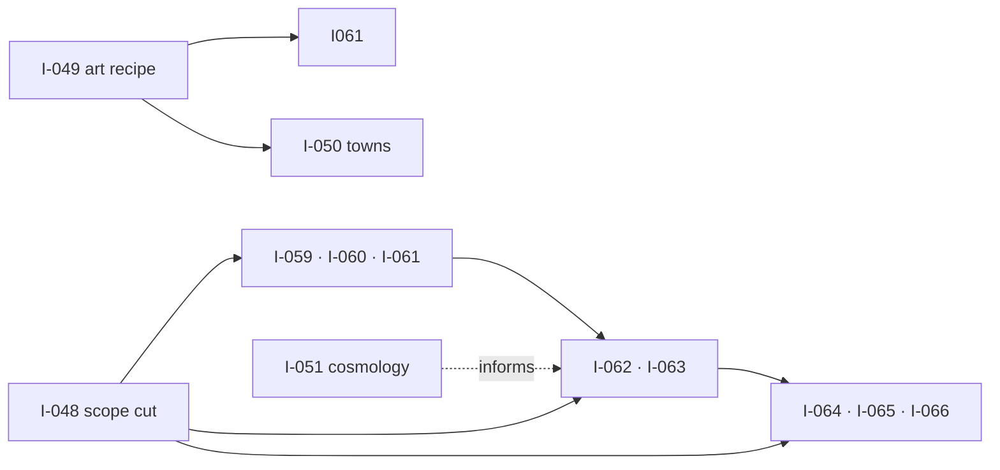

# Idea map — I-046 → I-058

**Date:** 2026-08-01
**Purpose:** one page showing what each open idea is for, what it consumes, what it produces, and which SWF level it belongs to — so they can be picked off one at a time without re-deriving context.

**Level key:** `L0` = the world as it stands · `L1` = world concept (god, legend, map, towns) · `L2` = areas and biomes · `L3` = races, dungeons, camps, bosses · `L4` = NPCs, mobs, items · `ENG` = engineering, level-independent · `META` = process/tooling.

## The table

| Idea         | What it is                                                            | Goal                                                         | Input                                                                                                       | Output artifact                                                                                                                                                             | Level |
| ------------ | --------------------------------------------------------------------- | ------------------------------------------------------------ | ----------------------------------------------------------------------------------------------------------- | --------------------------------------------------------------------------------------------------------------------------------------------------------------------------- | ----- |
| **I-046**    | Junk entry titled `--help`                                            | Delete it — created by a stray CLI flag                      | —                                                                                                           | catalog with it removed                                                                                                                                                     | —     |
| **I-047**    | art-forge + intake hardening bundle                                   | Close small defects found during T0                          | `intake-art.mjs`, `intake2d.mjs`, `art-groups.json`                                                         | try/catch on `rollback()`, group-id uniqueness assert, bool-sentinel guards on `--timeout/--width/--height`, overwrite-rollback test for intake2d, headless storybook smoke | META  |
| **I-048** ⭐ | **Season 1 scope cut** — _already has a 226-line panel-reviewed spec_ | Turn an 11–64× content gap into a finishable slice           | `DR-001` §6, `A1-geography-cluster1.md`, Systems Designer's measured gaps                                   | a scope budget: 9–10 zones, ~30 monsters, 2 art classes                                                                                                                     | L1    |
| **I-049** ⭐ | Adopt the measured art recipe + settle the licence                    | Make the best recipe the default, and decide the legal route | `ABP-controlnet-rescue.md`, `DR-002` + appendix A                                                           | `forge.config.json` updated; a DR choosing: buy commercial licence / schnell-only / pre-production-only                                                                     | META  |
| **I-050**    | Regenerate the 6 town placeholders                                    | Replace below-bar art once I-049 lands                       | the 6 briefs in `A1-geography-cluster1.md`, recipe from I-049                                               | 6 new PNGs, `placeholder-quality` tag dropped                                                                                                                               | L1    |
| **I-051**    | L1 remainder — the god, Void, deep time                               | Write the myth layer the world has never had                 | the two cited research dossiers, `canon.md` §5, `A0`                                                        | `cosmology.md` — god, Void's nature, 3–5 named legends, what people wrongly believe                                                                                         | L1    |
| **I-052**    | Wire the 28 quests to the runtime                                     | The authored quests are connected to **nothing**             | `content/story/quests.json` (28 authored), `contracts/content/quests.json` (runtime), `RoomEventHandler.ts` | one reconciled catalog; `ITEM_PICKED_UP` / `ZONE_ENTERED` actually emitted                                                                                                  | ENG   |
| **I-053** ⚠️ | Phasing decision + spike                                              | Decide the one thing that cannot be retrofitted              | `GameState`, `role-systems-designer-scale.md` §2                                                            | a DR + spike: does the world need per-player state divergence?                                                                                                              | ENG   |
| **I-054**    | Asset gate hardening                                                  | The gate passed 6 entries pointing at **untracked** files    | `check_asset_manifest.mjs`, `intake-art.mjs`                                                                | git-tracked assertion; intake able to replace an entry and target dirs other than `concept/`                                                                                | META  |
| **I-055**    | Artifact gate hardening                                               | Current detector is corner-only and knife-edge               | `artifact-gate.mjs`, the 52-image corpus                                                                    | held-out validation set, coverage beyond the 4 corners, measured FP/FN                                                                                                      | META  |
| **I-056**    | Resolve 14 canon contradictions                                       | The world already disagrees with itself                      | `A0-current-world.md` §4                                                                                    | amended canon; `char-expedition-member` single definition; `core-story.md` superseded magic rule removed                                                                    | L0    |
| **I-057**    | Extract the process as a plugin                                       | Make the worldbuilding method reusable                       | roles charter, SWF contract, ABP traps                                                                      | `worldforge` plugin — 11 role agents, SWF skills, G7 hook                                                                                                                   | META  |
| **I-058** ⚠️ | Seamless large-world scaling — _from another session_                 | AOI + shard grid + border ghosts + authority handoff         | `GameState`, room/pod model                                                                                 | AOI via `StateView`, shard grid, cross-shard combat                                                                                                                         | ENG   |

## Two things to resolve before starting

<strong>I-053 and I-058 overlap.</strong> Both concern how world state is divided and delivered
per player — phasing (different players see different <em>content</em>) versus AOI/sharding
(different players see different <em>regions</em>). They are technically distinct but share the
same subsystem and the same "cannot be retrofitted" property. Decide whether they merge, or
whether I-053 is a prerequisite decision that I-058 then implements.

<strong>I-048 already has a full spec</strong>, panel-reviewed by Systems Designer, Player
Experience and Archivist, with an Archivist BLOCK marked clearable. It is the most ready idea in
the list and the one that sizes every other.

## Suggested order

1. **I-048** — scope. Sets the size of everything below it.
2. **I-053 / I-058** — the irreversible architecture call. Cheapest now at 28 quests.
3. **I-049** — the art route and its licence consequence.
4. Then in parallel: **I-051** (content), **I-052 / I-054 / I-055** (engineering), **I-050** (art).
5. **I-057** last — encode the process once it has been run for real, so the plugin captures what worked rather than what was guessed.

## What the levels currently hold

| Level                                   | Status                                                                                                 |
| --------------------------------------- | ------------------------------------------------------------------------------------------------------ |
| **L0** — the world as it stands         | ✅ `A0-current-world.md`: 44 commitments, 23 gaps, 14 contradictions                                   |
| **L1** — world concept                  | ⚠️ geography + 6 towns done (`A1-geography-cluster1.md`); **god, Void and legend not written** (I-051) |
| **L2** — areas and biomes               | ❌ not started                                                                                         |
| **L3** — races, dungeons, camps, bosses | ❌ not started                                                                                         |
| **L4** — NPCs, mobs, items              | ⚠️ 116-monster bestiary written with 13 body plans; **no art, not playable**                           |

## L2 → L4 — added 2026-08-01

These levels had **no ideas at all** before this pass. L4 had a written bestiary but nothing
covering what makes it playable.

| Idea      | What it is                   | Goal                                                                                                                | Input                                                      | Output artifact                                                                    | Level |
| --------- | ---------------------------- | ------------------------------------------------------------------------------------------------------------------- | ---------------------------------------------------------- | ---------------------------------------------------------------------------------- | ----- |
| **I-059** | Ecology and habitat lore     | Derive climate, vegetation, water and food chains from terrain; place the 116 monsters **by zone**, not just region | `A1-geography-cluster1.md`, `bestiary.json`                | `A2-ecology.md`; bestiary gains a `zone` field                                     | L2    |
| **I-060** | Zone content pass            | Give every zone hazards, resources, landmarks and a reason to go there                                              | cluster-1 zones, Systems Designer's 3-zones-per-band model | per-zone content records + A2-zones-cluster1.md; alternates designed on paper only, routed to cluster 2 per A1 §4.4 (D1) | L2    |
| **I-061** | Biome concept art            | The `art:biome` group is empty                                                                                      | terrain types, recipe from I-049                           | biome key art in the manifest                                                      | L2    |
| **I-062** | Boss design                  | **F-023 shipped boss threat/aggro code and no boss exists**                                                         | `bestiary.json` element table, F-023 behaviour             | boss identities, lore, `art:boss` entries                                          | L3    |
| **I-063** | Dungeon design               | 283 unused dungeon props, zero dungeon content                                                                      | seed catalog, cluster-1 zones                              | dungeon locations, layout grammar, zone attachment                                 | L3    |
| **I-064** | Promote monsters to playable | 116 designed, **6 implemented**                                                                                     | `bestiary.json`, F-013 codegen, `asset-keys.json`          | minted mobTypes + assetKeys; character sheets stop failing `check_content.mjs:512` | L4    |
| **I-065** | NPC roster                   | Only one NPC sheet exists                                                                                           | towns, factions, DR-001's burial-detail player role        | NPC definitions and their quest-giver status                                       | L4    |
| **I-066** | Item and equipment scheme    | **No tier system exists at all**                                                                                    | `canon.md` §5 (element coatings, magic stones)             | tier scheme; what `art:item` should contain                                        | L4    |

<strong>All eight are sized by I-048.</strong> Their scope is undefined until the Season 1 cut
decides how many zones, monsters and art classes cluster 1 actually ships. Starting any of them
before I-048 risks planning 32 zones of work and building 9.

### Dependency shape

