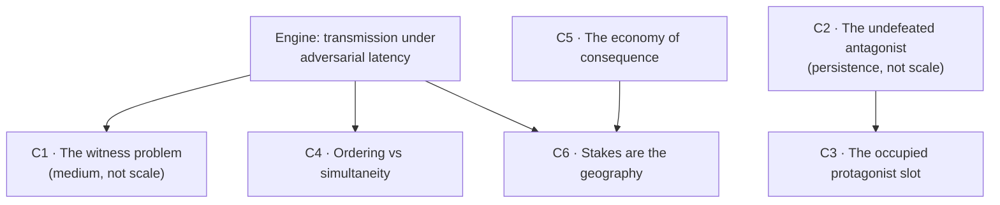

# Narrative Director — scope analysis: does "The Undertow" survive a persistent MMO at continent scale?

**Date:** 2026-08-01
**Role:** Narrative Director (dramatic integrity only)
**Serves:** `docs/superpowers/specs/2026-08-01-worldbuilding-roles-charter.md` §1 standing decisions; `docs/superpowers/specs/2026-08-01-synthesis-workflow-contract.md` §4
**Sources read:** `docs/story/undertow/core-story.md`, `content/story/canon.md`, `content/story/style.md`, all nine `content/story/*.json` (152 nodes), `docs/story/undertow/novel-complete.md` (register sample)

**Not in scope for this document:** consistency (Archivist), buildability (Systems Designer). This is a judgement about whether the story works as drama under the new constraints, and what the trade-offs are. **No recommendation is made.** The decision is the owner's.

<strong>One measurement first, because it changes the whole analysis.</strong> All 28 quests in
<code>content/story/quests.json</code> carry exactly one objective type: <code>MOB_KILLED</code>.
Every act, every arc, every espionage beat, the ledger theft, the bell-keeper's confession,
the last letter — all of it is currently expressed to a player as "kill N of mob family X."
The 146 KB of drama lives in the novel and the lore bodies, not in the playable graph.
<strong>The story does not yet exist as play.</strong> So the question is not "does the existing
game story survive scaling" — it is "does this dramatic material survive being built, for the
first time, at MMO scale."

---

## 1. What kind of story this actually is

### The dramatic engine

**The Undertow is not a mystery, not a revenge tale, and not a war story. It is a story about transmission under adversarial latency — about truth that is delivered correctly, on time, to the right audience, and loses anyway.**

The evidence that this is the engine, and not a reading of it:

- The reader is told the war is staged in the prologue. `core-story.md` §5 names this outright — dramatic irony, declared. `canon.md` §3 is even blunter: the Widow knows the truth from Day 0 "and does not care. This is stated outright, never a reveal." **A story that gives away its secret on page one has staked everything on something other than the secret.**
- Every institution in the world is a delivery system. The Blood Caravan delivers goods. The Bellfaith delivers proclamations in three layers — signal, reading, seal. Riders deliver detail. Lovers' ink delivers a letter only one person can read. Far-mirrors deliver market news early. The Crossroads Man delivers evidence in three parcels: seal → ledger → confession.
- Every act is a delivery intercepted, outrun, or arriving to an audience that has already decided. The antagonist's method is literally a **latency exploit** (`canon.md` §4: "the gap between the fast signal and the slow detail — hours versus days — is where truth is decided"). The Widow's weapon is **withholding a delivery** — the appendix to `core-story.md` states the symmetry explicitly: "he built the war with dozens of actions; she fed it with a single inaction."
- The ending is one letter arriving. Not a treaty, not a victory — a delivery that finally completes.

### What it is about

Two propositions, and the story is built to prove both:

1. **A community's belief is set by arrival order, not by content.** "The first news sticks." This is stated as world mechanics and then dramatised five times.
2. **Once hatred takes ownership of a grief, removing the author changes nothing.** The Broker is arrested in act 5 and the war continues, because the hatred has an heir. The theme line is stated in `core-story.md` §5: truth can beat a lie but cannot erase the hatred the lie planted; the only thing that reliably crosses the line is a bond between two people.

### What makes it work when it works

Four things, and each one is load-bearing:

| Property                 | Where it comes from                                                                                                                                                      | Why it matters                                                                       |
| ------------------------ | ------------------------------------------------------------------------------------------------------------------------------------------------------------------------ | ------------------------------------------------------------------------------------ |
| **Named-corpse scale**   | ~1,700 soldiers total across two towns of 8,000 and 6,000. `core-story.md`: "this is a war of towns, not of kingdoms. Every corpse has a name; every name has a family." | Grief is legible only when the arithmetic is small enough to hold.                   |
| **Closed causality**     | Six towns; exactly two cross-border institutions; **both destroyed before act 1**.                                                                                       | One man can own the news only because there is only one news system and it is short. |
| **Understated register** | `style.md` §1: grief "stated as a fact of the day, never performed." "She didn't cry at the burial. She counted the shovels instead."                                    | The restraint is what makes the material bearable at 146 KB.                         |
| **Irreversibility**      | `style.md` §6 iron rule: no spell resolves politics, cures grief, or raises the dead. Deaths are permanent.                                                              | The world cannot take anything back. That is where the weight comes from.            |

The antagonist construction deserves its own note, because it is the best structural idea in the corpus: **the villain is split into a brain with a structure and a heart with none.** The Broker can be defeated because he owns money, a name, and a network. The Widow cannot be defeated because she owns nothing but a wound and a voice — `core-story.md` §3: "you cannot arrest a wound." The climax is the discovery that the antagonist you _can_ beat was never the one that mattered. This is a genuinely strong construction and it survives almost nothing on the scaling list below without deliberate rework.

---

## 2. The structural collision

An intimate tragedy has one protagonist, a closed cast, a fixed reading order and a last page. A persistent MMO has thousands of simultaneous protagonists, an open cast, no reading order and no last page. Below is precisely where those two things collide. They are six distinct collisions, not one, and **they do not all have the same cause** — which matters, because two of them are not scale problems at all.

### C1 · The witness problem — and it is a _medium_ problem, not a scale problem

The Widow's entire arc rests on one sentence: she was the only person who saw the rider wearing no town's colours. Scarcity of witnesses is not decoration here — it is the mechanism by which she is disbelieved, driven out, silenced, and thereby transformed.

An MMO does two things to that, and only one of them is about scale.

The scale half: put five hundred players on that hillside and there is no sole witness. Fine — that is solvable by staging.

**The unsolvable half is that the player population is a communication channel the world cannot model.** The Bellfaith's news system is dramatically alive because detail moves at horse speed and can be robbed on the road. Players have out-of-game chat: instant, unsealed, unrobbable, continent-wide, and outside every layer of the fiction. A player forum is a far-mirror that everyone owns for free. **The central mechanism of the world — that whoever arrives first owns the truth — is defeated by the medium before a single design decision is made.** This is true at twenty players and at twenty thousand. Scale does not cause it; scale only makes it impossible to ignore.

<strong>This is the crux.</strong> Every other collision on this list has a craft answer. This one
does not have a craft answer inside the current premise — it has only three exits: (a) make the
information asymmetry <em>not</em> the engine, (b) make the players' own channel part of the
subject rather than a leak in it, or (c) accept that the world's most distinctive mechanic is
flavour text that the audience will route around on day one. Options in §4 are sorted partly by
which exit they take.

### C2 · The undefeated antagonist — persistence converts theme into backlog

`canon.md` §2: the Widow "survives, undefeated — no death, no defeat event (the epic's deliberate absence)." `style.md` §7 restates it: "that absence is itself the ending's point."

In a closed text, an unresolved antagonist is a wound the reader carries out of the book. **In a persistent world, "never resolved" is indistinguishable from "not yet patched."** A live-service audience reads absent resolution as content debt, files a bug, and asks when the Widow raid is coming. The single most deliberate authorial choice in the corpus is exactly the choice the medium's grammar will misread as an omission.

Again: this is not scale. This is persistence. A single-player game with an ending could keep the absence intact at any world size.

### C3 · The protagonist slot is already occupied — by two people at once

`canon.md` §2 lists `char-expedition-member` with want "to matter to the ground he stands on," voice "player-driven," fate "alive — the throughline." That is the Crossroads Man, verbatim (`core-story.md` §3: he wants a place where "the ground remembers his weight"). **The game's player character and the story's protagonist are currently the same entity.** At `maxClients = 1` that is elegant. At MMO scale it forks, and both forks cost something real:

- **Everyone is the Crossroads Man.** The man whose entire dramatic function is being _the only unaffiliated person in the land_ becomes the most common demographic in the world. "No town claims him" stops meaning anything the moment it describes the majority. His identity is a scarcity claim, and scarcity claims do not survive replication.
- **The Crossroads Man becomes an NPC.** Then the story's protagonist is someone the player watches, and the player is demoted to courier for a plot they cannot alter. This is survivable — see Option E — but it is a genuinely different game, and it must be chosen rather than drifted into.

The one arrangement that is not available is the current one.

### C4 · Ordering versus simultaneity — the who-knows-what matrix cannot hold

`canon.md` §3 is a strict information ordering over a shared space: the War-Countess and the Speaker "must not learn before act 4"; the Iron Regent "must not learn before act 4"; the War-Countess must not learn of the relic sale "before act 5." These are not flavour constraints — the matrix is the plot. Each one exists because a character acting on knowledge one act early collapses the story.

A persistent shared world has players at every act simultaneously, standing in the same square. An act-5 player and an act-1 player addressing the same War-Countess is a contradiction the fiction has no way to absorb. Instanced phasing resolves it technically and **destroys it dramatically**: phasing means the town is not shared, and a town that is not shared is the one thing an MMO exists to provide. You can have the matrix or you can have the shared square. Not both.

There is a second, quieter version of this: **act 4's hinge is a public confession heard for the first time.** A confession heard for the ten-thousandth time by a town that hears it every twenty minutes is not a confession — it is a scheduled performance, and the player knows it. Repetition does not weaken that scene. It inverts it into comedy. (This is the basis of the veto in §6.)

### C5 · The economy of consequence — volume kills the death rule

`style.md` §7: every named death must be causally human — an order, a mob, a betrayal — never a monster's kill. Monsters kill only unnamed characters. Five named deaths across five acts, each authored individually, "none of them softened after the fact."

The medium's core verb is killing, at a rate of thousands per player per week — and today it is the _only_ verb the quest graph knows. A world cannot simultaneously teach "a death is an event with a name and a family" and "you have killed four hundred things since lunch." The story's most disciplined rule is the one the loop contradicts by sheer arithmetic, and it contradicts it worse the larger the world gets, because a larger world needs more mobs per player, not fewer.

Worth naming as the one bright spot: the **war-scar etiology** (monsters are the residue of unburied battlefields) is the single best marriage of lore to loop in the entire corpus, and it survives this collision — see §3.

### C6 · The stakes _are_ the geography — enlarging the map invalidates the premises one at a time

The charter's world scale is "large, comparable to a major MMO continent." Measure that against what the story needs:

| Premise                                 | Requires                                                              | At continent scale                                                                                                                |
| --------------------------------------- | --------------------------------------------------------------------- | --------------------------------------------------------------------------------------------------------------------------------- |
| "Whoever owns the bells owns the truth" | One news system, short enough for one man's riders to outrun everyone | A continent cannot be outridden by one stable of horses. The monopoly becomes absurd.                                             |
| "Gildmark is the only deepwater port"   | One coast, one gate to the sea                                        | A continent has many coasts. The chokehold evaporates.                                                                            |
| The war matters                         | Two towns that are the world                                          | Two towns of 8,000 and 6,000 fighting with ~1,700 volunteers is a border squabble two valleys wide, invisible from anywhere else. |
| Every corpse has a name                 | ~38,500 total population                                              | On a continent, the arithmetic of grief stops being holdable, which is exactly the property §1 identified as load-bearing.        |

<strong>State this plainly:</strong> scale does not <em>dilute</em> this story. It falsifies its
premises. The Undertow's stakes are not merely set in its geography — they are <em>made of</em>
its geography. Every one of its three chokepoints (one port, one news system, one road that
matters) is a smallness argument.

---

## 3. What survives scaling, and what dies

Unsentimental. Sorted by whether scale helps, is neutral, or is fatal.

### Strengthens at continent scale

- **The materialist method.** The corpus's real achievement is that every institution has a price list, an owner and a loser: harbour shares that _are_ council seats, a constitution designed to be sold, a church that owns the news. A continent needs more of this, not less, and this method is infinitely extensible without diluting anything.
- **The news system as infrastructure** (signal / proclamation / seal, two speeds). Detach it from the Broker's personal ownership and it becomes _better_ at scale: latency gives distance a meaning, which is one of the hardest things to make a player feel on a large map. What dies is one man owning it; the system itself wants to be bigger.
- **The war-scar etiology.** "Monsters are the wounds of war; the longer they fight, the madder the land goes." More fronts means more monsters, and clearing them reads as clearing history's residue rather than farming. This is the one lore-to-loop marriage that gets stronger with every square kilometre added.
- **Cindervast.** Deep history needs no audience-sequencing and no witness scarcity. The image — a city erased in a night, where the only surviving population is statues of the man who killed them — is completely scale-independent and gets more powerful as the number of people who have only _heard_ of it grows.
- **The two-institution engine** (a cross-border peace institution and a cross-border truth institution, both compromised before the story starts). That is a reusable regional generator, not a one-off.

### Survives unchanged, indifferent to scale

- **Liss and Joren.** The smallest unit in the corpus survives because it never needed the world. Two people, one letter, one ink that only the beloved can read. This is the safest asset on the list and it should be treated as the template for what "intimate" means at any world size.
- **The naming morphology and the two registers as _law_** (`style.md` §2). Diction laws scale far better than plots do. What does _not_ survive is the "nothing is written in a third register" clause — see §5.
- **The relic-weapon taboo and the no-king taboo.** A word that has become an obscenity across a whole land is more impressive on a continent than in a valley.

### Dies, or must be rebuilt from the studs

- **The single evidence chain** (seal → ledger → confession). It can be walked once. Player two onward gets a re-enactment. This is not fixable by writing it better; it is a property of chains.
- **The who-knows-what matrix as a live constraint.** C4. It cannot survive simultaneity in a shared space.
- **The Broker as a person.** A single hidden man who personally lit one caravan and personally outrides every proclamation cannot own a continent. He survives only as an **office or a method** — and, usefully, the Gilded Rot naming law already opens that door: `style.md` §2 says the definite article "turns a role into an identity," and "the Broker" is already built like an account rather than a hand.
- **"The only witness."** Dies immediately, completely, and without appeal. C1.
- **The Widow's moral armour.** `core-story.md` §3 gives her four powers; the first is that she is _the war's number-one bereaved_, and attacking her proves her right. That armour is a **uniqueness claim**. On a continent there are a thousand widows and the armour is gone — not weakened, gone. Any option that keeps her must rebuild the source of her unassailability from something other than scarcity of grief.
- **The ending at Rooktide.** Two families burying sons together, and a letter arriving after two seasons. It works because it is the last image after 146 KB of accumulated weight, read in order. A persistent world guarantees neither order nor lastness. Rooktide survives as a _place with a meaning_; it cannot survive as a _final page_.
- **The novel's register.** Not because it is bad — it is the strongest prose in the project — but because it is close-POV light-novel interiority (`novel-complete.md` v3 header: an explicit, owner-approved override of the game's strict register), and a persistent MMO has nowhere to put interiority. It survives as a companion artifact for readers. It cannot become world-facing text.

---

## 4. Structural options

Five. Each is stated with what it does to the drama and what it costs. **No ranking, no recommendation.**

### Option A — The Undertow as completed history; the world opens after it

All five acts are past, one to two generations back. Players arrive into the consequences: a war that never formally ended, the Widow's network of the bereaved outliving her, a Bellfaith whose seal nobody quite trusts any more, a second patch of dead ground beside Cindervast.

- **What it does to the drama:** converts tragedy into inheritance. The engine changes from _"can the truth arrive in time?"_ to _"what do you do with a truth everyone already has and nobody acts on?"_ — a different engine, and a viable one, well suited to persistence because it has no clock. Every sequencing collision (C1, C2, C4) dissolves at once, because a finished story cannot be witnessed wrongly, re-enacted, or spoiled.
- **What it costs:** the story stops being an experience and becomes lore bodies and ruins. The best antagonist in the corpus is dead before the player exists. Conversely, this is the one option where the Widow's undefeated status gets _stronger_ — as history, an unpunished woman is a permanent accusation; as a live quest target, she is a bug report.

### Option B — One regional tragedy among several

The six towns keep their current scale and their current story, as one region of a continent. Other regions get their own self-contained tragedies with **different engines** — not variants of this one.

- **What it does to the drama:** preserves the intimacy exactly, because the intimacy was made of the geography and the geography is untouched (C6 is answered by not scaling the region at all). It converts the world's thesis into an anthology argument — _this happens everywhere, differently_ — which is a stronger continental statement than one big plot could make.
- **What it costs:** a region is a level band. Players out-level the tragedy and leave, which makes the tragedy a chapter you finish and abandon — precisely the opposite of persistence. And every other region now needs comparable authored mass, or the Undertow region reads as the only real place in the world and everywhere else reads as filler.

### Option C — The Undertow as the world's inciting incident, not its plot

The caravan burning is Day 0 for the continent, not for six towns. What was proven at Millcross scale — the false flag, the latency exploit, the bought seal — is the **technique** that the continent's powers then adopt. The game is the century of that technique spreading.

- **What it does to the drama:** promotes the antagonist from a man to a practice. Every region has a Broker-shaped office and the player fights a method that cannot be arrested — which is a direct, literal dramatisation of the story's own thesis that hatred outlives its author. The Widow's ending stops being one story's sting and becomes the world's operating principle.
- **What it costs:** the intimacy of one hillside is gone permanently. The story is demoted from drama to doctrine, and doctrine has no last image and no faces. All of the corpus's best scenes are small ones; under this option they become footnotes to a big thing, which is the exact inversion of what made them work.

### Option D — Persistent world, non-persistent story: run the Undertow once, world-wide, on a real calendar (**the option nobody has proposed**)

Not instancing, not a repeatable chapter, not a phased campaign. A **bounded, dated, world-wide season**: the six towns go live, the war runs on a real calendar for the entire population simultaneously, act 4's mob burns messengers on a specific date, and when it ends the world is permanently changed by whatever the population actually did. **The acts never run again.** Every player who arrives afterwards arrives into Option A's world — but the version of it that the first cohort produced.

- **What it does to the drama:** this is the only option that keeps the _original engine_ intact at scale, because it makes the player population itself the crowd — and the crowd is what this story is actually about. C1 inverts from a fatal leak into the subject: out-of-game chat, rumour, contradictory screenshots and mutual accusation are no longer a threat to the fiction, they _are_ the fiction. The Broker's latency exploit becomes literally true, because player information genuinely does arrive at different times in different languages and time zones. The Widow's thesis — hatred needs no author — gets tested against real people, who historically supply it without prompting. It is also the only option where the ending is _earned by the audience_ rather than delivered to it.
- **What it costs:** brutal, and it should not be softened. (1) Enormous authoring spent on a window; late players inherit a story they can only be told about, which is a permanent two-tier player base. (2) **The ending is not authorable** — the population might simply decline to burn the messengers, at which point the story's thesis is publicly disproved in front of everyone. That is a real dramatic risk, not a hypothetical one, and it is the price of making the audience the crowd. (3) It demands live-ops discipline the project does not have today. (4) It is unrepeatable, so a failed execution cannot be re-run.

### Option E — Keep the story; permanently demote the player from protagonist to witness and courier

The Crossroads Man becomes an NPC with his own arc. Players are **the road**: they carry sealed proclamations, escort bell-riders, hold fords, guard letter-cairns — and their aggregate success or failure determines whose version of each proclamation reaches each town first.

- **What it does to the drama:** this is the only mapping in this analysis where the core loop and the theme are the _same activity_. The engine — transmission under adversarial latency — becomes the literal job description. It answers C3 cleanly (the protagonist slot is vacated on purpose, not by accident) and turns C1's out-of-game chat problem into a competitive resource rather than a leak. Crucially, it also gives the world a native verb that is not killing, which is the only structural answer to C5 on this list.
- **What it costs:** players do not get to be the hero of the story they are standing in — a known, real retention risk that should not be argued away. And all 28 existing quests would be replaced, because none of them expresses this verb; the current quest graph is 100% `MOB_KILLED` and contains no delivery, escort, or interception objective at all.

---

## 5. The tone question

The owner has settled that bright, readable art against a grim world is deliberate (charter §1). My judgement, from the dramatic side only:

**The contrast survives continent scale. The two-register law does not — and that is the real tone risk, not the art.**

Three findings:

1. **Visual contrast is a per-frame property, not a world-size property.** It works because the eye reads the image fast and the text lands slow, and that timing relationship is identical on a continent and in a valley. Nothing about scale touches it. This part of the standing decision is safe.

2. **Uniform grimness at scale becomes wallpaper, and wallpaper cannot contrast with anything.** Six towns can sustain a single sombre register. Dozens cannot. Grim needs a floor of ordinary life to be legible against, and the corpus currently supplies that floor exactly once — the caravan morning, where two towns' drums and flutes clash and children run under the horses — and then withdraws it for the entire remainder. That one scene is doing all the work of establishing what was lost. At continent scale you need that scene's register in a hundred places, permanently, or the grim stops registering as grim and starts registering as flat.

3. **`style.md` §1 forbids the register a persistent world needs most.** The law reads: "The world speaks in two registers. Nothing is written in a third." A persistent MMO must speak in a third — the register of **ongoing ordinary life**: dailies, market chatter, festivals, guild business, the fifteen-hundredth time a player walks past a stall. Written in Ashen Vigil, that content will read as either relentless or, worse, accidentally comic — a merchant selling turnips in the diction of a woman counting shovels at her husband's grave is a joke the fiction did not intend to make.

There is precedent for the law bending: the novel is already written in a third register (close-POV light-novel interiority), an explicit owner-approved override recorded in its own v3 header. So the question is not _whether_ the two-register law can bend, but **who governs the third register and where it is allowed** — and that is a decision the tone owner has not yet been asked to make.

**Net:** scale does not force a register change on the _art_. It forces the addition of a register to the _prose_, which the current voice law explicitly bans. That is a live collision and it belongs on the owner's desk regardless of which structural option is chosen.

---

## 6. Veto position

Two vetoes, both narrow and specific. I am **not** vetoing any of the five options, and I am **not** vetoing scale.

<strong>Veto 1 — the five acts may not be kept as a simultaneously-available, repeatable levelling
spine while also keeping the who-knows-what matrix and the act-4 confession.</strong>

Why, precisely: act 4's hinge is a **public confession heard by a town for the first time**. The Bell-Keeper's line is a one-time speech act — "That's a whole town believing a lie, and I did it on purpose." A speech act cannot be repeated ten thousand times to the same town without changing category. Repetition does not weaken that scene; it **inverts** it into farce, and the player watching the sixth performance this hour knows exactly what they are looking at. The same applies to the truth's public failure in act 4, which is the thematic pivot of the entire epic: a failure that is scheduled to recur on a timer is not a tragedy, it is a ride.

Compounding it: `canon.md` §3's matrix is a strict information ordering over a _shared_ space. Simultaneity breaks it, and the only technical fix — phasing every town per player act — deletes the shared square, which is the sole reason to be an MMO at all. **You may have the matrix, or the repeatable spine, or the shared square. Any two. Never all three.** This is dramatically unworkable, not merely difficult, and no amount of writing craft closes it.

<strong>Veto 2 — the Widow may not be resolved: no defeat event, no boss fight, no redemption arc.</strong>

Why, precisely: her unresolvedness is not an unfinished thread, it is the thesis. `canon.md` §2 records her fate as "survives, undefeated — no death, no defeat event (the epic's deliberate absence)"; `style.md` §7 calls that absence "itself the ending's point." **A killable Widow makes the story's claim false inside its own world** — it states that hatred does have an author and that you can stab him, which is the exact proposition the preceding 146 KB was constructed to refute. It would also retroactively make the Broker's arrest meaningful, which unmakes act 5.

I acknowledge C2 directly: persistence will make her unresolvedness feel like content debt to a live-service audience, and that pressure is real and will not go away. **The legitimate answers are to change her role** — retire her into history (Option A), let her become a movement rather than a person (Option C), or hand her outcome to the population (Option D). **The illegitimate answer is to defeat her** in order to make the plot MMO-shaped. If that is proposed, this veto blocks it and it returns to the panel.

### Not vetoed, but priced

Option D carries a risk unique to it and I want it on the record rather than buried: **the population may falsify the thesis in public.** If the crowd declines to burn the messengers, the story's central claim about people is disproved live, in front of everyone, permanently and unrepeatably. That is not a reason to reject Option D — it is arguably the most honest version of this particular story anyone could build, since the story is _about_ what crowds do. But it is a wager on human behaviour with no undo, and the owner should price it as such before choosing it, not discover it in week three.

---

## 7. Open questions this analysis could not settle

Left for the panel and the owner; each is outside a Narrative Director's decision rights:

1. **Who governs the third register** that a persistent world requires, and where it is permitted (§5). Needs the tone owner and, at L1 synthesis, the Art Director.
2. **Whether the Undertow's six towns keep their current population arithmetic** at continent scale, or are re-scaled. §3 says the story's grief-legibility depends on the small numbers; the Cartographer and Political Economist may need them larger. This is a genuine cross-role conflict and should be resolved as one, not settled quietly by whoever writes first.
3. **What the world's non-killing verb is.** All 28 quests are `MOB_KILLED` today. Option E supplies one; the other four options do not, and §2 C5 applies to all of them. This is the Systems Designer's ground, but the drama cannot be built without an answer.
4. **Whether the novel remains canonical**, becomes a companion artifact, or is superseded. §3 argues its register cannot become world-facing text; it does not argue about its authority over facts. That is the Archivist's call.
