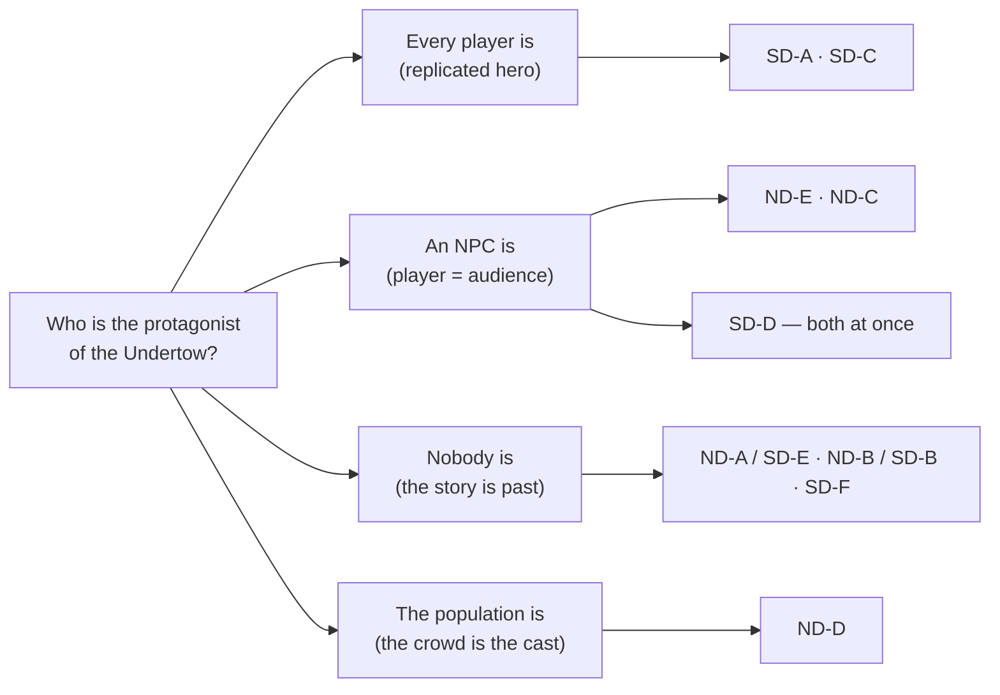

# Player Experience — what is the player in this world, and does any proposed scope give them a place in it?

**Date:** 2026-08-01
**Role:** Player Experience (charter §2.1) · **Veto:** worlds where the player has no place, or where thousands of players must each be the sole protagonist of a closed story
**Serves:** `docs/superpowers/specs/2026-08-01-worldbuilding-roles-charter.md` §1 standing decisions
**Read before writing:** `docs/worldbuilding/role-narrative-director-scope.md`, `docs/worldbuilding/role-systems-designer-scale.md`, `docs/story/undertow/core-story.md`, `content/story/canon.md`, `content/story/style.md`, all 28 quests in `content/story/quests.json`, `content/characters/player-expedition.md`, all 116 entries in `content/bestiary/bestiary.json`, `contracts/src/meta/types.ts`, `nakama/src/questEngine.ts`

**Not in scope:** consistency (Archivist), buildability (Systems Designer), dramatic integrity (Narrative Director). **No recommendation is made.** Which option ships is the owner's decision.

<div class="callout danger">
<strong>Both prior reports asked the same question, and it is not the whole question.</strong>
The Narrative Director asked <em>what happens to the story at scale</em>. The Systems Designer asked
<em>what happens to the architecture at scale</em>. Across their eleven options the player is a
<strong>constant</strong> — an unexamined variable that the story is done <em>to</em>. Not one of the
eleven is a proposal about what the player <em>is</em>. That is the gap this document occupies, and
it is the reason §5 exists.
</div>

<div class="callout warn">
<strong>Naming hazard for the Showrunner.</strong> The two reports both label their options A–E/A–F
and <strong>the letters do not agree</strong>. ND-A (completed history) is SD-E (deep time past);
ND-B is SD-B; ND-C, ND-D, ND-E, SD-A, SD-C, SD-D, SD-F are each unique. Nine distinct options, not
eleven. This document writes <code>ND-x</code> and <code>SD-x</code> throughout and never a bare letter.
</div>

---

## 1. What the player currently is

From the content and the code as written, not from aspiration.

### 1.1 In game state — a body and a number

`contracts/src/meta/types.ts` is the whole of the player's persistent self:

| The player has                                 | The player does not have           |
| ---------------------------------------------- | ---------------------------------- |
| `level`, `xp`, `statPoints`                    | a class                            |
| `allocated: { str, agi, int, vit, dex }`       | a race                             |
| 3 equipment slots (weapon / armor / accessory) | a faction membership or standing   |
| 4 equipped skill slots                         | a reputation, a title, a home town |
| an active + completed quest list               | a name                             |

`canon.md` §5 is explicit and correct about this: _"Class and race are lore and art today, nothing more. The server stores no class, race, or job on a player."_ The world has published **eight classes, eight races, six peoples, four wisdom branches and a school-per-town map** — a complete identity system — and none of it touches the thing the player actually is. The player's only expressible identity is a stat allocation.

### 1.2 In fiction — an unnamed contractor whose employer dies in act 4

`content/characters/player-expedition.md`: _"You. One of the party that reopened the meadow — not a chosen hero, just the one still standing at the tent line when the training dummies stopped being enough."_

`content/story/factions.json`: `faction-expedition` — _"The player's own side: the party that reopened the meadow."_

This is a **good** MMO identity. It is plural by construction (a party, not a chosen one), it is outside every town's banner, and it explains why a stranger with a sword is welcome anywhere. It survives replication at any population, because "one of the expedition" does not become false when there are ten thousand of you.

Three problems sit on top of it, all recorded in content:

1. **The player's employer is the Quartermaster**, and `canon.md` §2 kills her in act 4 (`event-quartermaster-falls`). She gives **12 of the 28 quests** — the largest single block. The player's only institutional relationship in the world has a scheduled expiry.
2. **The player is a quest giver to themselves.** `quest-what-the-mob-left` has `"giver": "char-expedition-member"` — the player-character node hands the player a quest to bury the Quartermaster.
3. **The player is voiced, once.** `dlg-expedition-member-twin-strike-aftermath` gives the player three first-person spoken lines. One authored voice line in 152 nodes is not a design; it is a leak.

### 1.3 The dossier collision — the Narrative Director is right, and it is worse in the data

`canon.md` §2 lists `char-expedition-member` with want _"To matter to the ground he stands on,"_ voice _"Player-driven,"_ fate _"Alive — the throughline."_ That want is the Crossroads Man's, verbatim from `core-story.md` §3 (_"a place where the ground remembers his weight"_).

But `characters.json` disagrees with `canon.md`: it lists the same id as `"role": "ally"`, `"region": "region-spawn-meadow"`, summary _"You — one of the party that reopened the meadow."_ One file says the player is the story's protagonist; the other says the player is a meadow-level auxiliary. **The player character has two mutually incompatible definitions in shipped content**, and the collision is not a scale problem — it is true today at `maxClients = 1`. This belongs on the Archivist's desk as a G5 item regardless of which option wins.

### 1.4 What the 28 quests actually ask the player to do

**All 28 objectives are `MOB_KILLED`.** One objective each. Five distinct targets (`hybrid` ×10, `balanced` ×6, `aggressive` ×5, `double_attacker` ×4, `defensive` ×3). Counts of 1 to 6. There is no second objective type anywhere in the file.

That measurement is already in the ND's report. What is **not** in either report is what the quests' own prose asks for. Read the `offerText` fields:

| Quest                           | What the fiction asks                                                              | What the objective is    |
| ------------------------------- | ---------------------------------------------------------------------------------- | ------------------------ |
| `quest-the-last-letter`         | _"Carry Liss's letter across the front to Norhollow."_                             | kill 3 `double_attacker` |
| `quest-the-letter-that-arrived` | _"Walk the letter to her door yourself."_                                          | kill 2 `hybrid`          |
| `quest-the-ledger-theft`        | _"Follow the Clerk's watch-schedule into the vault room. Copy the page he marks."_ | kill 4 `hybrid`          |
| `quest-what-the-mob-left`       | _"See her buried at the crossroads."_                                              | kill 2 `balanced`        |
| `quest-a-stall-rebuilt`         | _"…then help raise the frame."_                                                    | kill 2 `balanced`        |
| `quest-two-plates-at-dusk`      | _"Walk the road to the crossroads grave and back with her."_                       | kill 2 `hybrid`          |
| `quest-the-first-crossing`      | _"Clear the road to Rooktide."_                                                    | kill 2 `defensive`       |
| `quest-the-brink`               | _"Stop the crate before it touches the water."_                                    | kill 6 `hybrid`          |

<div class="callout idea">
<strong>The verbs were written and then dropped at the objective layer.</strong> These are not
kill-quests with flavour text. They are <strong>caretaking quests with a killing gate</strong> —
carry, walk, escort, copy, bury, raise, hold — and every one of them was converted to
<code>MOB_KILLED</code> because that is the only event the server emits. The world's non-killing
verbs already exist in shipped content. What is missing is not authorship. It is emission.
</div>

**What the player currently is, in one line:** an unnamed, classless, unaffiliated pair of hands with a private number that goes up, hired by a woman who dies in act 4, whose only expressible action is killing and whose only record of having existed is a per-character quest log nobody else can see.

---

## 2. The protagonist problem

An intimate tragedy has one protagonist. An MMO has thousands simultaneously. Here is precisely what each distinct option does with that, and which ones leave the player watching.



| Option                                                     | Protagonist slot                                                   | Player's actual role                                                                          | Tourist?                                                                    |
| ---------------------------------------------------------- | ------------------------------------------------------------------ | --------------------------------------------------------------------------------------------- | --------------------------------------------------------------------------- |
| **SD-A** — Undertow is the continent spine                 | Every player is the Crossroads Man                                 | Replicated sole hero. 10,000 people who are each _"the only unaffiliated person in the land"_ | No — worse. The identity is a **lie the world tells everyone**              |
| **SD-C** — Undertow inverted to endgame (61–80)            | Same, deferred 60 levels                                           | Same, plus a 60-level wait to become the hero                                                 | No, but see §4                                                              |
| **ND-B / SD-B** — one region among several                 | Every player is the Crossroads Man **for one week, at level 1–30** | Sole hero of a chapter you outgrow and abandon                                                | Partly — you were the protagonist, past tense                               |
| **ND-A / SD-E** — completed history, world set after act 5 | Nobody. The protagonist is dead or gone                            | Inheritor. A person living among consequences                                                 | **Only if no present conflict is authored.** SD-E names this risk correctly |
| **ND-C** — Undertow as the world's inciting incident       | An office, not a person                                            | Someone fighting a practice                                                                   | No — but the player fights a noun, and nouns have no face                   |
| **SD-F** — Season 1 of a serialized world                  | Every player, once per season                                      | Sole hero on a subscription cadence                                                           | No, and it is the only option where "you missed it" is _scheduled_          |
| **SD-D** — instanced campaign + story-light open world     | Every player, **privately**                                        | Sole protagonist inside the instance; **nobody at all outside it**                            | **Yes, in the shared world** — see veto 2                                   |
| **ND-D** — one dated world-wide season                     | The population is the cast                                         | A member of the crowd the story is about                                                      | No. The strongest answer on this list                                       |
| **ND-E** — player demoted to courier and witness           | An NPC (the Crossroads Man)                                        | The road itself                                                                               | **No.** See below — this is the most misread option                         |

### 2.1 ND-E is not the tourist option, and calling it "demotion" mis-sells it

The ND frames its own Option E as _"players do not get to be the hero of the story they are standing in — a known, real retention risk."_ From my domain, that framing is backwards in one specific way that matters.

A courier corps is not an audience. **An audience cannot change the outcome; a courier can, and in ND-E the courier is the only party who can.** The proposal makes the aggregate of player deliveries determine _whose version of each proclamation reaches each town first_ — which is the plot's decision procedure. The player is not watching the Crossroads Man solve it; the player is holding the variable he cannot reach.

What ND-E genuinely costs is different and should be stated in its own terms: **the player never gets a scene.** No named NPC will ever turn and address them as the one who did it, because the one who did it is ten thousand people and the fiction cannot name them. That is a real and permanent loss of a specific pleasure, and it is not the same thing as being a tourist.

### 2.2 The option that actually produces tourists is SD-D

SD-D puts every meaningful act inside a private instance and states, as its own risk, that _"an open world with the story deliberately removed can read as scenery."_ Read that against the player's day: the shared world — the only part of the game where other people exist — is by construction the part where nothing the player does is legible to anyone. The player is a protagonist in a room nobody else can enter and a passer-by everywhere else. That is the precise shape of the tourist problem, and it is the subject of veto 2.

### 2.3 A finding neither report made: intimacy requires acquaintance, and the level curve destroys it

ND-B / SD-B puts the corpus's best material — Liss and Joren, two plates at dusk, the deserter's name — at **level 1–30, in the player's first week**. The Systems Designer prices this as "your best material is seen once and never returned to." The Player Experience cost is worse than that and different in kind:

**These scenes only land on someone who already knows the cast.** _"Two plates at dusk"_ works because you have spent hours in Embervale and know what the war took from it. A player on day one has met nobody. The level curve delivers the corpus's emotional payload in the exact order that guarantees the audience is unequipped to receive it — and then removes the content from their route forever.

This is not an argument against ND-B / SD-B. It is a cost that neither report priced, and it applies identically to any option that maps the acts onto ascending level bands.

---

## 3. The verb problem — and whether combat is the right core loop

### 3.1 The claim that only one option supplies a non-killing verb is false on the evidence

The ND's §7 open question 3 states: _"All 28 quests are `MOB_KILLED` today. Option E supplies one; the other four options do not."_ Three pieces of evidence contradict the premise underneath it.

**One — two non-killing verbs are already declared in the contract.** `contracts/src/meta/types.ts:55`:

```ts
export type MatchEventType = "MOB_KILLED" | "ITEM_PICKED_UP" | "ZONE_ENTERED";
```

`ITEM_PICKED_UP` and `ZONE_ENTERED` appear in exactly four places across the repository — the type, the zod schema, the catalog, and the C# mirror. **Nothing emits them and no quest uses them.** Fetch-and-carry and go-there are declared, mirrored to the client, validated by schema, and dead.

**Two — the quest engine is verb-agnostic.** `nakama/src/questEngine.ts` matches purely on `obj.type !== event.type || obj.targetId !== event.targetId`. It has no knowledge of killing. The moment a `ZONE_ENTERED` or `ITEM_PICKED_UP` event is emitted, delivery and escort objectives work with **zero engine change**.

**Three — there is exactly one emitter.** `colyseus-server/src/rooms/handlers/RoomEventHandler.ts:140` is the only `metaEventReporter.record` call in the tree. The world is kill-only because of one call site, not because of an architecture.

<div class="callout warn">
<strong>Restating the open question correctly.</strong> The question is not "which option supplies a
non-killing verb" — the content supplies several already (§1.4) and the contract declares two. The
question is <strong>which option gives those verbs somewhere to land</strong>: a delivery that can
fail, a road that stays open or does not, a grave that stays dug. A verb with no persistent
consequence is a differently-shaped kill count.
</div>

### 3.2 Is combat the right core loop, given 116 monsters already exist?

**Yes, and the bestiary is not the problem people will assume it is.** I was asked to say plainly whether the bestiary pulls the game toward a genre the story does not support. My answer is that it pulls in two directions and only one of them is wrong.

**Where the bestiary is doing the story's work — and doing it better than the quests are.** 40 of 116 designs (14 war-scar, 11 undead, 9 spirit, 6 relic-born) are made of the war's own dead, and 28 of 116 carry the Void element that `canon.md` §5 assigns to war-scars. Their lore does not describe monsters; it describes **unfinished burial**:

- _Shovel Wight_ — "Burial parties go out to the Ashvale Front between the fighting and they do not always all come back."
- _Ashvale Carrion Hound_ — "The bell-wardens go out after them with holy work, and it is work, not mercy."
- _Gravetide Wight_ — **"The bell-wardens say the cure is a proper grave, and they are right, and there is no time."**
- _Warscar Titan_ — "It stands where the burying stopped and it does not permit the burying to start again."

`canon.md` §5 completes the frame: war-scars are Void-line, _"which is why the Bell School's holy work is a weapon and not only a mercy, and why the Bellfaith is the branch that answers them."_

The corpus has therefore already answered "is killing meaningful here" for a third of its bestiary: **killing a war-scar is not killing. It is burial, performed with a weapon because the ground will not permit a shovel.** That is a genuinely rare thing — a materialist justification for the MMO core loop that the fiction wrote for itself, before anyone asked it to.

**Where the bestiary genuinely pulls wrong.** Three specific places, and none of them is "monsters":

1. **The eight-level-band curve.** `1-10` through `71-80` with 22/20/18/16/14/12/8/6 designs is a themepark progression skeleton. A curve exists to be climbed at farm rate, and farm rate is what `style.md` §7 cannot absorb. The bestiary's _fiction_ is Undertow-native; its _shape_ is a different game's.
2. **24 humanoid-raider body plans and 10 raider designs.** These are people. _Tollroad Wrecker_ — "Men who set a rope across the trade road and call it a toll." _Ashen Torchbearer_ — a believer sent ahead of a raid. The corpus's death rule (`style.md` §7) survives this on a technicality — raiders are unnamed, so no named death is monster-caused — but a world whose thesis is _every corpse has a name_ asks the player to kill unnamed men by the hundred as a levelling activity. That is the real genre pull, and it is at the humanoids, not the drakes.
3. **The high bands are the thinnest.** Bands 61–70 and 71–80 hold 8 and 6 designs. Whatever content the player spends the most time on has the least creature support.

<div class="callout danger">
<strong>The plain answer.</strong> Combat is the right core <em>activity</em> and the wrong core
<em>justification</em>. Killing works in this world when it is <strong>burial, escort or interception</strong>
— all three are already written into quest prose and bestiary lore. It stops working the moment it is
<strong>harvest</strong>, and a levelling curve is a harvest by definition. The bestiary is not
dragging the game toward the wrong genre; the <em>level band</em> attached to each bestiary entry is.
</div>

### 3.3 The reward collision nobody has raised

`style.md` §7, dark-quest rules: **"Rewards favor lore and understanding over loot. The point of finishing one of these quests is knowing something true about someone, not gear."**

`content/story/quests.json` contains **no reward field of any kind** — no xp, no item, no currency, across all 28 quests. The corpus is consistent with itself: the best-written content in the project pays nothing.

An MMO player logs in tomorrow because today's session moved something. If the quests that carry the world's meaning are the quests that pay nothing, players will do them once, out of curiosity, and then route around them permanently — which converts the corpus's most careful writing into optional reading. **This is a live collision between a voice law and the genre's economy, and it exists under every one of the nine options.** It belongs on the owner's desk beside the ND's third-register question.

---

## 4. What the player is owed

Four things. Identity (a coherent answer to "who am I here"), progression (a legible sense of becoming), consequence (evidence the world registered you), and a reason to log in tomorrow. Scored against the nine distinct options. **`—` means the option is silent on this axis, which is itself a finding: most of them are.**

| Option                            | Identity                                               | Progression                                     | Consequence                                      | Reason for tomorrow                        |
| --------------------------------- | ------------------------------------------------------ | ----------------------------------------------- | ------------------------------------------------ | ------------------------------------------ |
| **SD-A** continent spine          | **Broken** — a scarcity identity issued to everyone    | Conventional levels, fine                       | Nil — the acts fire the same way for everyone    | Content cadence only                       |
| **SD-C** endgame band             | Same, deferred                                         | Fine, but 60 levels of unrelated material first | Nil                                              | Content cadence only                       |
| **ND-B / SD-B** one region        | Coherent for one week, then abandoned                  | Fine                                            | Nil                                              | Other regions, unrelated                   |
| **ND-A / SD-E** completed history | **Coherent and plural** — inheritor, no scarcity claim | — (must be invented)                            | — (must be invented)                             | — (must be invented)                       |
| **ND-C** inciting incident        | Coherent — you fight a method                          | —                                               | —                                                | —                                          |
| **SD-F** serialized seasons       | Coherent per season                                    | Fine                                            | Weak — seasons don't compound                    | **Strong** — the next season               |
| **SD-D** instanced + open world   | **Split** — hero inside, nobody outside                | Fine inside; undefined outside                  | **Nil in the shared world**                      | Instance backlog only                      |
| **ND-D** dated world-wide season  | **Strongest** — you were there                         | Fine                                            | **Strongest** — permanent and collective         | **Strongest during the season; nil after** |
| **ND-E** courier corps            | **Coherent and plural** — you are the road             | Undefined (verb has no curve yet)               | **Strong** — aggregate delivery decides outcomes | **Strong** — the road reopens tomorrow     |

Three readings worth stating plainly:

- **Six of nine options are silent on consequence.** Under SD-A, SD-C, ND-B/SD-B, ND-C and SD-D, nothing a player does is visible to another player. The world state is either scripted (fires identically for everyone) or private (instanced). A world in which no player action is observable by another player is technically an MMO and experientially a lobby.
- **The two options that score best on the player's axes — ND-D and ND-E — are the two the prior reports treated most cautiously.** ND-D is priced as a wager with no undo; ND-E is priced as a retention risk. Both prices are real. They are also the only two options where the player's presence changes the world, and that should be weighed on the same page as the risk.
- **ND-A / SD-E scores three dashes, and that is honest, not damning.** Setting the world after act 5 does not answer identity, progression or consequence — it _clears the ground_ so they can be answered. SD-E already says this ("E must invent a present-tense conflict anyway"). What neither report says is that the invention required is not a plot. It is a **job** — see §5.

---

## 5. Three options nobody has proposed

Each comes from the player's side, each names its cost per charter §4, and none of them is a recommendation. All three are compatible with more than one of the nine — they answer _what the player is_, which every existing option leaves blank.

### Option P1 — The player is a burial detail

The core loop's justification is **interment, not slaying**. The player belongs to a burial corps working under the Bell School — an office, not a destiny. Killing a war-scar is the first half of the act; the second half is the grave, and the grave is world state. Ground that has been properly buried **stops producing war-scars**, visibly and persistently, and reverts if abandoned.

The corpus wrote this job already and stated its own bottleneck: _"The bell-wardens say the cure is a proper grave, and they are right, and there is no time."_ **There is no time** means the scarce resource is hands. An MMO is a machine for supplying hands. This is the rare case where the population is not a problem the fiction has to survive — it is the thing the fiction has been asking for.

- **Identity:** an office. Scales to ten thousand without becoming false, unlike the Crossroads Man. It also gives the player the one thing §1 found missing — an affiliation that outlives the Quartermaster.
- **Verb:** bury, consecrate, hold a row, escort a burial party. Non-killing and native, not imported.
- **Consequence:** the map is the scoreboard. A quarter of the Ashvale Front that is quiet is quiet because players made it quiet, and everyone can see it.
- **Cost, named honestly, and it is the expensive one:** this requires **persistent world state per zone**, which SD §2.4 establishes does not exist in any form — `GameState` is built in `onCreate` and discarded in `onDispose`, and `IMetaBackend` writes nothing about the world. This is exactly the work SD flags as getting strictly more expensive with every commit. It is the right answer anyway, because without it P1 is a reskin of a kill counter. Second cost: it puts the corpus's most distinctive ground (Ashvale Front, 26 of 116 designs) at the centre of the game, which reopens the band-mapping question in §2.3. Third cost: `style.md` §7's no-loot rule collides with it head-on (§3.3).

### Option P2 — The player is the caravan

The story's first act destroys the **Blood Caravan** — the land's only peace institution, founded on a stated principle (`core-story.md` §2): _"if we sell together, there is no reason to fight."_ It is destroyed before the player exists, and no option proposes putting it back.

Make the players its body. Not a quest chain — an institution: routes, cargo, a split that has to be agreed between two towns that hate each other, prices that move because of what did or did not arrive, and the standing risk that the road eats the shipment. A caravan is **inherently a crowd**; it is the one institution in this corpus that gets more true, not less, with more people in it.

- **Identity:** caravaner. Cross-border by definition, which is precisely the thing the world says has become impossible — so being one is a statement, not a job title.
- **Verb:** haul, escort, price, deliver, split. Every one of them already declared as `ITEM_PICKED_UP` / `ZONE_ENTERED` (§3.1).
- **Consequence:** the world's central economic fact — one deepwater port, one road that matters — becomes the player's daily arithmetic. Peace stops being a theme and becomes a supply line with a price attached, which is the Political Economist's ground and answers G3 natively: the loser is whoever the route bypasses.
- **Reason for tomorrow:** the route is open or closed, and it changed while you were asleep.
- **Cost:** it requires an **economy** — prices, scarcity, ownership — which does not exist in any form in the codebase and which SD's report does not cost anywhere. It also risks the strongest thematic objection in this document: the caravan's destruction is the story's inciting incident, and rebuilding it as a player amenity can read as undoing the tragedy for convenience. Whether that is a resurrection or a rebuttal is the Narrative Director's call, not mine. Third cost: an economy invites the exact adversarial behaviour the Broker models, from real people, permanently — which is either the best thing about this option or a live-ops liability, and the owner should decide which before, not after.

### Option P3 — Belief, not knowledge, is the scarce resource

The ND's C1 states that out-of-game chat defeats the world's central mechanic and that there are _"only three exits: (a) make the information asymmetry not the engine, (b) make the players' own channel part of the subject, or (c) accept it is flavour text."_ **There is a fourth, and the Widow is the proof it works.**

The Widow knew the truth on day zero, said it out loud in the middle of a public square, and was disbelieved, branded and burned out. Her arc is a complete demonstration that in this world **knowing is free and being believed is expensive.** Chat, wikis and spoilers destroy an information-scarcity mechanic. They do nothing at all to a **credibility** mechanic.

So: the world never gates what a player knows. It gates what a player can make a town act on. Only a sealed proclamation moves an NPC town's disposition, seals are scarce, physically carried, forgeable, robbable on the road, and verifiable by a warden. A player who knows the truth and holds no seal is exactly the Widow in the square — right, loud, and inert.

- **Identity:** witness. The one role in this corpus that has been fully authored and never offered to the player.
- **Verb:** carry, verify, forge, rob, testify. All interception-shaped; all multiplayer by nature, since the counterparty is another player.
- **Why it survives the medium:** the player forum becomes a room full of people who all know and cannot prove it. That is not a leak in the fiction. It is the fiction's central experience, delivered by the medium for free.
- **Cost:** it makes forgery and robbery core player verbs, which means **players will do this to each other**, which is a PvP-adjacent commitment the project has not made and which the standing decisions do not cover. It also demands that seals be physical objects with provenance — inventory, transfer, theft, verification — none of which exists. And it partially contradicts the ND's own veto 1: if belief is the mechanic, a town's disposition must be mutable, and mutable town state is one step from the who-knows-what matrix the ND blocked. That tension is real and I am not resolving it here.

---

## 6. Veto position

Two vetoes. Both narrow, both from the player's side, and neither overlaps the ND's or the SD's.

<div class="callout danger">
<strong>VETO 1 — The five acts may not be shipped as the player's personal main-story spine with the
player cast as the Crossroads Man. This blocks SD-A and SD-C as written, and blocks the
<code>char-expedition-member</code> dossier in <code>canon.md</code> §2 under every option.</strong>
</div>

Why, precisely. The Crossroads Man's entire dramatic function is a **scarcity claim**: `core-story.md` §3 makes him the one unaffiliated man in a land of six towns, trusted by both sides for exactly that reason, and `canon.md` §2 records his fate as _"Alive — the throughline."_ Issue that identity to ten thousand simultaneous players and it does not weaken — it **inverts**. "No town claims him" becomes the most common demographic in the world. "The throughline" becomes a thing every account is told about itself while standing next to four hundred other throughlines.

This is the charter's veto condition stated literally: _thousands of players each the sole protagonist of a closed story._ It is also the one veto in this document that **phasing does not buy off**. The Systems Designer's veto 1 can be satisfied by building a replication layer; mine cannot, because the defect is not that two players see the same NPC — it is that the world has promised each of them a uniqueness it issued in bulk. A player who notices this does not file a bug. They stop believing the world's account of them, and that is unrecoverable.

**What this veto does not block.** It does not block the acts being playable. It does not block SD-A's scope ambition or SD-C's inversion as _world-shaping_ decisions — the SD correctly declined to veto SD-A and I decline too. It blocks one specific casting choice. Fixes that satisfy it: cast the player as the expedition (already written, already plural, already in `factions.json`), as a burial detail (P1), as the caravan (P2), as a courier corps (ND-E), or as the crowd (ND-D). **Any plural identity satisfies this veto.** Only the replicated-singular one is blocked.

<div class="callout danger">
<strong>VETO 2 — No option may ship a persistent shared world in which no player action is observable
by another player. This blocks SD-D as written, and blocks any option that answers "consequence"
with a private quest log.</strong>
</div>

Why, precisely. SD-D pairs an instanced campaign with an open world that is _"persistent, clockless and deliberately story-light,"_ and names its own risk as the world reading _"as scenery rather than a place."_ From the player's side that is not a risk, it is the specification: every act with meaning happens where nobody can see it, and the only shared space is the one where nothing counts. The player is a protagonist in a private room and a passer-by everywhere else.

The general form is worse than SD-D specifically, which is why the veto is written generally. Today, `QuestsDoc` is per-character, `MOB_KILLED` writes to one player's document, and `GameState` is discarded on `onDispose`. **Under six of the nine options (SD-A, SD-C, ND-B/SD-B, ND-C, SD-D, and SD-F between seasons) there is no mechanism by which one player's action becomes another player's world.** That is a world in which the player has no place — not because there is nothing to do, but because doing it leaves no mark any other person can find. That is the charter's other veto condition, and I am invoking it.

**What satisfies this veto.** One system, not a suite: a single class of world state that a player action changes and another player can observe. Buried ground that stays buried (P1). A route that is open or closed (P2). A seal that changed hands (P3). A proclamation that arrived first (ND-E). A season's outcome (ND-D). **The bar is one; the current count is zero.** I am not specifying which — that is the Systems Designer's and the owner's ground. I am blocking zero.

### Not vetoed, but priced

- **ND-E's missing scene.** No named NPC will ever turn and thank the player, because the player is ten thousand people. That is a real, permanent absence of a specific pleasure and it should be chosen knowingly, not discovered in month two (§2.1).
- **ND-D's two-tier population.** Every player who arrives after the season inherits a world they can only be told about. The ND prices the thesis risk; the player-side price is a permanent class of accounts that were not there, in a world whose entire subject is who witnessed what. That is either the most thematically coherent live-ops decision available or a permanent grievance, and it is the same decision either way.
- **The reward law.** `style.md` §7's no-loot rule applied at MMO quest mass means the best writing in the project pays nothing and will be skipped (§3.3). Not a veto — a voice law is not mine to block — but it will decide whether the corpus is played or merely archived.

---

## 7. Open questions this analysis could not settle

1. **Which definition of `char-expedition-member` is canonical** — `canon.md` §2's throughline protagonist or `characters.json`'s meadow-level ally (§1.3). Archivist, G5. This is true today, not at scale.
2. **What the player is paid** for the quests that carry the world's meaning, given `style.md` §7 and the total absence of reward fields in `quests.json` (§3.3). Tone owner and Systems Designer jointly; neither alone can settle it.
3. **Whether the player's identity is assigned or chosen.** Canon has eight classes, eight races, six peoples and a school-per-town map, all lore-only. Whether any of it becomes player-selectable is a decision with a schema cost, an art cost and a balance cost, and it is currently deferred to "phase C" by a line in `canon.md` §5 that no plan owns.
4. **Whether players may act on each other.** P3 requires it; P2 invites it; ND-D depends on it. The standing decisions in charter §1 are silent on PvP, and three of the twelve options on the table cannot be costed until that silence ends.
