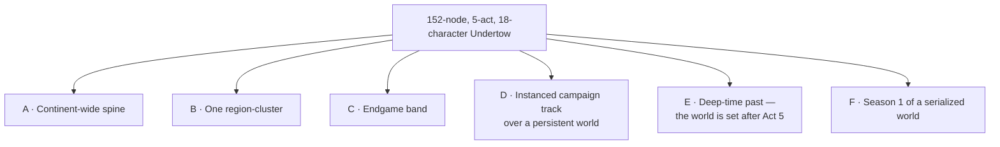

# Systems Designer — is the Undertow viable as the spine of an MMO world?

**Role:** Systems Designer (charter §2.1) · **Veto:** lore that cannot be built or played at MMO scale
**Date:** 2026-08-01 · **Level:** L1 panel input, written independently
**Answers:** whether a 5-act, 152-node, 18-character story can carry a persistent large-world MMO, and what the structural options are

<div class="callout info">
<strong>What this document is not.</strong> It contains no recommendation. Section 3 lays out six
options with their engineering cost and risk; picking one is the owner's decision. Sections 4 and 5
are the two places where I am not neutral: a technical veto, and the hardest problem that survives
every option.
</div>

---

## 0. Method — measured vs assumed

Every number below is tagged. **Measured** numbers came out of this repository at this commit.
**Assumed** numbers are industry norms for large themepark MMOs, stated openly so they can be
argued with rather than smuggled in.

### Measured (from the repo)

| Fact                         | Value                                                                                                    | Source                                           |
| ---------------------------- | -------------------------------------------------------------------------------------------------------- | ------------------------------------------------ |
| Player top speed             | **20 world units/s**                                                                                     | `colyseus-server/src/schemas/Player.ts:23`       |
| World size                   | **1000 × 1000 u**                                                                                        | `colyseus-server/src/config/gameConfig.ts:13`    |
| Playable regions             | **3**                                                                                                    | `content/maps/atlas-frontier.md`                 |
| Seeded mobs on the whole map | **9** (3 + 2 + 4)                                                                                        | `content/maps/atlas-frontier.md` `mobSpawnAreas` |
| Simulation tick              | **50 ms (20 Hz)**, fixed timestep                                                                        | `gameConfig.ts:8`, `GameRoom.ts:241`             |
| Patch rate                   | **50 ms**                                                                                                | `GameRoom.ts:139`                                |
| Room capacity                | **`maxClients = 1`**                                                                                     | `GameRoom.ts:56`                                 |
| Mob respawn delay            | **5000 ms**                                                                                              | `MobLifeCycleManager.ts:96`                      |
| Creature designs             | **116**, over **8 level bands**, **9 regions**                                                           | `content/bestiary/bestiary.json`                 |
| Creature _implementations_   | **6 mob types**                                                                                          | `colyseus-server/generated/mob-types.json`       |
| Quests                       | **28**, over 8 regions                                                                                   | `content/story/quests.json`                      |
| Story nodes                  | **152** (40 lore, 28 quests, 18 chars, 17 events, 14 dialogue, 10 arcs, 10 factions, 10 regions, 5 acts) | `content/story/*.json`                           |
| Novel                        | **150,207 bytes**                                                                                        | `docs/story/undertow/novel-complete.md`          |
| Level-band distribution      | 22 / 20 / 18 / 16 / 14 / 12 / 8 / 6 across bands 1‑10 … 71‑80                                            | `bestiary.json`                                  |

### Assumed (industry norms — challenge these first if you disagree with my conclusions)

| Assumption                                                   | Value         | Why                                                                                                                |
| ------------------------------------------------------------ | ------------- | ------------------------------------------------------------------------------------------------------------------ |
| On-foot crossing time for "a major MMO continent"            | **20–30 min** | This is what makes a world feel large without mounts/teleports; below ~15 min it reads as a level, not a continent |
| Leveling zones per 10-level band                             | **3**         | One main route + two alternates. Two is the alt-hostile floor; four is generous                                    |
| Distinct creature species per zone before repetition is felt | **12**        | Coincidentally what the current bestiary already averages per region (116 / 9 = 12.9)                              |
| Quests per leveling zone                                     | **20**        | Enough to level through the zone by questing alone                                                                 |
| Simultaneous spawned mobs per leveling zone                  | **150–400**   | Tagging contention floor for a multiplayer zone                                                                    |
| Live mob respawn                                             | **90–300 s**  | 5 s is a single-player debug value, not a shared-world value                                                       |

---

## 1. The load a large MMO world imposes

### 1.1 World area — the 576× problem

This is the number that dominates everything else, and it comes out of one measured value:
**a player moves 20 world units per second.**

```
current world crossing   =  1000 u / 20 u·s⁻¹      =    50 s
current diagonal         =  1414 u / 20 u·s⁻¹      =    71 s
target crossing (20 min) =  20 × 60 × 20 u·s⁻¹     = 24,000 u
target crossing (30 min) =  30 × 60 × 20 u·s⁻¹     = 36,000 u
```

Taking the conservative end, **a continent is ~24,000 u on a side**: 5.76 × 10⁸ u² against today's
1.0 × 10⁶ u². That is **576× the area** and **24× the side length**. The entire current playable
world — three regions, six towns' worth of story ground, the whole Undertow map — is a **0.17%
patch** of the target continent.

<div class="callout warn">
<strong>This is a content problem before it is an engineering problem.</strong> You do not get to
"just make the number bigger". 576× the area at today's mob density is 5,200 mobs; at today's
species density it is 384 species; empty space at MMO scale reads as unfinished, not as wilderness.
</div>

### 1.2 Zone count — 32 outdoor zones, ~14 dungeon templates

Derived from the **8 level bands that already exist** in the bestiary:

```
leveling zones   = 8 bands × 3 zones/band              = 24
hub / city zones = 1 per ~2 bands                      =  4
contested / endgame                                     =  4
                                                   ────────
outdoor persistent zones                                = 32

instanced dungeon templates = 1–2 per band              = 12–16
```

**32 outdoor zones.** The world currently has **3**. Even counting the six towns in `regions.json`
as zones-in-waiting, it has **10** — a third of what the existing level curve implies.

Cross-check on zone size: 5.76 × 10⁸ u² / 32 = **1.8 × 10⁷ u² per zone**, i.e. a square of
**4,240 u** on a side. On-foot zone crossing = 4,240 / 20 = **212 s ≈ 3.5 min**, which is a sane
zone traversal time. So the geometry is self-consistent.

But note what that means: **one zone is ~18× the area of the entire current map.** `atlas-frontier`
is not a small continent. It is a fraction of one zone.

### 1.3 Monster density and species count

Today's density: 9 mobs / 10⁶ u² = **9 per million u²**. Applied to a 1.8 × 10⁷ u² zone:

```
mobs per zone   = 9 × 18                        ≈ 162  (inside the assumed 150–400 band)
continent total = 32 zones × ~180 mobs          ≈ 5,800 concurrently spawned AI actors
```

**The existing density is approximately correct.** It is the area, not the packing, that is missing.

Species, however, are not correct:

```
species needed  = 32 zones × 12 species/zone    = 384 distinct creature definitions
designed        = 116                           → shortfall 268 (3.3×)
implemented     = 6                              → shortfall 378 (64×)
```

There is a cheaper path on the design side and it is already latent in the data. `bestiary.json`
carries `element` (7 values), `durability`, `speed`, `archetype` and `levelBand` as separate axes
from `bodyPlan` (13 values). A **variant system** — 3 ranked/elemental variants per base — turns
**128 bases into 384 spawn entries**. Under that system the 116 already-designed creatures are
**≈ one continent's worth of bases**, and the design shortfall collapses from 3.3× to ~1.1×.

The **implementation** shortfall does not collapse. It is 64× and it is real (§2.7).

### 1.4 Quest volume

```
quests needed = 24 leveling zones × 20  +  8 hub/endgame zones × 10   ≈ 560
existing      = 28
```

**28 / 560 = 5%.** The shortfall is **~19×**, and it is worse than the raw ratio suggests: 7 of the
28 quests are Gildmark-side and 4 are Ashvale-front, i.e. they are concentrated on **one conflict**
rather than distributed across a level curve. The current quest set is one arc's worth of one route.

Narrative nodes scale similarly: **152 nodes bought one 5-act arc** that covers, generously, two
level bands of content. Eight bands at comparable density implies **600–1,200 nodes**.

### 1.5 Travel, respawn, instancing

- **Travel.** A 24,000 u continent at 20 u/s is 20 minutes edge-to-edge with no mount and no
  teleport. Every travel-shortening system an MMO has (mounts, flight, waypoints, ports, hearth
  recalls) exists to make numbers like this bearable. **None of them exist in the codebase.** They
  are not garnish — without them, cross-continent play is a 20-minute tax per trip.
- **Respawn.** Retuning 5 s → 180 s and assuming ~30% of the population is dead at any instant:
  `5,800 × 0.30 / 180 ≈ 10 respawns/s` continent-wide, ~0.3/s per zone process. **Compute-trivial.**
  The hard part is not the rate; it is that spawner state must survive a process restart, which
  today it cannot (§2.4).
- **Instancing.** 12–16 dungeon templates × a per-group instance means an unbounded, bursty second
  population of short-lived rooms alongside 32 long-lived zone rooms. These are **two different
  lifecycle models in one cluster** — one that is allocated and torn down (which the current
  `1 match = 1 room = 1 pod` model already fits), and one that must never be torn down at all
  (which it does not fit at all).
- **Concurrency envelope.** At the README's stated 150–300 players/instance × 32 zones, the
  continent's design capacity is **4,800–9,600 CCU per shard** — and 32 pods must run whether or not
  anyone is standing in them.

---

## 2. What the architecture supports today

Read from the code, not the README. The honest summary: **the server is an excellent
single-instance match simulator and is not, at any point in its current code, a persistent world.**

### 2.1 `maxClients = 1`

`GameRoom.ts:56`. Not "configured low" — every system in the repository has been designed, tested
and profiled against a one-player room. `gameConfig.ts` reinforces it: `mobCount: 1, // Reduced for
debugging`. The gap between here and 150 players is not a constant; it is every assumption that was
never stressed.

### 2.2 There is no interest management, and the README says there is

`README.md:16` states: _"AOI (Area of Interest): Grid filtering (3x3 cells per player) to optimize
snapshot bandwidth (budget: 15-25 entities; ~800B peak/client)."_

```
grep -rni "aoi|area of interest|quadtree|spatialHash|areaOfInterest" colyseus-server/src  → 0 matches
grep -rn  "@filter|filterChildren|StateView"                        colyseus-server/src  → 0 matches
```

`GameState` is five flat `MapSchema`s (`players`, `mobs`, `npcs`, `projectiles`, `zoneEffects`) with
no per-client filtering of any kind. **Every client receives every changed field of every entity in
the room, 20 times a second.**

What that costs at zone scale, conservatively (24 B of changed fields per moving entity per patch):

```
no AOI:  330 moving entities × 24 B × 20 Hz          ≈ 158 KB/s per client
         × 150 clients                                ≈  23 MB/s egress per pod
with AOI: ~22 visible entities × 24 B × 20 Hz         ≈  10 KB/s per client
         × 150 clients                                ≈ 1.6 MB/s egress per pod
```

**~14× reduction.** At MMO scale AOI is not an optimisation — it is the difference between a
shippable pod and one that saturates a NIC on its own. The budget in the README describes a system
that has not been written.

### 2.3 The cluster is one process

`src/index.ts:19-21`:

```ts
const gameServer = new Server({
  transport: new WebSocketTransport({ server }),
});
```

No `presence: RedisPresence`, no `driver: RedisDriver`. Colyseus falls back to local presence and a
local driver, which means **rooms are only discoverable inside their own process**. Two pods today
are two disconnected worlds: no cross-pod room listing, no cross-pod matchmaking, no seat
reservation that can be honoured by a different pod. Any zone-per-pod topology requires this to
change _before_ anything else, because a player walking from zone A to zone B is precisely a
cross-process seat reservation.

### 2.4 No world state is persisted — only character state

`GameState` is constructed in `onCreate` (`GameRoom.ts:86-87`) and discarded in `onDispose`
(`GameRoom.ts:207-227`). The single seam to durable storage is `IMetaBackend`, and it has exactly
three methods:

```ts
verifySession(token); // auth
getLoadout(userId); // profile / equipment / skills / quests, read-only
reportMatchEvents(batch); // fire-and-forget progression events
```

Nothing writes back mob state, spawner state, world flags, node/resource state, territory,
structures, or even player position. **A pod restart resets the world.** That is correct behaviour
for a match and disqualifying for a persistent one. Persistence today means "your character
persists", not "the world persists" — and the distinction is the entire genre.

### 2.5 Physics is one Planck world on one thread

One `PlanckPhysicsManager` per room (`GameRoom.ts:90`), one Planck `World`, stepped at a fixed 50 ms
inside the same Node event loop that also runs state encoding, the AI module, the battle queue and
the Express REST router. There is no seam at which half a zone could be stepped on another core.
The per-pod ceiling is therefore a **single-core** ceiling — which is why zone-per-pod (§1.2's 32
zones) is arithmetically the natural topology, and why "one big continent room" is not a topology at
all.

### 2.6 There is no boundary or handoff concept

`getMapDimensions(mapId)` returns a fixed width/height and the simulation assumes a closed box —
`physicsManager` is constructed from `state.width/height`. There is no code path that hands a player
from room A to room B while preserving:

- physics body state (velocity, impulse, contact set)
- combat state (`BattleManager` queue, status effects, `entering` immunity)
- threat state (`ThreatRegistry` is a field of `GameState`, so it dies with the room — F-023)
- party / group membership (does not exist)

**Every one of those is a per-room object.** Zone handoff is not a feature to add on top; it is a
new lifecycle that four existing subsystems currently contradict.

### 2.7 116 designed creatures, 6 implemented

`generated/mob-types.json` lists six: `aggressive`, `balanced`, `defensive`, `double_attacker`,
`hybrid`, `spear_thrower`. The F-013 content gate hard-fails any map referencing a type outside that
list — correctly, but the effect is that **the bestiary is a design artifact with no runtime path**,
and the gate that keeps content honest is simultaneously the ceiling on content volume. Reaching 384
spawn entries by the current route means 384 hand-written mob types. Reaching it by a data-driven
route means a creature-definition schema that does not exist yet.

### 2.8 Where `1 match = 1 room = 1 pod` collides with a persistent continent

Three specific collisions, in order of severity:

| Match assumption                                                            | Persistent-world requirement                         | Where it breaks                                                         |
| --------------------------------------------------------------------------- | ---------------------------------------------------- | ----------------------------------------------------------------------- |
| State is **disposable** — `onDispose` destroys `GameState`                  | Zone state must outlive every process that hosted it | `GameRoom.onDispose` is correct for a match and fatal for a zone        |
| Population is **bounded and co-located** — everyone shares one interest set | Two players 3,000 u apart share _no_ interest set    | Full-state broadcast (§2.2) is affordable in a match, ruinous in a zone |
| Membership is **closed** — you join at the start, leave at the end          | Players cross zone borders continuously, mid-combat  | No handoff exists (§2.6); no cross-process presence exists (§2.3)       |

The honest reading: `1 match = 1 room = 1 pod` is **exactly right for instanced content** (dungeons,
scenarios, the campaign track) and **structurally wrong for the open world**. That is not a flaw
that needs fixing so much as a fact that narrows which of §3's options are cheap.

---

## 3. The structural options

Six. Options **D**, **E** and **F** have not, to my knowledge, been proposed. Each option states
what it does to the Undertow, what it costs to build, and what it risks.



### Option A — The Undertow is the continent-wide spine

**Story:** the 5 acts remain the main storyline; all 32 zones are authored as subordinate to the
Ashvale war and the Broker's conspiracy.

**Cost:** ~530 additional quests and ~600–1,000 additional narrative nodes, every one of which must
be causally justified by a war between two towns over five seasons. The existing 24 KB `canon.md`
becomes the constraint on 32 zones of content, and its §6 contradiction rule must be enforced across
~19× the content mass.

**Risk — and this is a design risk, not an engineering one:** the conflict cannot bear the load.
`canon.md` §1 is a **five-season chronology with a fixed cast of 18 and five scripted deaths**. That
is a shape with a beginning and an end. A continent-wide spine must supply reasons to be in a level
61‑70 zone, and the Undertow has no material there — its highest-stakes content (the relic sale, the
Broker's unmasking) is a conspiracy resolved by a handful of people, not by 150. Stretching a
5-season war across 80 levels dilutes precisely what makes it good: the intimacy of an 18-person cast.

### Option B — The Undertow is demoted to one region-cluster

**Story:** the 3 regions + 6 towns become one sub-continent (roughly 8–10 of the 32 zones, level
bands 1‑30). The remaining 22–24 zones get independent conflicts under a shared world frame.

**Cost:** the cheapest of the six. No rewrite. `canon.md` §4 geography survives intact; you add a
containing frame above it. The 116-creature bestiary already maps to 9 regions, which is exactly one
region-cluster's worth — **the existing content is correctly sized for option B and for nothing else.**

**Risk:** your best-written material becomes level 1‑30 content that a player sees once, in their
first week, and never returns to. The emotional peak of the world sits at the bottom of the level
curve, and every zone authored afterward is measured against a 146 KB novel it will not match.

### Option C — The Undertow is inverted to the top band

**Story:** the 5 acts become level 61‑80 content. Bands 1‑60 are authored to lead into them.

**Cost:** the most sequenced. Six bands (~18 zones, ~400 quests) must be authored _before_ the
existing content is reachable, and the existing 28 quests must be re-tiered — several are `MOB_KILLED
× 3` tutorial objectives that cannot survive the move. The bestiary's band distribution actively
fights this: **bands 61‑70 and 71‑80 hold only 8 and 6 creatures**, the two thinnest bands in the
file, so the level range that would have to carry the epic is the range with the least creature
support.

**Risk:** nobody sees the best content for months, and the Undertow's register — ordinary people,
steel not spellfire, a war that ends in nothing changing — is a poor fit for the escalation an
endgame band conventionally promises.

### Option D — Instanced campaign track over a story-light persistent world _(not previously proposed)_

**Story:** the Undertow stops being geography. The 152 nodes run as a **bounded scenario track**:
instanced, fixed-cast, fixed-clock chapters that every player runs on their own timeline, layered
over an open world that is persistent, clockless and deliberately story-light. The 5 acts keep their
ending; the world keeps not having one.

**Cost:** two runtimes — but **the expensive one already exists.** `1 match = 1 room = 1 pod`,
`maxClients` in the low tens, `GameState` disposed on completion, `MetaEventReporter` flushing
progression to Nakama on teardown: that _is_ an instanced-scenario server, and it is what is built
today. The new build is a second runtime for the open world (persistent zones, AOI, cross-process
presence, handoff, world persistence). The saving is that the campaign never needs any of those.

**Risk:** two runtimes means two combat implementations drifting apart unless the simulation core is
extracted into a shared package first — and `BattleModule` is currently constructed directly from
`GameState`, so that extraction is real work. Second risk: an open world with the story deliberately
removed can read as scenery rather than a place, which pushes the burden of "why am I here" onto
systems (economy, territory, faction) that do not exist yet.

<div class="callout idea">
<strong>Why D is worth stating plainly:</strong> it is the only option in which the answer to
"a 5-act story has an ending, a persistent world may not" is <em>architectural</em> rather than
editorial. The other five options all try to fit a bounded story into an unbounded space. D stops
trying.
</div>

### Option E — The Undertow is relocated to deep time _(not previously proposed)_

**Story:** the epic already happened. The playable world is set some years after Act 5, and all 152
nodes become the continent's recent history — ruins, grave markers, NPC memory, salvaged ledgers,
a Cindervast that is now two generations cursed instead of one.

**Cost:** you lose 28 quests of _playable_ content, which is 5% of what a continent needs anyway, so
the loss is small in system terms. You keep **100% of the writing as world texture**, and you gain
something the world otherwise has to invent from nothing: a materially-grounded backstory that
explains why every town is the way it is. The `canon.md` §3 who-knows-what matrix becomes far more
valuable, not less — it is now the ground truth behind what people misremember.

**Risk:** the 146 KB novel becomes unplayable. That is a genuine loss of the strongest artifact in
the project, and it is not recoverable by adding zones later. There is also a trap: "the interesting
war is over, you missed it" is a hostile opening frame unless the present has a conflict of its own,
which means E does not save you from authoring a new spine — it only saves you from contradicting
the old one.

### Option F — The Undertow is Season 1 of a serialized world _(not previously proposed)_

**Story:** ship at the scale the content actually supports — **9–10 zones**, which is exactly what
116 creatures at 12 species/zone and one 5-act arc already cover — and grow by one region-cluster
per release, each cluster carrying its own act structure and its own bestiary slice.

**Cost:** the lowest day-one cost of the six, and it is the only option that honours the charter's
own standing decision: _"Large, comparable to a major MMO continent, **may start small and scale**."_
It also matches the release cadence already in place (`ps-release-workflow`, 1.6 in flight). The
architectural work still has to happen — AOI, cross-process presence, world persistence, handoff —
but it happens against 9 zones, not 32.

**Risk:** a permanent content-cadence commitment. If a cluster does not ship on schedule, the world
visibly stops growing, and a world that has visibly stopped growing is read as abandoned. Also, each
new cluster must be reconcilable with `canon.md` §6 forever, and the contradiction surface grows
with every season.

---

## 4. Veto position

I veto two things. Both are technical, both are specific, and neither is a preference about which
option is better.

<div class="callout danger">
<strong>VETO 1 — No option may play the Undertow's chronology as shared, server-global state
without a phasing layer, and no plan may treat phasing as a content task.</strong>
</div>

`canon.md` §1 is a strictly ordered chronology of **irreversible, globally-visible state
transitions**: the caravan burns once; the Quartermaster dies in Act 4 shielding refugees; the
Bell-Keeper breaks; the relic sale is stopped at the brink in Act 5. Five named characters die at
specific acts. In a single shared persistent world there are exactly two ways to run that, and both
are currently blocked:

1. **Fire once, server-wide.** Every player who logs in after the server's Act 4 can never play Acts
   1–4. The 152 nodes become unreachable content for every future player, and the main story has a
   calendar expiry date. This is not a technical impossibility — it is a technical _guarantee_ of
   permanently orphaned content, and it should be chosen consciously if at all.
2. **Phase it per player.** Player A sees a living Quartermaster; player B, standing in the same
   coordinates, sees her grave. This requires per-player visibility of NPC existence, spawn tables,
   and zone dressing.

**Why 2 is blocked today, precisely:** `GameState` exposes `npcs`, `mobs` and `zoneEffects` as flat
`MapSchema`s with **no `@filter`, no `filterChildren`, and no `StateView` on any field in the entire
`src/` tree** (verified by grep, §2.2). There is currently **no mechanism by which two clients in one
room can be shown different world contents.** Adding one is not a content decision and it is not a
schema annotation: it is a change to the replication layer plus every system that iterates
`state.npcs` / `state.mobs` — `AIWorldInterface`, `MobLifeCycleManager`, `BattleModule`,
`ZoneEffectManager`, `GameSimulationSystem`, the REST API's live-room handlers, and the generated C#
client models. Phasing is the single most invasive system an MMO codebase can take on, and it must
be planned as such or not planned at all.

**What this veto does _not_ block:** Options D, E and F all route around it — D by making the
chronology instanced (per-player by construction), E by placing it entirely in the past (no live
transitions at all), F by keeping the world small enough that a scripted world-state advance is
survivable. Options A, B and C are all blocked _unless_ they ship phasing or accept outcome 1
explicitly, in writing.

<div class="callout danger">
<strong>VETO 2 — No option may present a large continent as a single Colyseus room.</strong>
</div>

Specifically: one `PlanckPhysicsManager` per room, one Planck `World`, a fixed 50 ms step, state
encoding and AI and the REST router on the same Node event loop (§2.5), plus full-state broadcast to
every client at 20 Hz (§2.2). At 5,800 mobs and even a few hundred players, that is a single-core
physics step and ~23 MB/s of egress per pod for one zone's worth of population. The zone-per-room
topology in §1.2 (32 rooms × ~180 mobs × 150–300 players) is arithmetically compatible with the
README's own stated target; a continent-in-a-room is not compatible with anything.

This veto is **cheap to satisfy** — it constrains topology, not content — but it must be settled
before any option is costed, because it determines that cross-process presence (§2.3), zone handoff
(§2.6) and world persistence (§2.4) are **prerequisites of the open world in every option except
D-with-a-tiny-world and F-at-season-1**.

**What I do not veto:** Option A. It is expensive and I believe the conflict cannot carry 80 levels,
but that is a judgement about narrative, not a technical block, and the charter does not give me a
veto over judgement. It is the owner's to make.

---

## 5. The single hardest structural problem

**Narrative time versus persistent time — and its technical expression, phasing.**

A 5-act story is a _sequence_: it has an order, a clock, and an end state in which five people are
dead and the war has not stopped. A persistent world is a _steady state_: it must be legible and
playable to the player who arrives on day 1 and to the one who arrives on day 900, and those two
players must be able to stand in the same field and group up.

Every option in §3 must answer the same question: **what does the world look like to the 500th
player who logs in?** The answers are not equally hard, but none of them is free:

- **A / B / C** must build phasing, or accept permanently orphaned content.
- **D** must keep an instanced campaign and a persistent world from drifting into two different games
  — and specifically must extract a shared simulation core out of `GameState`, which today owns
  `battleManager`, `mobLifeCycleManager`, `aiModule`, `worldInterface` and `threatRegistry` as direct
  fields.
- **E** must invent a present-tense conflict anyway, because "the interesting war is over" is not a
  reason to log in.
- **F** must answer it repeatedly, once per season, forever — and each answer constrains the next.

**Why I rank this above content mass.** The §1 shortfalls are large — 19× on quests, 3.3× on creature
designs, 64× on creature implementations, 576× on area — but they are _volume_ problems. Volume is
solvable by time, money, tooling and pipelines, and this project already demonstrably builds
pipelines. Phasing is a _topology_ problem: it changes what a "room" is, what a client is allowed to
see, and how every system that iterates world state is written. It cannot be parallelised across
content authors, it cannot be retrofitted cheaply once 500 quests assume a single shared world state,
and it is the one decision in this document that gets **strictly more expensive with every commit
that does not account for it**.

If one thing is settled before content authoring resumes at scale, it should be this one.

---

## Appendix — the derivation chain in one block

```
MEASURED   player speed                          20 u/s
MEASURED   world                                 1000 × 1000 u  = 1.0e6 u²
ASSUMED    continent on-foot crossing            20 min
DERIVED    continent side   20×60×20           = 24,000 u
DERIVED    continent area   24,000²            = 5.76e8 u²      → 576× current

MEASURED   level bands in bestiary               8
ASSUMED    leveling zones per band               3
DERIVED    leveling zones   8×3                = 24
DERIVED    + hubs (4) + endgame (4)            = 32 outdoor zones   (have 3, or 10 incl. towns)
DERIVED    zone area       5.76e8 / 32         = 1.8e7 u²           → 18× the current whole map
DERIVED    zone side       √1.8e7              = 4,240 u            → 3.5 min to cross on foot

MEASURED   mob density      9 mobs / 1.0e6 u²
DERIVED    mobs per zone    9 × 18             ≈ 162                (assumed band 150–400: OK)
DERIVED    continent mobs   32 × 180           ≈ 5,800 concurrent AI actors

ASSUMED    species per zone before repetition    12   (= current 116/9 = 12.9)
DERIVED    species needed   32 × 12            = 384
MEASURED   species designed                      116                → 3.3× short
MEASURED   species implemented                   6                  → 64× short
DERIVED    with 3 variants/base: 128 bases     = 384 entries        → design gap ≈ 1.1×

ASSUMED    quests per leveling zone              20
DERIVED    quests needed  24×20 + 8×10         ≈ 560
MEASURED   quests existing                       28                 → 19× short

ASSUMED    live respawn                          180 s
DERIVED    respawn rate  5,800×0.30/180        ≈ 10/s continent-wide  (≈0.3/s per zone: trivial)

DERIVED    bandwidth, no AOI   330×24 B×20 Hz  ≈ 158 KB/s/client → 23 MB/s per 150-player pod
DERIVED    bandwidth, with AOI  22×24 B×20 Hz  ≈  10 KB/s/client → 1.6 MB/s per pod  (≈14×)

DERIVED    shard capacity  32 zones × 150–300  = 4,800–9,600 CCU
```
